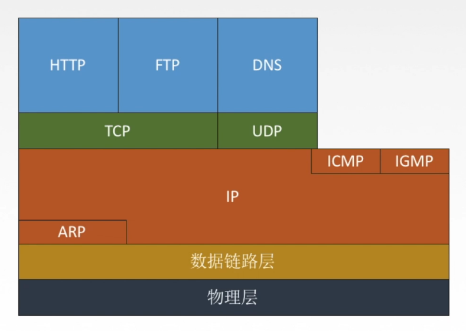
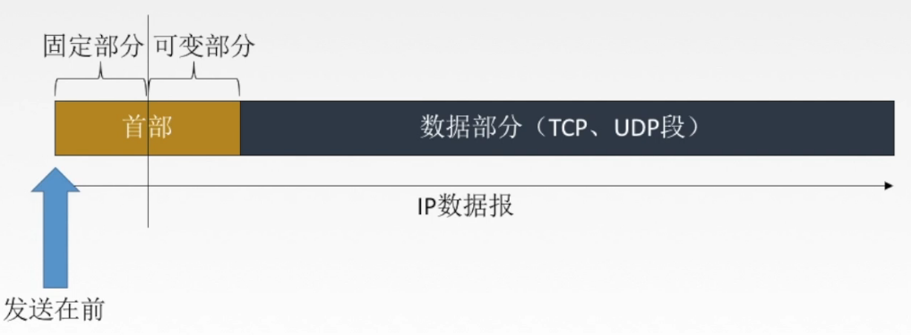
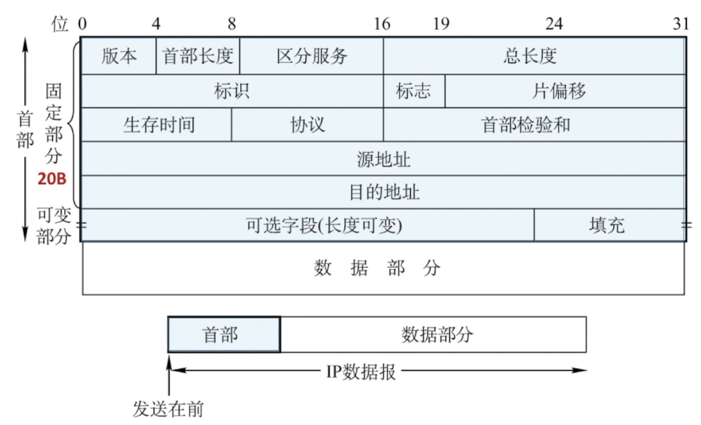

# 404 IP 数据报格式

图1.TCP/IP 协议栈

与 IP 协议配套使用的还有三个协议：

1. **地址解析协议 ARP**（Address Resolution Protocol）
2. **网际控制报文协议 ICMP**（Internet Control Message Protocol）
3. **网际组管理协议 IGMP**（Internet Group Management Protocol）

图 1 画出的各协议所处位置，含义是，IP 经常使用 ARP；ICMP、IGMP 要使用 IP。

## 一. IP 数据报格式

图2.IP 数据报格式

IP 数据报包含数据部分（上层传下来的数据），和网络层添加上的**首部**。

首部可分为**固定部分**和**可变部分**。

图3.IP 数据报详细格式

图 3 上面的数字单位为 bit，固定部分总长 20B = 160bit。

1. 版本：

   4bit，指明 IP 协议的版本，IPv4 或 IPv6（毕竟IPv 1、2、3、5 都没实际使用过）。

2. 首部长度：

   4bit，表示首部的总长度。

   注意**单位为 32 位字（4B）**，即，如果只有固定部分的 20B，可变部分为 0B，则首部长度为 0101（5x4B=20B）。

   也因为单位为 4B，当首部长度不足时，利用可变部分最后的填充字段加以填充。所以也使得数据部分必在 4 的整数倍处开始。

   显然，由于固定部分为 20B，所以首部长度最小为 0101（5）；由于首部长度只有 4 位，所以首部长度最大为 1111（15）。

3. 区分服务：

   8bit，用来获得更好的服务，指示期望获得哪种类型的服务。
   比如想让该数据报获得更好的转发优先级，就可以使用这个字段。

   在旧标准中叫作服务类型，但实际从未使用过，后来改名为区分服务。只有在使用区分服务时，这个字段才起作用。在一般情况下都不使用这个字段。

4. 总长度：

   16bit，指首部和数据部分之和的长度。单位为 1B。

   虽然最大能表示 $2^{16}-1=65535$ ，但实际上几乎不会表示这么大。
   因为每一种数据链路层协议都规定了一个数据帧中的**数据字段的最大长度**，称为**最大传送单元 MTU**，如以太网中的 MTU = 1500B。所以如果数据报总长度超过了 MTU 值，就需要分片处理，即将一个过长的数据报，拆分成多个数据报（我感觉数据报长度超过 MTU 也没啥意义）。
   不过另一方面，如果 IP 数据报越长，那么数据部分占比就越大，传输效率会提高。但短的话也有好处，路由器转发的速度就会加快。

   这些，来源于同一个过长的数据报经过分片处理，拆分得到的多个数据报，就称为**数据报片**。
   原未经分片的数据报中的数据部分，经过分片处理后，则分散在其各数据报片中的数据部分中。

   IP 协议规定，对于长度不超过 576 字节的数据报，在互联网中的所有主机和路由器都必须能够接收。
   这是因为假设上层交下来的数据长度有 512（ $2^9$ ）字节，加上 IP 数据报最长的首部 60B，再给 4B 的富裕量，就是 576B。

   所以，对于长度不超过 576B 的数据报，对面主机肯定是能接收的，至于超过了的，就不一定了，得看对面主机支不支持接收超过 576B 的数据报。

5. 标识：

   16bit，IP 软件在存储器中维持一个计数器，每产生一个数据报，计数器加1，并将此值赋给标识字段。

   但标识字段并非序号，因为 IP 提供的是无连接服务，数据报不存在按序接收的问题。

   当数据报由于长度超过网络的 MTU 而必须分片时，这个标示字段的值就被复制到所有的数据报片的标示字段中，以说明这些分片原本是同一数据报。

   相同的标识字段的值使分片后的各数据报片最后能正确地重装成原来地数据报。

6. 标志：

   3bit，但目前其中只有 2bit 有意义。

   最低为记为 **MF（More Fragment）**。MF = 1，表示后面还有分片；MF = 0，表示该分片是最后一个。

   中间一位记为 **DF（Don‘t Fragment）**。意思是不能分片；当 DF = 0，才允许分片。

7. 片偏移：

   13bit，片偏移指出：较长的分组在分片后，某片在原分组中地相对位置。
   也就是说，相对于用户数据字段的起点，该片从何处开始。**片偏移以 8B 为偏移单位**。这就是说，除最后一个数据包片外，每个分片的长度一定是 8B 的整数倍。

8. 生存时间（TTL，Time To Live）：

   8bit，表明数据报在网络中的寿命。由发出数据报的源点设置这个字段，每经过一个路由器时，TTL 的值减 1，当数据报的 TTL 值为 0 时，则丢弃该数据报。
   这是为了防止数据报无限制地在互联网中兜圈子。

9. 协议：

   8bit，指出此数据报携带的数据是使用何种协议，以便目的主机的 IP 层知道应将数据部分上交给哪个协议进行处理。
   TCP 为 6；UDP 为 17。

10. 首部检验和：

    16bit，**只检验数据报的首部，不包括数据部分**。

    发送方，首先将首部检验和字段置为 0，然后把首部以 16bit 分为多段，以反码算数运算的方式求总和，将求和结果，取反码，作为首部检验和。

    （反码算数运算：和正常的二进制加法一样，唯一的区别就是当最高位产生进位时，会是在最低位+1。）

    接收方，将接收到的数据报的首部，仍以 16bit 分为多段，以反码算数运算的方式求总和，将求和结果，取反码，如果首部未发生任何变化，则结果必为 0，于是保留该数据报；否则认为出差错，并丢弃该数据报。

11. 源地址：32bit，指源 IP 地址。

12. 目的地址：32bit，指目的 IP 地址。

13. 可选字段：0-40B，用来支持排错、测量以及安全等措施。

14. 填充：填充内容全为 0，用来将首部长度补成 4B 的整数倍。

2021.02.23

