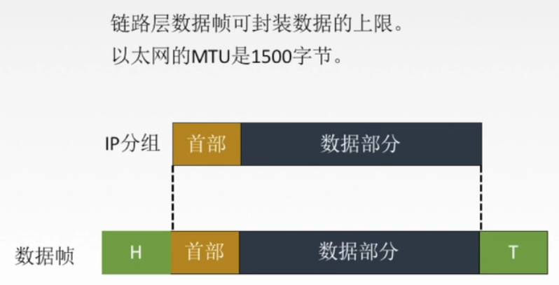
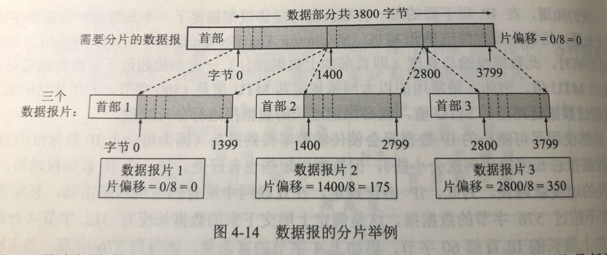
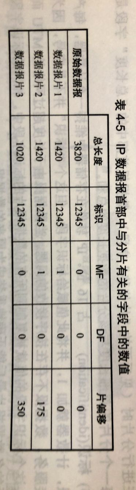

# 405 IP 数据报分片

因为每一种数据链路层协议都规定了一个数据帧中的**数据字段的最大长度**，称为**最大传送单元 MTU**。

图1.MTU:数据链路层-数据帧-数据部分的最大长度

如，以太网中的 MTU = 1500B。

所以，如果数据报总长度超过了 MTU 值，就需要分片处理，即将一个过长的数据报，拆分成多个分组。

当然，这得是该过长数据报允许进行分片（DF = 0），才能分片处理。若过长数据报本身不允许分片（DF = 1），则无法向下传递，而向上返回一个 ICMP 的差错报文（后续讲这个 ICMP 的差错报文）。

图2.分片举例

图 2 为，将 3820B 的数据报（含 20B 首部），分为长度不超过 1420B 的数据报片。

可见，偏移量是指，数据报片的数据部分起始位置，在原数据报中源位置，与原数据报数据部分起始位置的相对位置

图3.图2例子中各数据报片的首部部分字段

标识字段都相同，表示是属于同一原始数据报分片而来。

MF = 1，DF = 0，表示后面还有分片，不允许分片。
MF = 0，DF = 0，表示是最后一个分片，不允许分片。

2021.02.23