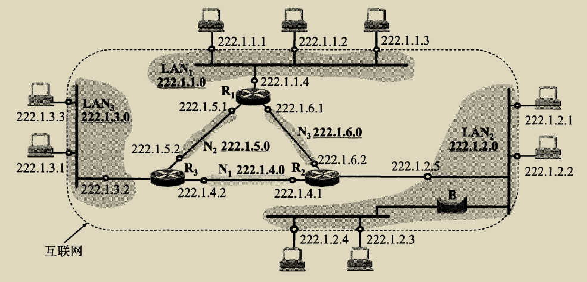
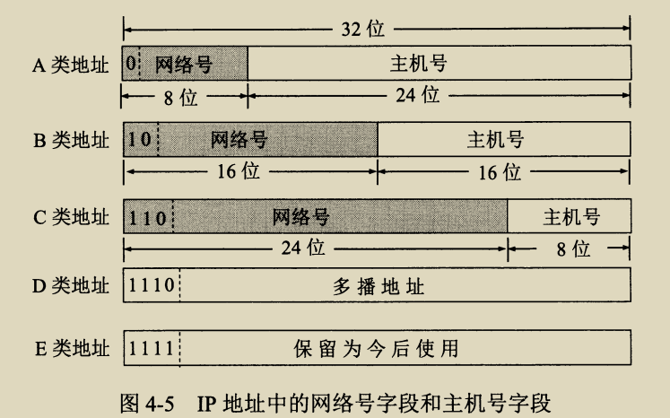
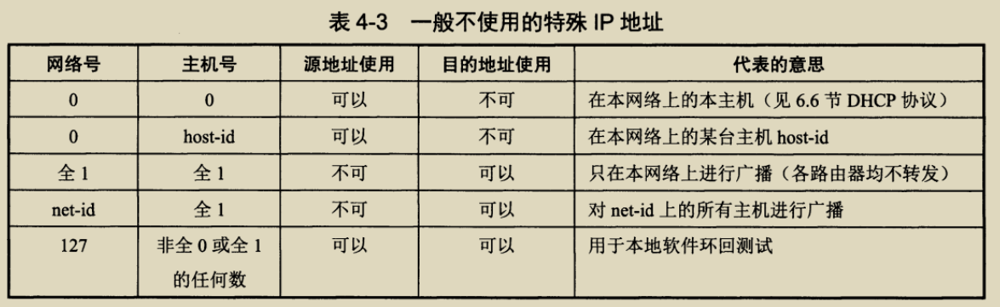
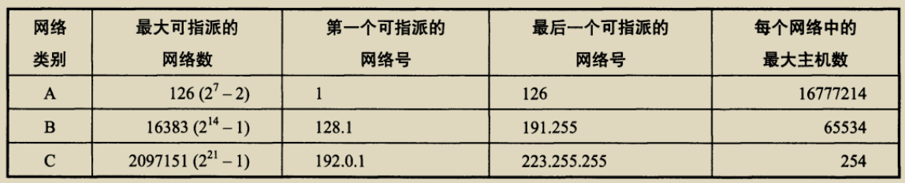
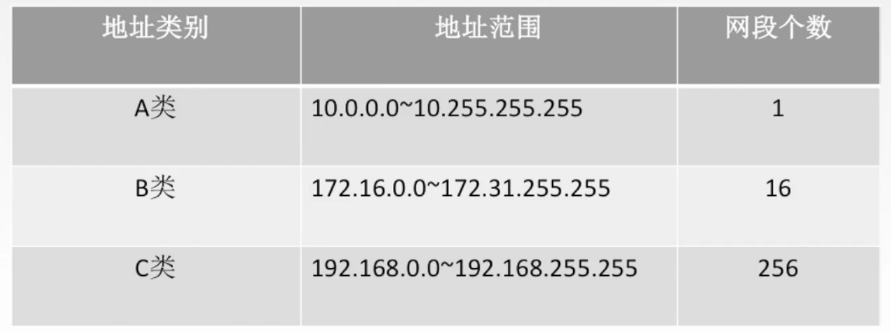

# 406 IPv4 地址

连接到互联网上的每台主机（或路由器），都分配一个 32bit 的全球唯一标识符，即 IP 地址。

传统的 IP 地址都是分类的地址，分为 A、B、C、D、E 五类 IP 地址。

IP 地址的格式：IP 地址 = 网络号+主机号。

网络号，确定主机在哪一个网络；
主机号，确定主机是该网络中的哪一台。

例如，某 IP 地址为：11011111 00000001 00000001 00000001；也可写成**点分十进制**的形式：223.1.1.1

## 一. 互联网中的 IP 地址

图1.互联网中的 IP 地址示意图

由图 1 可见，在同一网络中的主机，其网络号是相同的，如图 1 中以前 3B 作为网络号。
于是可将图 1 中分为三个网络：LAN1，LAN2，LAN3

注意到在右下角 LAN2 中有一个网桥，但网桥两边的网络号相同，可知，网桥并不能分割广播域，网桥连接的仍然称为一个局域网。

再看路由器，图 1 中每个路由器有三个端口，每个端口都拥有其 IP 地址，且都属于不同局域网。
显然，路由器总会有两个或两个以上的 IP 地址。

当两个路由器直接相连时，在连线两端的接口处，可以分配也可以不分配IP地址。现在常常不分配IP地址。
通常把这样的特殊网络（路由器间的网络）叫做**无编号网络**或**无名网络**。

## 二. IP 地址的分类

图2.IP 地址的分类

依照 IP 地址的前几位不同，将 IP 地址分为了 A、B、C、D、E 共五类。

观察到 A、B、C 三类的主要区别在于主机号的的位数。
这是因为，不同网络中的主机数不同，这样分类后，就可以根据网络中的主机数，选择合适类别的 IP 地址。

D 类地址，是多播地址，是在一对多通信的时候才使用的地址。

E 类地址，保留着为今后使用。

## 三. 特殊用途的 IP 地址

在各类 IP 地址中，有些 IP 地址具有特殊用途，一般不使用：

图3.一般不使用的特殊 IP 地址

自己结合网上看的信息再说明一下：

1. 0.0.0.0：

   类似 JAVA 中的 this，需要结合具体情况才知道其含义。
   例如，当一个主机有多个 IP 地址时，我们就可以只 0.0.0.0 表示这台主机。假如一台机器上有两个 IP：203.16.20.5/24 和 203.16.24.4/24。如果我们把一个 JAVA 应用的 IP 绑定到了 0.0.0.0:8080，那访问 203.16.20.5:8080 和 203.16.24.4:8080 都可以与这个 JAVA 应用建立连接

2. 127.x.x.x：

   用于本地软件环回测试，当分组在网络层，发现目的地址是 127.0.0.1 时，就不会继续往下层封装了，而是直接开始返回上层，将分组传递给解封装的队列中了。所以也就不会经过网卡发送到网络上。

   注意啊，127.x.x.x 都是环回地址，只是常用 127.0.0.1 而已。

   为什么要求不能是 127.0.0.0 和 127.1.1.1 呢。因为 主机号全 0 表示网络，主机号全 1 表示广播地址啊。

3. 1.1.1.1：广播地址，只在本网络上进行广播（路由器均不转发）。

4. net-id+主机号全 1：对特定网络的广播，比如我在 A 网络发送一个对 B 网络的广播，路由器会转发。

5. 网络号全 0 +host-id：指本网络上的 host-id 主机。

至于为什么，不能作为源地址/目的地址使用，我确实没找到说明。
只猜想，广播地址不能作为源地址，大概是因为来源不准确？

由以上可知，可知 IP 地址的指派范围：

图4.IP 地址的指派范围

A 类：网络数 -2 是因为要除去网络号全 0 与为127 两种情况。
B、C 类：网络数 -1 是因为网络号不可能全为 0 了，所以只需要除去为127 的情况。

## 四. 私有 IP 地址

图5.私有IP地址

A、B、C 类都有部分地址作为私有 IP 地址，私有 IP 地址适用于内网使用。

在外部网络中是没用的，路由器都不认这些私有 IP 地址。
但在内部网络就随便用。
可以注意到，C 类中就有很熟悉的 192.168.0.1。

至于为什么选这些范围作为私有 IP 地址，只能说规定如此了，没有太多的为什么。

---

说明一下网段这个名词。

第一种意思：在前面 319链路层设备 中讲过网段是一个网络层共用物理层设备的部分，也是一个冲突域。
第二种意思：但 IP 地址这里，我在网上看到很多人使用网段，但含义是指 如从 192.168.0.1 到 192.168.255.255 这之间就是一个网段。
显然地，如图 1 的 LAN2，按第一种意思，就有两个网段，按第二种意思，就有一个网段。

虽然我也觉得，第二种意思在 IP 地址这里，也挺形象的。
不过我并没有在书上看到使用网段这个词是第二种意思。
而且我在维基百科上查到：

>前面所讨论的学术定义是 "网段" 在物理层的严格定义，"网段" 还有一些不严格的含义，比如指代以太网上的一个广播域，这是数据链路层上一个独立的内部相互作用区域。
>
>或者在中文的网络知识入门中，这个词更经常地被误用来指代 "子网"，也就是网络层中由网关或路由器等设备隔开的不同部分。例如IP为 192.168.0.1 ~ 192.168.0.254 的设备就位于掩码 255.255.255.0 的同一子网中，这句话经常被说成 "位于192.168.0.x '网段' 中"，如果不涉及网络层之下的结构，这么说不会引起混淆，但是在深入探讨互联网底层结构的时候，应该避免使用 "网段" 来指代 "子网"。

所以，这第二种意思，应该是误用，但因为很形象，所以大家也用习惯了吧。

2021.02.28