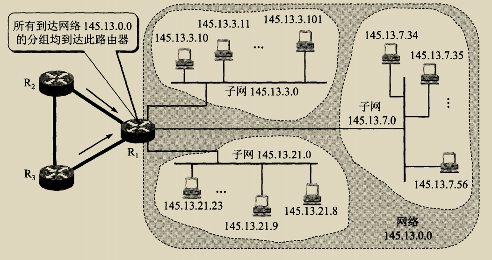

# 408 子网划分和子网掩码

上一节学了分类的 IP 地址。
但分类的 IP 地址显然存在问题，

1. IP 地址的利用率有时很低。比如可能网络主机数刚好只超过 C 类几台时，但也只能使用 B 类地址。
2. 两级 IP 地址不够灵活。比如当需要新建立一个网络时，还得向 ISP 申请 IP 地址，在没有获得 IP 地址前，是无法接入互联网的。

## 一. 子网划分

在 1985 年起，在 IP 地址中又增加了一个**子网号字段**，使两级 IP 地址变成了 三级 IP 地址。
即由（<网络号>，<主机号>）变为了（<网络号>，<子网号>，<主机号>）。

这种做法叫作**子网划分（subnetting）**，或**子网寻址、子网路由选择**。

某单位划分子网后，该单位对外仍然表现为一个网络，即外部网络看不见单位内部的子网的划分。

划分子网的方法是从网络的主机号接用若干位作为子网号（subnet-id），自然，主机号就减少了同样的位数。

**子网号根据情况可能允许全 0 或 全 1；**
**主机号不能全 0 或 全 1，因为全 0 表示本网络，全 1 表示广播。**

凡是从其他网络发送给本单位的某台数据的数据报，仍然是根据数据报的目的网络号找到连接在本单位网络上的路由器。但在此路由器收到数据报后，再按目的网络号和子网号找到目的子网，把数据报交付给目的主机。

图1.将145.13.0.0划分为三个子网，对外仍是一个网络

图 1，使用 B 类地址（网络号占 2B），在内部将 145.13.0.0 划分为三个子网（假定子网号使用 1B），对外仍是一个网络。

所有发送给 145.13.0.0 的分组都会经过路由器 $R_1$ ，路由器 $R_1$ 根据接收的分组的目的地址，转发相应的子网。

## 二. 子网掩码

我们说到，图 1 中将内部网络划分成了三个子网，但就是这么一说，而且图 1 中内部网中也没有给三个子网三个路由器啊，那么子网划分究竟是如何实现的呢。

显然，IP 地址本身并不携带是否划分了子网的信息，所以无法从 IP 地址中看出是否划分了子网。
所以，引入了**子网掩码**。

子网掩码与 IP 地址同长，都为 32bit。
子网掩码是由一串连续的 1 和跟随的连续的 0 组成。其中，对应 IP 地址中的网络号及子网号的位为 1，对应主机号的部分为 0。
（实际上，并未严格规定使用连续的 1 后跟连续的 0，只是极力推荐这样使用。当然现实中大多数是这样做的。）

通过将 IP 地址与子网掩码进行与（and）运算（二者都真为真，其余为假），就可以得知该 IP 地址所处子网。
例如，图 1，其 IP 地址为：网络号（2B），子网号（1B），主机号（1B），则其子网掩码为 11111111.11111111.11111111.00000000（255.255.255.0）
（其实也就是利用与运算 and 提取出子网掩码中为 1 的部分对应的 IP 地址中的部分。）

于是，内部主机将其 IP 地址与子网掩码进行与运算，结果相同的就处于同一子网。
例如，图 1 中，145.13.3.0 子网中，145.13.3.10、145.13.3.11、145.13.3.101 与子网掩码 255.255.255.0 的与运算结果都是 145.13.3.0。

| IP地址       |             145.13.3.10             |             145.13.3.11             |
| ------------ | :---------------------------------: | :---------------------------------: |
| IP地址二进制 | 10010001.00001101.00000011.00001010 | 10010001.00001101.00000011.01100101 |
| 子网掩码     | 11111111.11111111.11111111.00000000 | 11111111.11111111.11111111.00000000 |
| 与运算结果   | 10010001.00001101.00000011.00000000 | 10010001.00001101.00000011.00000000 |
| 结果十进制   |             145.13.3.0              |             145.13.3.0              |

同样的，假定有一个目的地址是 145.13.3.10 的数据报，已经到达了路由器 $R_1$ ，则路由器 $R_1$ 也是将目的地址与子网掩码进行与运算，根据计算结果可知该 IP 地址处于哪一子网，就知道该发往哪个子网。
（虽然这里图 1 三个子网掩码都一样，但子网掩码并不一定都得一样哦）

同一 IP 地址与不同的子网掩码与运算，可能在结果数字上相同。但含义不同。
例如，IP 地址为：141.14.72.24，与子网掩码 255.255.192.0、子网掩码 255.255.224.0 进行与运算的结果在数字上是相同，都是141.141.64.0，但含义不同，
由子网掩码 255.255.224（11100000）.0 计算得出的子网号比由子网掩码 255.255.192（11000000）.0 计算的出的子网号多一位；相对的，也就是 255.255.224（11100000）.0 的主机号比 255.255.192（11000000）.0 少一位。

对于没有划分子网的网络，讲道理，不用子网掩码也行啊。
不过互联网早规定了，所有网络都需要使用子网掩码。
所以没有划分子网的网络，就使用**默认子网掩码**，也就是对于网络号的部分全 1，对应主机号的部分全 0。

即：
对于A类地址来说，默认子网掩码是 255.0.0.0；
对于B类地址来说，默认子网掩码是 255.255.0.0；
对于C类地址来说，默认子网掩码是 255.255.255.0。

这样无论是否划分子网，其流程都是统一的了。

顺带，划分子网后，每个子网的主机号全 0 或全 1 都不能作为主机的 IP 地址（因为用作子网号了）。
相比原本不划分子网，显然减少了主机总数，不过，划分子网也增加了灵活性。

## 三. 使用子网时的分组转发

路由器中存在路由表，路由表中的内容有目的网络地址，目的网络子网掩码，下一跳地址。

1. 从收到的数据报搜捕提取目的主机的 IP 地址 D，得出目的网络地址为 N（经过与子网掩码计算得到）。
2. 若 N 就是与此路由器直接相连的某个网络地址，则**直接交付**，不需要再经过其它路由器，直接把数据报交付给目的主机（这里包括把目的主机地址 D 转换为具体的硬件地址，把数据报封装为 MAC 帧，在发送此帧）；否则就是间接交付，执行第 3 步。
3. 若路由表中有目的地址为 D 的特定主机路由，则把数据报传送给路由表中所指明的下一跳路由器；否则执行第 4 步。
4. 若路由表中有到达网络 N 的路由，则把数据报传送给路由表中所指明的下一跳路由器；否则指向第 5 步。
5. 若路由表中有一个默认路由（目的网络地址项为 0.0.0.0，有设置默认的下一跳地址），则把数据报传送给路由表中所指明的默认路由器；否则执行第 6 步。
6. 报告转发分组出错。

自己简单归纳：

主机所在网络，就是该路由直接相连网络，那就直接交付了。
不在，那就还得经过路由，如果有特别为这个 IP 地址设定了对应的路由，就传给设定好的路由。
没有特别设定啊，那就看表里有没有目的网络地址的表项了，有的话就传给表项对应的路由。
没有，那如果有默认路由的话，就只能给传给默认路由了。
没有默认路由，这就真没办法了，报告转发分组出错吧。

2021.03.01