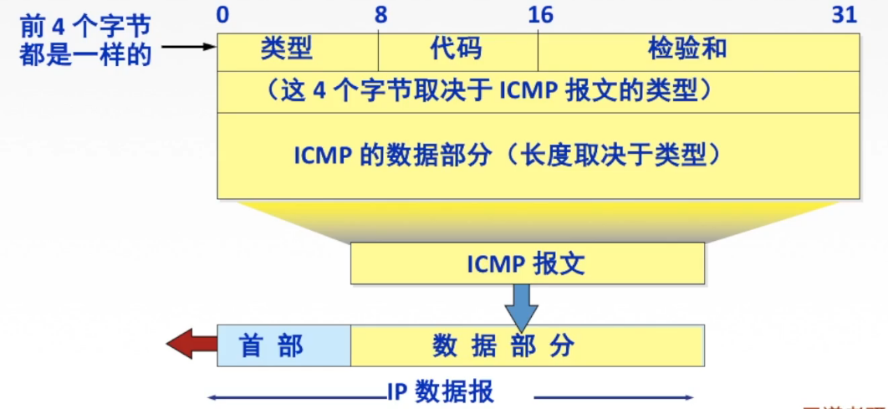
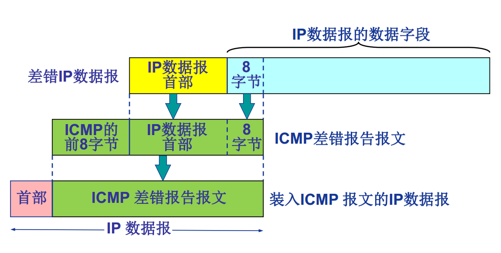
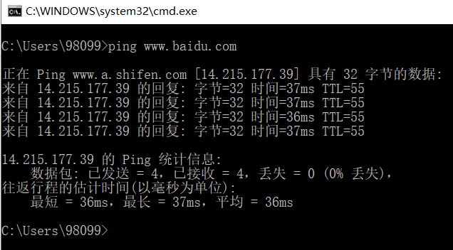
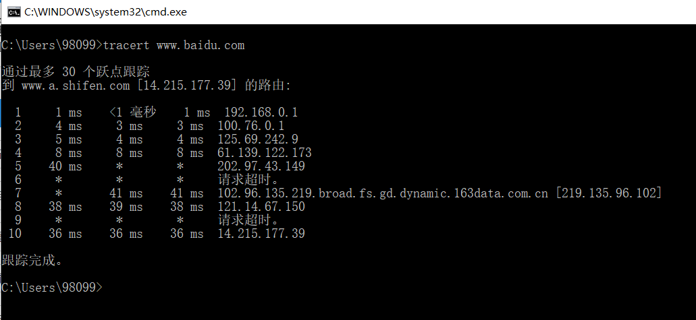

# 412 ICMP 协议

ICMP（Internet Control Message Protocol）协议支持主机或路由器，实现功能：差错（或异常）报告，网络探寻。

简而言之，ICMP 就是针对网络层传输出现差错，或进行网络探寻时，所发送的 ICMP 报文。

图1.ICMP 报文格式

ICMP 报文的格式：

1. 类型、代码、检验和：这 4 个字节都是固定的，一样的

2. 5B-8B：取决于 ICMP 报文的类型。

   | ICMP 报文种类 | 类型的值 | ICMP 报文的类型  |
   | ------------- | -------- | ---------------- |
   | 差错报告报文  | 3        | 终点不可达       |
   | 差错报告报文  | 11       | 时间超过         |
   | 差错报告报文  | 12       | 参数问题         |
   | 差错报告报文  | 5        | 改变路由         |
   | 询问报文      | 8 或 0   | 回送请求或回答   |
   | 询问报文      | 13 或 14 | 时间戳请求或回答 |

3. ICMP 的数据部分：长度取决于 ICMP 报文的类型。

   

   
图2.ICMP 差错报告报文的数据字段的内容

   比如，ICMP 差错报告报文来说，数据部分本质就是出错的 IP 数据报首部+其数据部分前 8 字节。
   提取差错 IP 数据报的数据部分前 8 字节，是为了获得运输层的端口号（对于 TCP 和 UDP）。

虽然从 图 2 看起来 ICMP 报文像是网络层的上层，因为 ICMP 报文是封装在 IP 数据报的数据部分中。

但实际上 ICMP 还是在网络层，属于网络层协议。

## 一. ICMP 报文的种类

ICMP 报文分为两种：**ICMP 差错报告报文** 和 **ICMP 询问报文**。

### 1.1 ICMP 差错报告报文

ICMP 差错报告报文，有四种：

1. **终点不可达**：

   当路由器或主机不能交付数据报时，就向源点发送终点不可达报文

2. **时间超过**：

   当路由器收到生存时间为零（TTL = 0）的数据报时，除丢弃该数据报外，还要向源点发送时间超过报文

   当终点在预先规定的时间内不能收到一个数据报的全部数据报片时，就把已收到的数据报片都丢弃，并向源点发送时间超过报文。

3. **参数问题**：

   当路由器或目的主机收到的数据报的首部中有的字段的值不正确时，就丢弃该数据报，并向源点发送参数问题报文。

4. **改变路由（重定向）**：

   路由器把改变路由报文发送给主机，让主机知道下次应将数据报发送给另外的路由器（可通过更好的路由）。

5. 源点抑制（王道的书说是五种，不过源点抑制报文取消了，所以现在是四种了）：

   当路由器或主机由于拥塞而丢弃数据报时，就向远点发送源点抑制报文，使源点知道应当把数据报的发送速率放慢。

那么不应发送 ICMP 差错报文的情况：

1. 对 ICMP 差错报告报文，不再发送 ICMP 差错报告报文。

2. 对第一个分片的数据报片的所有后续数据报片都不发送 ICMP 差错报告报文。

   即只对数据报分片的第一个分片发送 ICMP 差错报告报文，不会对不是第一个分片发送 ICMP 差错报告报文。

3. 对具有组播地址（一对多通信）的数据报都不发送 ICMP 差错报告报文。

4. 对具有特殊地址（如 127.0.0.0 或 0.0.0.0）的数据报不发送 ICMP 差错报告报文。

### 1.2 ICMP 询问报文

ICMP 差错报告报文，有四种，前面两种最常用，后两种现在已经不使用了：

1. **回送请求和回答**： 

   ICMP 回送请求报文，是由主机或路由器向一个特定目的主机发出的询问。

   收到此报文的主机必须给源主机或路由器发送 ICMP 回送回答报文。

   这种询问报文用来测试目的站是否可达和了解其有关状态。

2. **时间戳请求和回答**： 

   ICMP 时间戳请求报文，是请某台主机或路由器回答当前的日期和时间。

   在 ICMP 时间戳回答报文中有一个 32 位的字段，其中写入的正数代表冲 1900 年 1 月 1 日起到当前时刻一共有多少秒。

   时间戳请求与回答可用于时钟同步和时间测量。

3. 掩码地址请求和回答报文：

   现在已不使用。

4. 路由器询问和通告报文：

   现在已不使用。

## 二. ICMP 的应用

### 2.1 PING

PING：测试两个主机之间的连通性，使用了 **ICMP 回送请求和回送回答报文**。

例如，主机 A 向主机 B 发送四个 ICMP 回送请求报文，主机 B 正常工作就会相应，发回 ICMP 回送回答报文。由于往返的 ICMP 报文上都有时间戳，因此很容易得出往返时间等信息。

图3. 在 cmd 执行 ping www.baidu.com 命令

### 2.2 Trace route

Traceroute：跟踪一个分组从源点到终点的路径，使用了 **ICMP 时间超过差错报告报文**。

例如，主机 A 会向主机 B 发送一连串的 IP 数据报，但这些数据报中封装的是无法交付的运输层的 UDP 用户数据报。
首先第一个 IP 数据报 $P_1$ 的生存时间 TTL 设置为 1，当路由收到 $P_1$ 使其 TLL 减一等于零时，就会像源主机发送 **ICMP 时间超过**差错报告报文。
这样，主机 A 知道了发往主机 B 经过的第一个路由的信息。

然后主机 A 发送第二个 IP 数据报 $P_2$ ，并设置其 TTL = 2，同样地，当路由收到 $P_2$ 使其 TLL 减一等于零时，就会像源主机发送 ICMP 时间超过差错报告报文。
这样，主机 A 知道了发往主机 B 经过的第二个路由的信息。

然后主机 A 发送第三个 IP 数据报 $P_3$ ，并设置其 TTL = 3......

直到主机 A 发送的第 n 个 IP 数据报 $P_n$ ，刚好到达主机 B 时，TTL = 1。这样，主机 B 解封装，而由于数据报中封装的内容是无法交付的运输层的 UDP 用户数据报。所以主机 B 会向主机 A 发送一个 **ICMP 终点不可达**差错报告报文。

由此，主机 A 知晓了达到主机 B 需要经过路径，及其路径上每个路由和主机 B 的信息。

图4.在 cmd 执行 tracert www.baidu.com 命令

至于为什么一行有三个时间，因为每一个 TTL 值，源主机会发送三次同样的 IP 数据报。

2021.03.02

