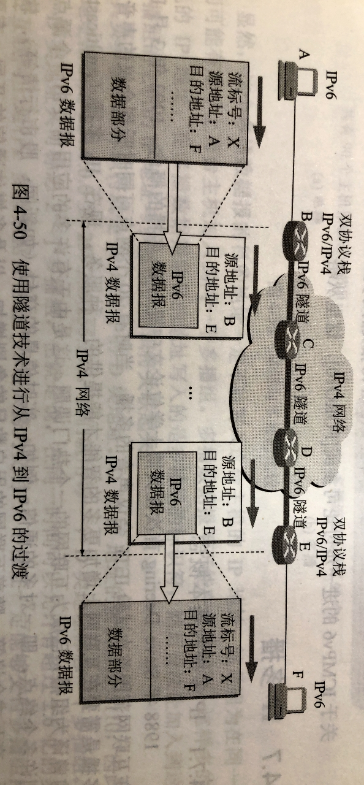

# 413 IPv6

前面说了，IPv4 由于是 32 位，最多也就 $2^{32}=4,294,967,296$ 个 IP 地址，虽然 NAT、CIDR 缓减了消耗的速度。但总归还是消耗完了。

而 IPv6 则是使用了 128 位的 IP 地址，所以从根本上解决了 IP 地址不足的问题，毕竟 $2^{128}$ 这个数据太大了，根本不可能用完。

当然 IPv6 不止如此，还改进了首部部分。实现了快速处理/转发数据报、支持 QoS 的功能。

QoS（Quality of Service，服务质量），指一个网络能够利用各种基础技术，为**指定的**网络通信提供更好的服务能力，是网络的一种安全机制，是用来解决网络延迟和阻塞等问题的一种技术。
例如，当网络拥塞时，对于支持 QoS 的设备，可以针对某种类别的数据流，对其设置某个级别的传输优先级，来表示其相对重要性。对于实时性要求不高的普通数据报，就可以设置较低优先级。

## 一. IPv6 数据报格式

IPv6 将协议数据单元 PDU 称为分组，而不是 IPv4 的数据报，但为了方便起见，我们还是使用数据报一词，或者分组和数据报混用。

图1.IPv6 格式

IPv6 数据报由两大部分组成，即**基本首部（base header）**和**有效载荷（payload）**。
有效载荷也称为**净载荷**。
有效载荷中由可分为两部分，允许有零个或多个**扩展首部（extension header）**，扩展首部后就是数据部分。

简而言之，将原本 IPv4 首部中不必要的功能取消，或挪到扩展首部，使得 IPv6 的基本首部字段数量减少到只有 8 个。
虽然 IPv6 的基本首部长度变成了固定的 40B，比最短的 IPv4 的首部 20B 增长了一倍。不过基本首部字段数量减少了，而路由器只处理基本首部，不处理扩展首部（除逐跳扩展首部外），所以还是提高了路由器的处理效率。

图2.IPv6 基本首部

字段：

1. 版本（version）：

   4bit，指明协议的版本，IPv6 对应的值为 6。

2. 通行量类（traffic class）：

   8bit，用于区分不同的 IPv6 数据报的类别或优先级。

3. 流标号（flow label）：

   20bit，

   IPv6 的一个新机制是支持资源的预分配，并且允许路由器把每一个数据报与一个给定的资源分配相联系。

   **流（flow）**是 IPv6 提出的抽象概念，指互联网络上从特定源点到特定终点（单播或多播）的一系列数据报（如实时音频或视频传输），而在这个流所经过的路径的路由器都保证指明的服务质量。

   所有属于同一个流的数据报都具有同样的流标号。

   因此，流标号对于实时音频/视频数据的传输特别由用。
   但对于传统的电子邮件或非实时数据，流标号则没有用处，将其置为 0 即可。

   （感觉，就是给这些特定的数据报保留好资源，使其能够快速地顺利转发。）

4. 有效荷载长度（payload length）

   16bit，指明 IPv6 数据报除基本首部外的字节数（毕竟 IPv6 基本首部是固定的 40B），最大为 $2^{16}=65536B(64KB)$ 。

5. 下一个首部（next header）：

   8bit，相当于 IPv4 的协议字段或可选字段。

   当 IPv6 数据报没有扩展首部时，下一个首部字段的作用和 IPv4 的协议字段一样，指出了基本首部后面的数据应交付 IP 层上面的哪一个高层协议（例如：6 或 17 分别表示应交付运输层 TCP 或 UDP）。

   当出现扩展首部时，下一个首部字段的值就标识后面第一个扩展首部的类型。
   而每一个扩展首部的第一个字段也都是 8bit 的下一个首部字段，也是标识其后第一个扩展首部的类型。

6. 跳数限制（hop limit）：

   8bit，用来防止数据报在网络中无限期地存在。最大为 255，每个路由器转发数据报时，先要把跳数减一，当跳数限制地值为 0 时，就把这个数据报丢弃。

7. 源地址：

   128bit，是数据报的发送端地 IP 地址。

8. 目的地址：

   128bit，是数据报的接收端的 IP 地址。

再说明一下扩展首部，在 RFC 2460 中定义了以下六种扩展首部：1. 逐跳选项；2. 路由选择；3. 分片；4. 鉴别；5. 封装安全有效荷载；6. 目的站选项。
每个扩展首部都有若干个字段组成，其长度也各不相同。
当使用扩展首部时，注意，扩展首部必须按照以上先后顺序出现，（如果有）逐跳选项应在最前面，（如果有）目的站选项应在最后面。
所以知道为什么基本首部、扩展首部都有一个字段是下一个首部了吧。

这些扩展首部（除了逐跳首部外）都是留给路径两端的源点和终点的主机来处理，路由器是不会处理扩展首部的（除了逐跳首部外），所以大大提高了路由器的处理效率。

## 二. IPv6 和 IPv4

1. IPv6 将地址从 32bit（4B）扩大到了 128bit（16B），有更大的地址空间。
2. IPv6 将 IPv4 的**校验和**字段彻底移除，以减少了每跳的处理时间。
   我们知道，在数据链路层对检查处有差错的帧就丢弃。在运输层，当使用 UDP 时，若检测出有差错的用户数据报就丢弃；当使用 TCP 时，对检车处有差错的报文段就重传，直到正确的传送到目的进程为止。因此在网络层的差错检测可以精简掉。
3. IPv6 将 IPv4 的可选字段移出首部，变成了扩展首部，成为灵活的首部格式，路由器不对拓展首部进行检查（除逐跳首部外），大大提高了路由器的处理效率。
4. IPv6 支持**即插即用**（即自动配置），不需要 DHCP 协议。
5. IPv6 首部长度（指基本首部+扩展首部长度）必须是 **8B 的整数倍**，IPv4 的首部是 4B 的整数倍。
6. IPv6 **只能在主机处分片**，IPv4 可以在主机或路由器处分片。
7. ICMPv6 有附加了报文类型 "分组过大"。
   因为 IPv6 只能在主机处分片，所以当中途接下来要传输的网络的数据链路层的最大传送单元 MTU 很小，怎么办呢？没办法，路由器只能丢弃该分组，返回一个分组过大的 ICMP 差错报告报文。
   不过这就是使用的 ICMPv6 协议了，ICMPv6 协议会附加一系列报文类型，其中就有分组过大类型。
8. IPv6 支持资源的预分配，支持实时视像等要求，保证一定的带宽和时延的应用。
9. IPv6 取消了协议字段，改用下一个首部字段。
10. IPv6 取消了总长度字段，改用有效载荷长度字段。
11. IPv6 取消了服务类型字段，因为优先级和流标号字段实现了服务类型字段的功能。

## 三. IPv6 地址表示形式

因为 IPv6 用 128bit 来表示 IP 地址，所以如果使用点分十进制来表示，未免有点太长了。
为了使地址简洁些，IPv6 使用**冒号十六进制记法（colon hexadecimal notation，简写 colon hex）**来表示，将每 16 位的值用十六进制表示，各值之间用冒号分割。例如：

点分十进制：104.230.140.100.255.255.255.255.0.0.17.128.150.10.255.255
冒号十六进制记法：68E6:8C64:FFFF:FFFF:**0**:1180:960A:FFFF

在十六进制记法中 ，允许把数字前的 0 省略。上面就把 0000 中的前三个 0 省略了。

冒号十六进制记法还可以允许**零压缩（zero compression）**，即一连串连续的零可以为一对冒号所取代，例如：FF05:0:0:0:0:0:0:B3，可压缩为:FF05::B3。
但为了保证含义准确，规定地址表示时只能使用一次零压缩。

还有一种表示方法，主要是在 IPv4 向  IPv6 转换阶段特别由用，即冒号前的值为十六进制记法，小数点前面的值为点分十进制记法：
例如：0:0:0:0:0:0:128.10.2.1，
再次使用零压缩即可得出：::128.10.2.1

CIDR 的斜线表示法仍然可用（那看来 IPv6 还是使用网络前缀），
例如：12AB:0000:0000:CD30:0000:0000:0000:0000/60
或：12AB::CD30:0:0:0:0/60
或：12AB:0:0:CD30::/60
表示其网络前缀为 60bit。

## 三. IPv6 基本地址类型

IPv6 数据报的目的地址可以是以下三种基本类型地址之一：

1. 单播地址：
   一对一通信，可作源地址，可作目的地址。
2. 多播地址：
   一对多通信，可作目的地址。
   IPv6 中并没有使用广播地址，而是合并到了多播地址中，毕竟多播的一对多，也可以包含一对所有的概念嘛。
3. 任播地址：
   一对多中的一个通信，本质是一对一通信，但表现出来像是一对多通信。可作目的地址。
   简而言之，使用任播地址作为目的地址，主机实际上是发送给该任播组中的某一主机（通常是距离最近的主机）。
   比如：当有多个服务器能提供同样网络服务时，对于用户来说使用具体哪个服务器并不重要，网络只需要负责将其传送到最好的（最近的）一个服务器就可以了。

## 四. ICMPv6

和 IPv4 一样，IPv6 也不保证数据报的可靠交付，因此 IPv6 也需要使用 ICMP 来反馈一些差错信息。
新的版本称为 ICMPv6，它比 ICMPv4 要复杂得多。
地址解析协议 ARP 和 网际组广利协议 IGMP 得功能都被合并到了 ICMPv6 中。

图3.IPv4 与 IPv6 网络层协议比较

ICMPv6 是面向报文的协议，它利用报文来报告差错，获取信息，探测邻站或广利多播通信。ICMPv6 还增加了几个定义报文功能及含义的其他协议。

在对 ICMPv6 报文进行归类时，不同的文献和 RFC 文档使用了不同的策略，有的把其中的一些定义为 ICMPv6 报文，而把另一些报文定义为**邻站发现 ND（Neighbor-Discovery）**报文或**多播听众交付 MLD（Multicast Listener Delivery）**报文。
但其实所有这些报文都应当是 ICMPv6 报文，至少功能和作用不同而已。
因此，我们把这些报文都列入 ICMPv6 的不同类别。
使用这种分类方法的原因是所有这些报文都具有相同的格式，并且所有报文类型都由 ICMPv6 协议处理。其实，像 ND 和 MLD 这样的协议都是允许在 ICMPv6 协议之下的。基于这样的考虑，可把 ICMPv6 报文分类如下图所示。请注意，邻站发现报文和组成员广西报文分别是在 ND 协议和 MLD 协议的控制下进行发送和接收的。

图4.ICMPv6 报文的分类

## 四. IPv4 向 IPv6 过渡的策略

毕竟互联网的规模已经太大了，要直接全改用 IPv6 不现实，所以只能慢慢过渡呗。

怎么过渡有两种办法。

### 4.1 双协议栈（dual stack）

使一部分主机（或路由器）装有双协议栈：IPv4 和 IPv6。
因此双协议栈主机（或路由器）既能和 IPv4 系统通信，也能和 IPv4 的系统通信。
双协议栈主机（或路由器）记为 IPv6/IPv4，表明它同时具有两种 IP 地址：IPv4 地址和 IPv6 地址。

如果是双协议栈路由器，则很可能这台路由器的不同接口，分别配置了 IPv4 地址和 IPv6 地址，并分别连接 IPv4 网络或 IPv6 网络。

如果是双协议栈主机发送数据时，不知道目的主机是双协议栈，IPv4 还是 IPv6 主机，怎么觉得使用 IPv4 还是 IPv6 呢？
它是使用域名系统 DNS 来查询，从而决定使用什么。
如果 DNS 返回的是  IPv4 地址，则双协议栈主机就使用 IPv4 地址。
如果 DNS 返回的是  IPv6 地址，则双协议栈主机就使用 IPv6 地址。

图5.使用双协议栈进行过渡

采用双协议栈方式，当 IPv6 数据报需要经过 IPv4 网络时（两台通信的 IPv6 主机中间存在 IPv4 网络），则在进入 IPv4 网络时，将 IPv6 数据报的首部转换为 IPv4  数据报的首部；在该数据报离开 IPv4 网络是，再恢复成原来的 IPv6 数据报。
但注意的是， IPv6 首部中的某些字段无法恢复，例如，IPv6 首部中的流标号，经过转换、恢复后，只能变为空缺。
这种信息的损失是使用首部转换方法所不可避免的。

### 4.2 隧道技术（tunneling）

图6.使用隧道技术进行过渡

在 IPv6 数据报要进入 IPv4 网络时，把 IPv6 数据报封装成 IPv4 数据报，即 IPv6 数据报变为 IPv4 数据报的数据部分。
当 IPv4 数据报离开  IPv4 网络时，再把数据部分（即原来的 IPv6 数据报）交给主机的 IPv6 协议栈。

所以就像隧道一样，IPv6 数据报在 IPv4 网络中进入隧道，看不见 IPv6 数据报了，从隧道出来时，才又恢复成 IPv6 数据报，又看见它了。

2021.03.02