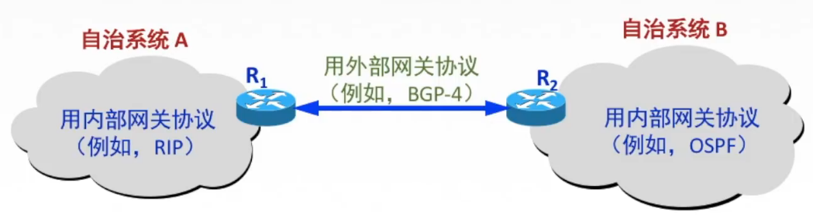

# 414 路由算法及路由协议概述

简单讲讲概述，在后面结合 IP 协议等内容再详细讲。

## 一. 路由算法

路由算法：

1. 静态路由算法（非自适应路由算法）：

   管理员手工配置路由信息。

   优点：简便、可靠，在负荷稳定、拓扑变化不大的网络中允许效果很好，广泛用于高度安全性的军事网络和较小的商业网络。

   缺点：路由更新慢，不适用大型网络。

2. 动态路由算法（自适应路由算法）：

   路由器间彼此交换信息，按照路由算法优化出路由表项。

   优点：路由更新快，适用大型网络，及时响应链路费用或网络拓扑变化。

   缺点：算法复杂，增加网络负担。

动态路由算法，又可细分：

2.1 全局性：所有路由器掌握完整的网络拓扑和链路费用信息。如，链路状态路由算法 OSPF。

2.2 分散性：路由器至掌握物理相连的邻居及链路费用。如，距离向量路由算法 RIP。

## 二. 路由协议

由于互联网规模太大，
也由于许多单位不想让外界知道自己的路由选择协议，但需要连入互联网。

所以在互联网中，存在多个自治系统 AS，一个自治系统 AS 是一个有权自主地决定在本系统中应采用何种路由协议的小型单位。 

**自治系统 AS**：在单一的技术管理下的一组路由器，而这些路由器使用一种 AS 内部的路由选择协议和共同的度量以确定分组在该 AS 内的路由，同时还使用一种 AS 之间的路由协议以确定在 AS 之间的路由。

一个 AS 内的所有网络都属于一个行政单位来管辖，一个 AS 的所有路游戏在本 AS 内都必须连通。

这样，路由现在协议分为了：

1. **内部网关协议 IPG（Interior Gateway Protocol）**：指在一个 AS 内使用的。如 OSRF，RIP。
2. **外部网关协议 EGP（Exterior Gateway Protocol）**：指在 AS 之间使用的。如 BGP。

（网关，在很久以前就是指路由器的意思）

图1.内部、外部网关协议

2021.02.20