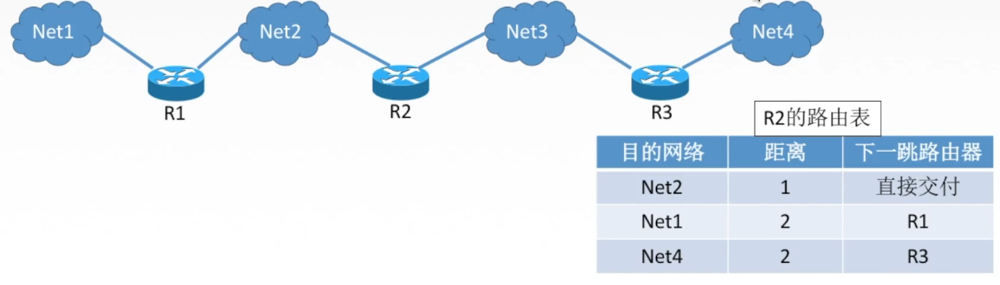
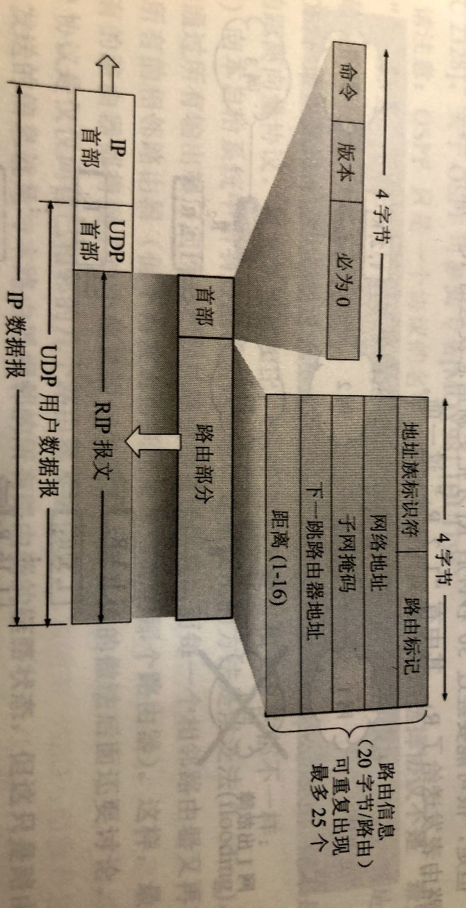
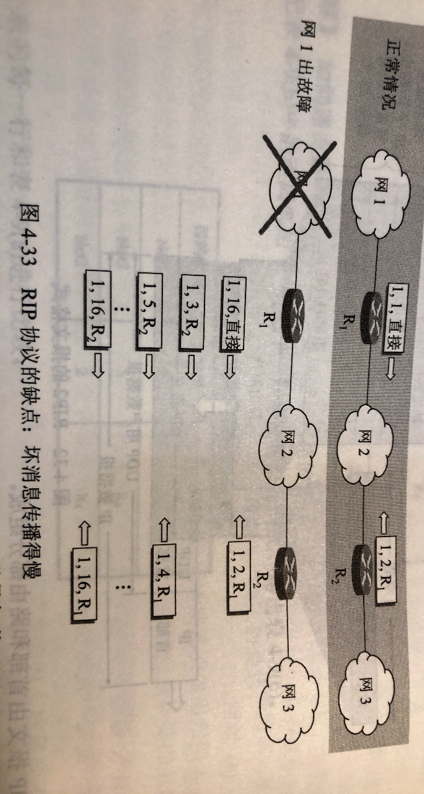

# 415 RIP 协议与距离向量算法

上一节讲了，路由协议分为内部网关协议 IGP、外部网关协议 EGP。
这一节，讲内部网关协议中的 RIP 协议。
下一节，讲内部网关协议中的 OSPF 协议。

## 一. 距离

RIP（Routing Information Protocol） 是内部网关协议 IGP 中最先得到广泛使用的协议。

RIP 是一种分布式**基于距离向量的路由选择协议**，是互联网的标准协议，其最大的优点就是简单。

RIP 协议要求网络中的每一个路由器都要维护从它到其他每一个目的网络的距离记录（因此，这是**一组距离**，即**距离向量**）。

图1.使用 RIP 协议的路由器 R_2 的路由表

RIP 协议将**距离**定义如下：

从一路由器到**直接连接的网络的距离定义为 1**。（也就是该路由器到自己直接连接的网络的距离为 1）
从一路由器到非直接连接的网络的距离定义为所经过的路由器数加 1。（加 1 是因为到达目的网络后就进行直接交付，而到直接连接的网络的距离已经定义为 1 了）。

（其实也可以将路由器到自己直接连接的网络定义为 0，无法就是整体距离减 1 的区别，在实现上并无其他差别。）

RIP 协议的距离，也被称为**跳数（hop count）**，因为每经过一个路由器，跳数就加 1。

RIP 协议认为好的路由就是它通过的路由器的数目少，即距离短。
**RIP 允许一条路径最多只能包含 15 个路由器。因此，如果距离等于 16 时，则表示网络不可达。**
可见，RIP 协议**只适用于小型互联网**。

RIP 只会选择最短距离的路由，所以即便存在着另一条更低时延但路由器更多的路由，也不会走这条路由。So，RIP 不能在两个网络之间同时使用多条路由。

## 二. 交换信息

RIP 协议与下一节的 OSPF 协议，都是**分布式路由选择协议**，其共同特点就是，每一个路由器都要不断地和其他一些路由器交换路由信息。

所以，思考以下问题：和哪些路由器交换信息？交换什么信息？在什么时候交换信息？

RIP 协议的特点是：

1. **仅和相邻路由器交换信息**。

   如果两个路由器之间的通信不需要经过另一个路由器，那么这两个路由器是相邻的。RIP 协议规定，不相邻的路由器不交换信息。

2. 路由器交换的信息是**当前本路由器所知道的全部信息，即自己现在的路由表**。

   也就是说，交换的信息是：" 我到本自治系统中所有网络的（最短）距离，以及到每个网络应经过的路由器 "。

3. **按固定的时间间隔**交换路由信息。

   例如，每隔 30 秒交换信息。然后路由器根据收到的路由信息更新路由表。

   当网络拓扑发生变化时，路由器也及时向相邻路由器通告拓扑发生变化后的路由信息。
   比如，当超过一定时限没有收到相邻路由器的通告，如超过 180 秒，则认为该相邻路由器退出了网络（网络拓扑发送了变化），则把此相邻路由器记为不可达的路由器，即把距离置为 16。

当路由器**刚刚开始工作时**，此时它的路由表是空的。
然后，路由器可得出它与它直接相连的网络的距离（都是 1）。
接着，路由器与**数量相当有限的**相邻路由器交换并更新路由信息。
经过若干次更新后，所有路由器最终都会知道到达本自治系统中任何一个网络的最短距离和下一跳路由器的地址，即**收敛**。

一般情况下，RIP 协议可以收敛，且过程也较快。

## 三. 距离向量算法

路由表中最主要的信息就是，到某个网络的距离，以及经过下一跳的下一跳地址。
路由表更新的原则是找出每个目的网络的最短距离。这种更新算法成为**距离向量算法**。

对**每一个相邻路由器**发送过来的 **RIP 报文**，进行以下步骤：

1. 对地址为 X 的相邻路由器法来的 RIP 报文，先修改此报文中的**所有项目**，把 "下一跳" 字段中的地址都改为 X，并把所有 "距离" 字段的值都加 1。每一个项目都有三个关键数据，即：到目的网络 N，距离 d，下一跳路由器 X。

2. 对修改后的 RIP 报文中的每一个项目，进行以下步骤：

   2.1 若原来的路由表中没有目的网络 N，则把该项目添加到路由表中。

   2.2 否则（即在路由表中有目的网络 N，这是就在查看下一跳路由器地址）

   ​		2.2.1 若下一跳路由器地址是 X，则把收到的项目替换原路由表中的项目（以新的消息为准）。

   ​		2.2.2 否则（即这个项目是：到目的网络 N，但下一跳路由器不是 X）

   ​			2.2.2.1 若收到的项目中的距离 d 小于路由表中的距离，则进行更新。

   ​			2.2.2.2 否则什么也不做。

3. 若 3 分钟还没有收到相邻路由器的更新路由表，则把此相邻路由器记为不可达的路由器，即把距离置为 16。

4. 返回。

上面给出的距离向量算法的基础就是 Bellman-Ford 算法（或 Ford-Fulkerson 算法）。

例题，就不写了。
提一下，题目可能给出的是向量，例如一个网络中有路由器 A、B、C、D、E、F，路由器 C 收到了来自 B 的向量为（5，0，8，12，6，2）。
这个向量各元素依次对应 B 到 A、B、C、D、E、F 的距离。可以注意到，该向量第二个为 0，因为到 B 自己嘛。

RIP 协议让一个自治系统中的所有路由器都和自己的向量路由器定期交换路由信息，不断更新其路由表，使得从**每一个路由器到每一个目的网络的路由都是最短的**（即跳数最少）。
这里应该注意：虽然所有路由器最终都拥有了中各自治系统的全局路由信息，但由于每一个路由器的位置不同，它们的路由表也应当是不同的。

## 四. RIP 协议的报文格式

图2.RIP2 的报文格式

现在较新的 RIP 版本是 1998 年 11 月公布的 RIP2（已成为互联网标准）。
图 2 为 RIP2 的报文格式。

这个格式内容应该不是考点，提出来主要是说明几个知识点。

RIP 报文是首部+路由部分，然后塞到 UDP 里面（传输层），再塞到 IP 数据报里（网络层）。
可见，RIP 协议是**应用层协议**。

一个 RIP 报文最多有 25 个路由信息（每个 20 字节），所以一个 RIP 报文最多也就只能携带 25 个路由信息，如果超过了 25 个，那么就再另发一个或多个 RIP 报文。

图3. RIP 的缺点：坏消息传播得慢

RIP 存在一个问题：**当网络出现故障时，要经过比较长得时间次啊能将此信息传送到所有路由器**。

这里的 $(1,b,c)$ 含义是：1 表示从本路由到网 1，这里全为 1；$b$ 表示距离为 $b$ ；$c$ 表示直接交付或者为下一跳路由器 $c$ 。

如图 3，当网 1 出故障，路由器 $R_1$ 修改 $(1,1,直接)$ 为 $(1,16,直接)$ ，但很可能需要等待 30 秒后才能发送给 $R_2$ 。
然而 $R_1$ 还未发送出去时， $R_2$ 发来了路由信息给 $R_1$ 。
于是 $R_1$ 就会误以为 $R_2$ 能够到达网 1，用从 $R_2$ 收到的 RIP 报文中的 $(1,2,R_1)$ ，把 $(1,16,直接)$ 覆盖掉（距离更短，替换）。

然后到了 $R_1$ 给 $R_2$ 发送路由信息。
 $R_2$ 更新的 $(1,2,R_1)$ 为 $(1,3,R_1)$ （同一路由以新的信息为准）。

然后循环往复，直到距离值变为 16，双方路由器才知道这个网 1 是不可达的。

反过来说，如果是好消息（更短的距离），就更新得快呗。
所以 RIP 协议这一特点总结为：**好消息传播的快，坏消息传播得慢**。
网络出现故障的传播时间往往需要较长时间（例如数分钟）。这是 RIP 的一个主要缺点。

其他缺点，因为路由器交换整个路由表，所以网络规模越大，开销也越大。

当然优点有**实现简单，开销较小，收敛过程较快**等。

2021.03.12