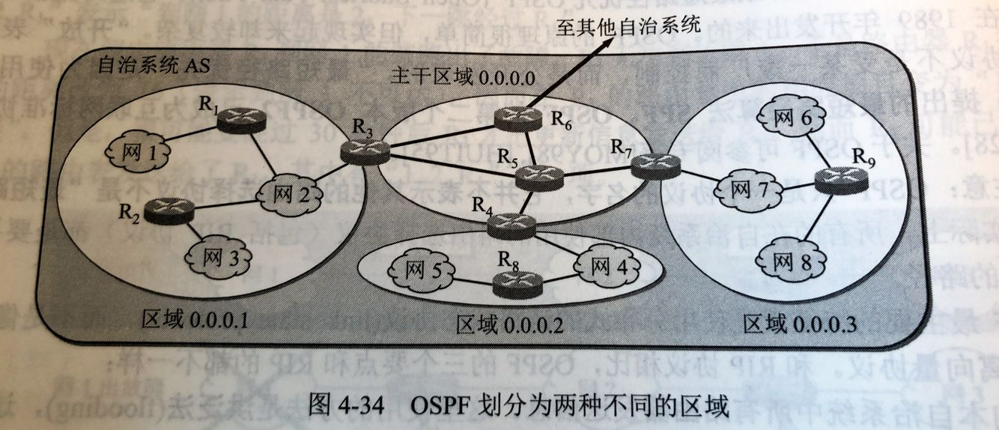
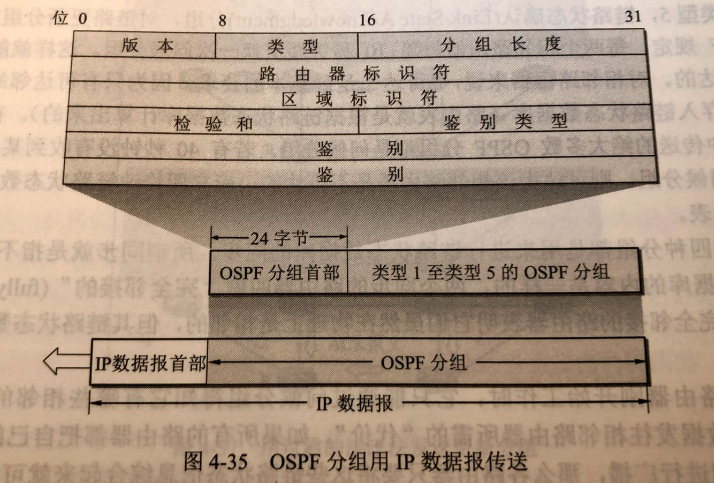
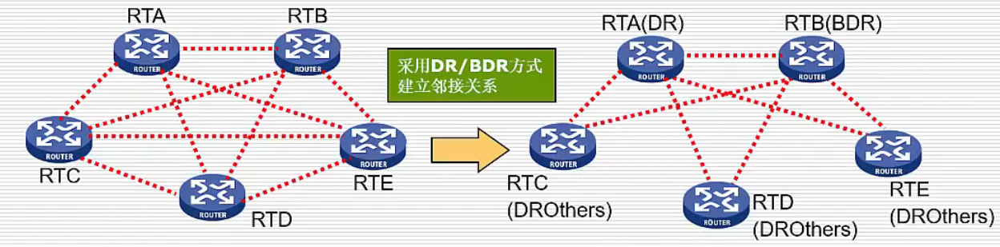

# 416 OSPF 协议与链路状态算法

**开放最短路径优先 OSPF（Open Shortest Path First）**，是为了客服 RIP 协议的缺点在 1989 年开发出来的。

开放，指 OSPF 协议不是受某一家厂商控制，而是公开发表的。
最短路径优先，是因为使用了 Dijkstra 提出的最短路径算法 SPF。

OSPF 原理很简单，但实现起来较为复杂。

OSPF 最主要的特征就是使用分布式的**链路状态协议（link state protocol）**，与 RIP 的距离向量协议相比，OSPF 的三个要点与之都不一样。

## 一. 交换信息

同样考虑三个问题：和哪些路由器交换信息？交换什么信息？在什么时候交换信息？

1. 向本自治系统中**所有路由器**发送信息。

   但 OSPF 使用的是**洪范法（flooding）**，这就是路由器通过所有输出端口向所有相邻的路由器发送信息。而每一个相邻路由器又再将此信息转发往其所有相邻路由器（但不再发送给刚刚发来信息的那个路由器）。这样，最终整个区域中所有的路由器都得到了这个信息的一个副本。

   详细后面讲，这里主要区别 RIP 是只向相邻路由器发送信息。
   （不过我感觉，这样子 OSPF 不也是只向相邻路由器发送信息嘛。应该说 RIP 和 OSPF 交换信息，也不对，应该是第一手信息交换的对象吧，RIP 是相邻路由器，OSPF 是所有路由器。下面详细说明吧。）

2. 发送的信息就是与本路由器**相邻的所有路由器的链路状态**，但这只是路由器所知道的**部分信息**。

   所谓链路状态，就是说明本路由器都和哪些路由器相邻，以及该链路的**度量（metric）**。
   OSPF 将这个度量用来表示费用、距离、时延、带宽等等。这些都由网络管理人员来决定，因此较为灵活。有时为了方便就称这个度量为**代价**。

   详细后面讲，这里主要区别 RIP 是发送的信息是 "到所有网络的距离和下一跳路由器 "。

3. 只有当链路状态**发生变化时**，路由器才向所有路由器用洪范法发送此信息。

   而不像 RIP 那样，不管网络拓扑有无发生变化，路由器之间都要定期交换路由表的信息。
   
   （怪不得使用洪范法，这种看起来开销就很大的算法，因为平常不用更新。）

链路，在讨论路由器之间交换信息时，最好就是将路由器之间的网络简化为一条链路。OSPF 中链路状态中的链路，实际就是指和这两个路由器都有接口的网络。

最终，所有路由器都能建立一个**链路状态数据库（link-state database）**，即**全网的拓扑结构图**。这个拓扑结构图在全网范围内是**一致的**（这成为**链路状态数据库的同步**）。

因此每个路由器都知道全网共有多少个路由器，以及哪写路由器是相连的，其代价是多少，等等。
每一个路由器使用链路状态数据库中的数据，构造出自己的路由表（例如，使用 Dijkstra 的最短路径路由算法）。
注意到，RIP 协议的每一个路由器虽然知道到所有的网络的距离以及下一跳路由器，但却是**不知道全网的拓扑结构**（只有到了下一跳路由器，才能知道再下一跳应当怎么走）。

OSPF 的链路状态数据库能较快地进行更新，使各个路由器能计师更新其路由表。
OSPF 的**更新过程收敛得快**是其重要优点。

## 二. 链路状态路由算法

步骤：

1. 每个路由器发现它的邻居节点**问候分组（Hello 分组）**，并了解邻居节点的网络地址。

   任何两个相邻路由器每隔 10s 都会交换一次问候分组。这样就能确定那些邻站是可达的。
   若有 40s 没有收到某个相邻路由器发来的问候分组，则可认为该相邻节点不可达。

   这里我没有弄清：" 通常每隔 10 秒，相邻路由器都要交换一次 HELLO 分组 "。
   这句话是指：
   a. 在发送 HELLO 分组的阶段，每隔 10s 发送一次。
   b. 还是在交换信息的整个阶段中，持续发送，交换信息结束后就停止了。
   c. 还是即便信息交换完之后，也在持续地发送 HELLO 分组呢。

   只在网上查到一些侧面信息：
   OSPF 有七种状态，如果正常的话，使用 OSPF 协议的路由器会进入 FULL 状态。
   FULL 状态也就是我这里写的步骤完成，两相邻路由器之间的信息交换完毕后，进入的状态。
   在 FULL 状态中，两相邻路由器会每隔 10s 发送一次 HELLO 分组，来维持邻居关系；若 40s 内未收到对方的 HELLO 分组，则认为邻居不可达了（链路状态发送了改变）。

   不过从我查到的这些信息，最多也只能推测出，在我写的步骤中，这第一步发送 HELLO 分组时是在持续发送的；在最后进入 FULL 状态是在持续发送的。至于中间的步骤是否在持续发送呢，那就无法得知了。
   感觉应该是一直持续地吧。

2. 设置它到每隔邻居的成本度量（metric）。

3. 构造**数据库描述分组（DD 分组）**，向邻站给出自己的链路状态数据库中的所有链路状态项目的摘要信息。

   链路状态数据库就是全网的拓扑结构图，将其的摘要信息放入数据库描述分组，发送给邻站。

4. 如果邻站收到的 DD 分组中的摘要自己都有，则邻站不做处理；如果存在没有的或是更新的，则发送**链路状态请求分组（LSR 分组）**，请求自己没有的或比自己更新的详细的信息。

5. 收到了邻站的 LSR 分组，发送**链路状态更新分组（LSU 分组）**给邻站进行更新。

6. 邻站更新完毕后，邻站返回一个**链路状态确认分组（LSA 分组）**，对链路更新分组确认。

当任一个路由器的链路状态发生变化

5. 洪范法发送 LSU 分组进行更新。
6. 更新完毕后，其他站返回一个链路状态请求分组 LSA 。
7. 使用 Dijkstra 根据自己的链路状态数据库构造到其他节点间的最短路径。

## 三. OSPF 的区域

将一个自治系统再划分为若干个更小的**区域（area）**。
每个区域都有一个 32 位的区域标识符（用点分十进制表示）。
区域不能太大，区域中的路由最好不超过 200 个。
划分区域的好处就是利用洪泛法交换链路状态信息的范围局限于每一个区域而不是整个自治系统，这就减少了整个网络上的通信量。

图1.OSPF 划分为两种不同区域

在一个区域内部的路由器只知道本区域的完整网络拓扑，而不知道其他区域的网络拓扑的情况。为了使每一个区月能够和本区域意外的区域进行通信，OSPF 使用**层次结构的区域划分**。

在上层的区域叫作**主干区域（backbone area）**。
主干区域的标识符规定为 0.0.0.0。主干区域的作用是用来连通其他在下层的区域。

从其他区域来的信息都由**区域边界路由器（area border router）**进行概括，如 $R_3,R_4,R_7$ 。显然每个区域至少应当有一个区域边界路由器。

在主干区域内的路由器叫作**主干路由器（backbone router）**，如 $R_3,R_4,R_5,R_6,R_7$ 。
**一个主干路由器可以同时是区域边界路由器**，如 $R_3,R_4,R_7$ 。

主干区域内还要有一个路由器专门和本自治系统外的其他自治系统交换路由信息，这样的路由器叫作**自治系统边界路由器**，如 $R_6$ 。

## 四. OSPF 分组格式

图2.OSPF 分组用 IP 数据报传送

OSPF 分组是OSPF分组首部+某个类型的 OSPF 分组（上面的五种分组），然后塞到 IP 数据报里（网络层）。
可见，**OSPF 直接使用 IP 数据报传送，而RIP 是直接使用 UDP 传送**。

使用 XXX 传送，是指将该信息作为 XXX 的数据部分进行传送。

OSPF 处于什么层次，说法不一，有说网络层，有说传输层，都有道理。
但是按**考纲算是在网络层的**，所以我按考纲来。

## 五. OSPF 其他特点

其他特点：

1. 为了确保链路状态数据库与全网的状态保持一致，OSPF 规定每隔一段时间，如 30 分钟，要刷新一次数据库中的链路状态。

   网上找的信息：这里刷新意思是，路由器对自身链路状态数据库中的每个 LSR 都有一个 30 分钟的计时器，当这个 LSR 的计时器超过 30 分钟时，就会与发来该 LSR 的邻居路由器进行一个上述的链路状态路由算法。

   感觉粗略地可以这样说，每隔 30 分钟就看看自己周围的邻居的链路状态，和自己链路状态进行对比、更新。

2. 由于一个路由器的链路状态只涉及与相邻路由器的连通状态，因此与整个互联网的规模并无直接关系。因此当互联网的规模很大时，OSPF 协议要比距离向量协议 RIP 好得多。

3. OSPF 协议不存在坏消息传得慢的问题，收敛速度很快。

4. 当 N 个路由器连接在一个以太网上，则每个路由器需要向其他 N-1 个路由器都发送链路状态信息，所以共有 N(N-1) 个链路状态信息要进行传送。针对这种多点接入的局域网的情况，OSPF 采用了**指定路由器（desingnated router）**的方法,使广播的信息量大大减少。
   即其他路由器只与指定路由器 DR 建立邻居关系，交换链路信息。

   为了减小 DR 突然故障产生的影响，可以同时也将 DR 的某相邻路由器设置为 BDR（Backup Designated Router，备份指定路由器），当 DR 故障时，则 BDR 就变为了 DR。
   如果没有 BDR，那么短时间内，这个网络就需要重新经由算法选出 DR，重新与新 DR 交换链路信息......，而在此期间，网络是中断的。

   DR、BDR 以外的其他路由器就称为 DROther。

   

   
图3.DR、BDR、DROther

2021.03.13

