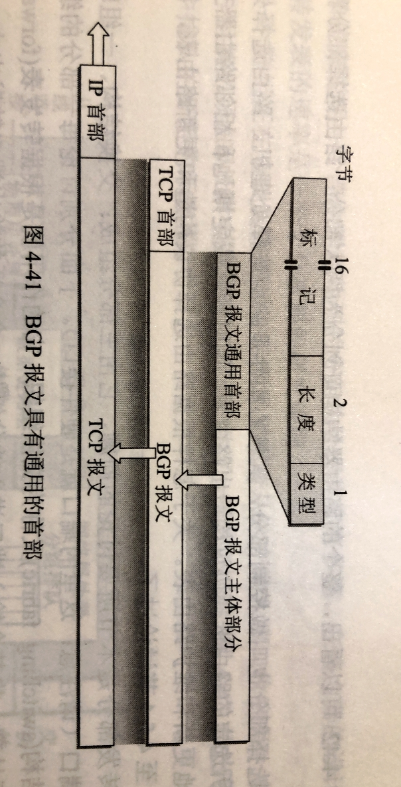

# 417 BGP 协议

外部网关协议 EGP ——边界网关协议 BGP。

## 一. 为什么使用外部网关协议

为什么在不同自治系统 AS 之间不使用内部网关协议呢？

1. 互联网的规模太大，使得 AS 之间路由选择非常困难。

   连接在互联网主干网上的路由器，必须对任何有效的 IP 地址都能在路由表中找到匹配的目的网络。而目前在互联网的主干网路由器中，一个路由表的项目数早已超过了五万个网络前缀。如果使用链路状态协议，则每一个路由器必须维持一个很大的链路状态数据库。而且使用 Dijkstra 算法计算最短路径的耗时也太长。

   另外，由于 AS 各自允许自己选定的内部路由选择协议，并使用本 AS 指明的路径度量，因此，当一条路径通过几个不同的 AS 时，想要对这样的路径计算处有意义的代价也是不太可能的。
   例如，某 AS 的代价 1000 表示一条较长的路由，而在另一个 AS 中 1000 表示不可达。

   所以比较合理的方法是，在 AS 之间交换 "可达性" 信息，告诉可达或不可达。例如，告诉相邻路由器：" 到达目的网络 N 可经过自治系统 $AS_x$ "。

2. 自治系统 AS 之间的路由选择必须考虑有关策略。

   由于相互连接的网络的性能相差很大，根据最短距离（最少跳数）找出来的路径，可能并不合适。也有的路径代价很高或很不安全。
   还有一种情况，如 $AS_1$ 要发送数据报给 $AS_2$ ，本来最好是经过 $AS_3$ ，但 $AS_3$ 不愿意让这些数据报经过自己的网络。另一方面 $AS_3$ 又愿意让某些其他的 $AS_x$ 经过，例如 $AS_3$ 是一个收费使用的自治系统，某些其他的 $AS_x$ 是付费用户。又例如，我国国内的站点在传送数据时，就不应当经过外国兜圈子，尤其是对我国安全有威胁的国家。

   所以，自治系统 AS 之间的路由选择应当允许使用多种路由选择策略，是为了找出较好的路径，而不是最佳路径。

综上所述，BGP 只能是力求寻找一条**能够到达目的网络且比较好的路由**，而**并非**是寻找一条最佳路由。
BGP 采用了**路径向量（path vector）路由选择协议**，与距离向量协议、链路状态协议都有很大区别。

## 二. BGP 协议交换信息

图1.BGP 发言人

在配置 BGP 时，每一个自治系统的管理员要选择至少一个路由器作为该自治系统的 **BGP 发言人**。一般来说，两个 BGP 发言人都是通过一个共享网络连接在一起的，而 BGP 发言人往往就是 **BGP 边界路由器**，但也可以不是 BGP 边界路由器。

一个 BGP 发言人与其他自治系统中的 BGP 发言人要交换路由信息，就要先建立 **TCP 连接（端口号为 179）**，然后在此连接上交换 BGP 报文以建立 **BGP 会话（session）**，利用 BGP 会话交换路由信息。
使用 TCP 连接交换路由信息的两个 BGP 发言人，彼此称为对方的**邻站（neighbor）**或**对等站（peer）**。

还是思考：和哪些路由器交换信息？交换什么信息？在什么时候交换信息？

1. 一个 BGP 发言人与其他 AS 的 BGP 发言人交换路由信息。
2. 交换网络的可达性的信息，即要到达某个网络索要经过的一系列 AS。
3. 发生变化时，更新有变化的部分。

图2.自治系统的连通图

交换信息的过程不需要详细了解。
只需要知道交换的信息是路径向量，其信息包含了到达某个网络需要经过哪些自治系统。

BGP 所交换的网络可达性的信息就是要到达某个网络所要经过的一系列 AS 。
当 BGP 发言人互相交换了网络可达性的信息后，各 BGP 发言人就根据所采用的策略从收到的路由信息中找出到达各 AS 的较好路由。

图 2 所示，为图 1 中的 $AS_1$ 上的一个 BGP 发言人构造出的自治系统连通图，可见构造出的为**树型结构**，不存在回路。

图3.交换路径向量的例子

如图 3 给出了一个例子。
自治系统 $AS_2$ 的 BGP 发言人同之主干网的 BGP 发言人："要到达网络 $N_1,N_2,N_3,N_4$ 可经过 $AS_2$ "。
主干网在收到这个通知后，就发出通知："要到达网络 $N_1,N_2,N_3,N_4$ 可沿路径 $(AS_1,AS_2)$ "。
同理，主干网还可发出通知："要达到网络 $N_5,N_6,N_7$ 可沿路径 $(AS_1,AS_3)$ "。

## 三. BGP 协议报文格式

图4.BGP 报文格式

将 BGP 报文塞进 TCP 报文中，作为 TCP 报文的数据部分，然后再塞进 IP 数据报的数据部分。

可见，**BGP 协议是应用层协议**，使用 TCP 传送。

## 四. BGP 协议特点

特点：

1. BGP 协议支持 CIDR，因此 BGP 的路由表也就包括目的网络的网络前缀、下一跳路由器、到达目的网络所要经过的各个自治系统序列。
2. 在 BGP 刚运行时，BGP 的邻站是交换整个 BGP 路由表。但以后只需要在发生变化时更新有变化的部分。这样做对节省网络带宽和减少路由器的处理开销方面都有好处。
3. BGP 交换路由信息的节点数量是自治系统的数量级，要比这些自治系统中的网络数少很多。
4. 每个自治系统中 BGP 发言人的数目是很少的。这样就使得自治系统之间的路由选择不致过过分复杂。

## 五. BGP 的四种报文

四种报文：

1. OPEN（打开）报文：
   用来与相邻的另一个 BGP 发言人建立关系，使通信初始化。

   若两个邻站属于两个不同 AS，而其中一个邻站打算与另一个 BGP 发言人建立关系，使通信初始化，这就应当有一个商讨的过程（因为很可能对方路由器的符合已经很重而不愿意再加重负担）。因此，一开始向邻站进行商谈时就必须发送 OPEN 报文。如果邻站接收这种邻站关系，就用 KEEPALIVE 报文响应。这样，两个 BGP 发言人的邻站关系就建立了。

2. UPDATE（更新）报文：
   用来通告某一路由的信息，以及列出要撤销的多条路由。

   BGP 发言人可以用 UPDATE 报文撤销它以前曾通知过的路由，也可以宣布增加新的路由。撤销路由可以依次撤销许多条，但增加新路由时，每隔 UPDATE 报文只能增加一条。

3. KEEPALIVE（保活）报文：
   用来周期性地证实邻站的连通性。也作为 OPEN 报文的确认。

   为了维持邻站关系，双方中的每一方都需要确信对方是存在的，且一直在保持这种邻站关系。为此，这两个 BGP 发言人彼此要周期性地交换 KEEPALIVE 报文（一般间隔 30s）。KEEPALIVE 报文只有 19 字节长（只用 BGP 报文地通用首部），因此不会造成网络上太大的开销。

4. NOTIFICATION（通知）报文：
   用来发送检测到的差错。也用于关闭连接。

## 六. 三种路由协议的比较

RIP 是一个分布式的基于距离向量的内部网关路由选择协议，通过广播 UDP 报文来交换路由信息。

OSPF 是一个分布式的基于链路状态的内部网关路由选择协议，使用 IP 协议。

BGP 是一个外部网关协议，在不同的自治系统之间交换路由信息，由于网络环境复杂，需要保证可靠传输，所以采用 TCP。

图5.王道的对比总结

2021.03.14