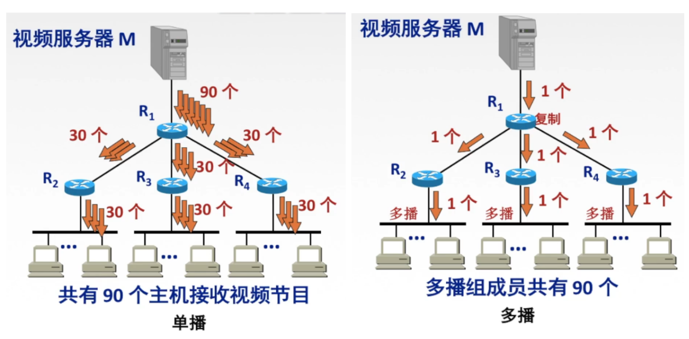
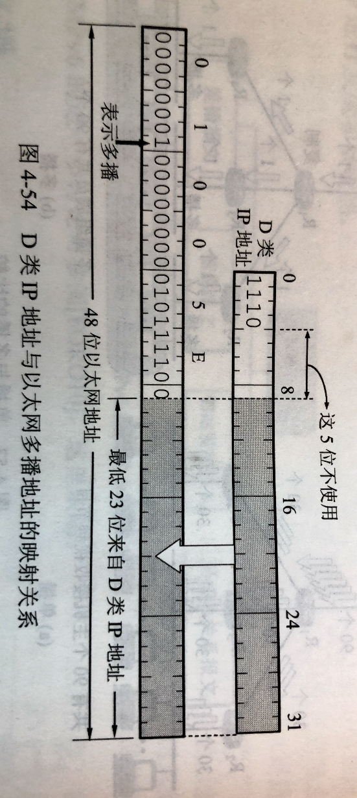
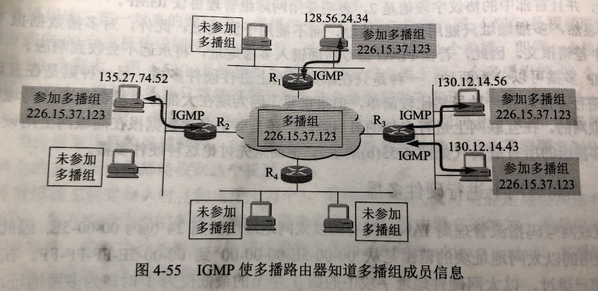

# 418 IP 多播

## 一. IP 数据报的传播方式

1. 单播：单播用于发送数据报到单个目的地，且没发送一份单播报文都使用一个单播 IP 地址作为目的地址。是一种**点对点**传输方式。
2. 广播：广播是指发送数据报到同一广播域或子网内的所有设备的一种数据传输方式，是一种**点对多点**传输方式。
3. 多播（以前译为组播，现通常用多播）：当网络当中的某些用户需要特定数据时，组播数据发送者仅发送一次数据，借助组播路由协议为组播数据报建立组播分发树，被传递的数据到达距离用户端尽可能近的节点后才开始复制和分发，是一种**点对多点**传输方式。

图1.单播、多播

对比：单播、多播。
如图1，服务器给 90 个用户发送同样的数据报。

使用单播的方式，则在服务器到这 90 个用户的路由上，会传输 90 个相同的数据报。

使用多播的方式，则是前面路由上只有一份数据报，当遇到有用户不在同一路径、需要分路时，路由器才将数据报复制、转发。如图 1 中多播在 $R_1$ 复制三份，分别转发给 $R_2、R_3、R_4$ 。当到达用户所在局域网时，由于局域网本身具有硬件多播功能，因此也**不需要再复制**分组而在改局域网上的多播组成员都能收到改数据报。

广播则是无差别的对同一广播域或子网内的所有设备发送数据报，不管是否有需求。
显然，一般没有必要这么做，毕竟广播也是会占用带宽的，对于没有该数据报需求的主机收到没用的广播就很烦。

显然的，当多播组的主机数很大时，采用多播方式就可以明显地减轻网络中各种资源地消耗。
在互联网范围的多播要靠路由器来实现，这些路由器必须增加一些能够识别多播数据报的软件。能够运行多播协议的路由器称为**多播路由器（multicast router）**。多播路由器当然也可以转发普通的单播 IP 数据报。

多播组中的主机可以是在同一个物理网络，也可以来自不同的物理网络，如图 1 多播组来自三个不同的网络。

## 二. IP 多播地址

在互联网上进行多播就叫做 **IP 多播**。
IP 多播所传送的分组需要使用多播 IP 地址。
属于同一多播组的设备将被分配一个组播 IP 地址。

实际上，在前面提到过，我们使用 IP 地址中的 D 类地址（1110 开头）在作为多播 IP 地址。
D 类地址范围：224.0.0.0 到 239.255.255.255。
理论上，每一个 D 类地址标志一个多播组，所以 D 类地址共可标志 $2^{28}(2^{32-4})$ 个多播组。
显然，**多播地址只能用于目的地址，不能用于源地址**。

注意知识点：

1. 多播数据报是 "尽最大努力交付"，不保证一定能够交付多播组内的所有成员，不提供可靠交付，应用于 UDP（UDP 是不提供可靠交付的一个协议，虽然不可靠交付，但用起来比较快）。
2. 对多播数据报不产生 ICMP 差错报文。因此，在 PING 命令后面键入多播地址，将永远不会收到响应。
3. **并非所有 D 类地址都可以作为组播地址**。因为有些地址已经被用其他用途了。

## 三. 硬件多播

IP 多播分为两种：在互联网范围内进行多播、在局域网内进行硬件多播。
后者虽然比较简单，但很重要，比较现在大部分主机都是通过局域网接入互联网的。在互联网进行多播的最后阶段，还是要把多播数据报在局域网上用硬件多播交付多播组的所有成员。

下面讨论在局域网上进行硬件多播。

类似地，MAC 地址中，设定部分 MAC 地址作为硬件多播地址。
前面<计算机网络>—3数据链路层—316以太网，中说过，MAC 地址中的前 3 字节（高 24 位）是厂商的标识符。其中第 1 字节的最低位为 I/G 位。当 I/G 位为 1 时，即为多播地址。

互联网号码指派管理局 IANA 拥有的以太网地址块的高 24 位为 00-00-5E，这意味着该地址块所拥有的地址范围从 00:00:5E:00:00:00 到 00:00:5E:FF:FF:FF。
IANA 将其一半分配为多播地址，由于是多播地址，所以 I/G 位变为 1，01-00-5E 表示多播。
则 IANA 的以太网多播地址的范围是从 01-00-5E-00-00-00 到 01-00-5E-7F-FF-FF。

图2. D 类 IP 地址与以太网多播地址的映射关系

不难看出，每一个地址中，最多只有 23 位（7 的二进制是 0111，所以后面只有 23 位）用于标识不同的多播组。而 D 类 IP 地址有 28 位用于表示不同多播组。
显然，二者是无法一一对应的。例如 IP 多播地址 224.128.64.32（E0-80-40-20）和 224.0.64.32（E0-00-40-20）表示不同多播组，而将其转换成以太网的硬件多播地址，却都是 01-00-5E-00-40-20。
因为这两个 D 类地址的 28 位中的高 5 位不同，而低 23 位是相同的。转换时，高 5 位直接丢弃不使用。

所以，由于对应关系不唯一，主机可能收到不是自己所属多播组的数据报，因此收到多播数据报的主机，还要在 IP 层利用软件进行过滤，将不是本主机要接受的数据报丢弃。

## 四. IGMP 协议、多播路由选择协议

### 4.1 IGMP 协议

**网际组管理协议 IGMP（Internet Group management Protocol）**，是让**连接在本地局域网**上的多播路由器直到**本局域网上**是否有主机（严格讲，是主机上的某个进程）参加或退出了某个多播组。
注意，IGMP 是本局域网。

**IGMP 也属于网络层，使用 IP 数据报传输信息**。
在协议栈中，可以看到，IGMP 和 ICMP 都是画在 IP 上方。

IGMP 工作的两个阶段：

1. 第一阶段：当某台主机加入新的多播组时，该主机应该向多播组的多播地址发送一个 IGMP 报文，声明自己要成为该组的成员。本地的多播路由器收到 IGMP 报文后，还要利用多播路由选择协议把这种组成员关系转发给互联网上的其他多播路由器。

   因为是 "向多播组的多播地址发送一个 IGMP 报文"，所以该多播组的成员都回收到这个报文。

2. 第二阶段：组成员关系是动态的。本地多播路由器要周期性地探寻本地局域网上的主机（也是发送 IGMP 报文来实现），以便知道这些主机是否继续是组的成员。

   只要有一台主机对某个组响应，那么多播路由器就认为这个组是活跃的。

   但一个组在经过几次探寻后仍然没有一台主机响应，多播路由器就认为本网络上的主机已经都离开了这个组，因此也就不在把这个组的成员关系转发给其他地多播路由器。

> IGMP 设计得很仔细，避免了多播控制信息给网络增加大量得开销。IGMP 采用的一些具体措施如下：
>
> 1. 在主机和多播路由器之间的所有通信都是使用 IP 多播。只要有可能，携带 IGMP 报文的数据报都用硬件多播来传送。因此在支持硬件多播的网络上，没有参加 IP 多播的主机不会收到 IGMP 报文。
> 2. 多播路由器在探寻组成员关系时，只需要对所有的组发送一个请求信息的询问报文，而不需要对每一个组发送一个询问报文（虽然也允许对一个特定组发送询问报文）。默认的询问速率是每 125 秒发送一次（通信量并不大）。
> 3. 当同一网络上连接有几个多播路由器时，它们能够迅速和有效地选择其中的一个来探寻主机成员关系。因此，网络上多个多播路由器并不会应其 IGMP 通信量的增大。
> 4. 在 IGMP 的询问报文中有一个数值 N，它指明一个最长响应时间（默认值为 10 秒）。当收到询问时，主机在 0 到 N 之间随机选择发送响应所需经过的时延。因此若一台主机同时参加了几个多播组，则主机对每一个多播组选择不同的随机数。对于于最小时延的响应最先发送。
> 5. 同一组内的每一台主机都要监听响应，只要有本组的其他主机先发送的响应，自己就可以不再发送响应了。这样就抑制了不必要的通信量。
>
> 多播路由器并不需要保留组成员关系的准确记录，因为像局域网上的组成员转发数据包是使用硬件多播。多播路由器只需要知道网络上是否至少还有一台主机是本组成员即可。实际上，对询问报文每一个组只需有一台主机发送响应（第 5 点）。
>
> 如果一台主机上有多个进程都加入了某个多播组，那么这台主机对发给这个多播组的每个多播数据报只接受一个副本，然后给主机中的每一个进程发送一个本地复制的副本。
>
> 最后我们还要强调指出，多播数据报的发送者和接收者都不知道（也无法找出）一个多播组的成员有多少，以及这些成员是哪些主机。互联网中的路由器和主机都不知道哪个应用进程将要向哪个多播组发送多播数据报，因为任何应用进程都可以在任何时候向任何一个多播组发送多播数据报，而这个应用进程并不需要加入这个多播组。

### 4.2 多播路由协议

显然，仅有 IGMP 协议是不能完成多播任务的。连接在局域网上的多播路由器还必须和互联网上的其他多播路由器协同工作，以便把多播数据报用最小代价传送给所有的组成员，这就需要使用**多播路由选择协议**。

虽然在 TCP/IP 中 IP 多播协议已成为建议标准，但多播路由选择协议则尚未标准化。

多播路由选择实际上就是要找出以源主机为根节点的**多播转发树**。在多播转发树上，每一个多播路由器向树的叶节点方向转发收到的多播数据报，但在多播转发数上的路由器不会受到重复的多播数据报（即多播数据报不应再互联网中兜圈子）。不难看出，对于不同的多播组对应于不同的多播转发树。同一个多播组，对不同的源点也会有不同的多播转发树。

多播路由选择协议常使用的三种算法：

1. 基于链路状态的路由选择
2. 基于距离向量的路由选择
3. 协议无关的多播（稀疏/密集）

前两种在前面讲过了。

第三种是可以建立在任何路由器之上的，所以称为协议无关的多播。
采用协议无关这个词，是因为虽然在建立转发树的时候是使用单播数据报来和远程路由器联系。但这并不要求使用特定的单播路由选择协议。
稀疏/密集，指一个多播组当中的组成员是离得远还是近，远就使用协议无关的多播-稀疏方式，近就使用协议无关的多播-密集方式。

---

简单说说自己之前没想通的地方。

我一直很疑惑，因为我以为主机是以自己的主机 IP 作为多播 IP 来加入多播组的。
我想，啊？这不就很麻烦吗，如果一个主机要加入某多播组，就只能在申请 IP 时，申请该组播组的 D 类地址加入；或者先放弃原本的 IP 地址，重新申请该组播组的 D 类地址。
诶？不对啊，那这样岂不是加入主播组的主机，就没办法单播了。因为别人发送单播数据报，目的地址填该主机的地址，就是多播地址了。

显然我想的就不对。

图3.

现在是这么想的。

多播 IP 是不能作为主机 IP 的。
当某主机要加入某个多播组时，是向所属多播路由器发送，要加入的多播组 IP（可能是这样，或者是在多播路由器询问时响应）。这样，多播路由器就知道，我的范围里，有加入了这个多播组 IP 的主机存在。
于是，多播路由器再和其他多播路由器沟通，建立该多播组 IP 的多播转发树。
相当于，对于建立这个多播组的多播转发树来说，有加入了这个多播组的主机所属的多播路由器才是激活状态，对这些路由器建立该多播组的多播转发树。

所以我的理解是，多播 IP 不是任何一个主机、服务器、路由的 IP 地址。
而只是把 IP 地址中的 D 类 IP 地址拿来作为组号使用（当然不是所有 D 类地址），虽然还是叫作 IP 地址（毕竟是 IP 地址里拿出来的），也是填在目的地址（本身就是 IP 地址拿出来，无非在目的地址这里多加一个判断呗），但区别很大，根本就不是主机的 IP 地址。

所以，可以看到图 3 中，主机上面是自己的 IP 地址，旁边是加入的多播组的 IP （组号）。

2021.03.25