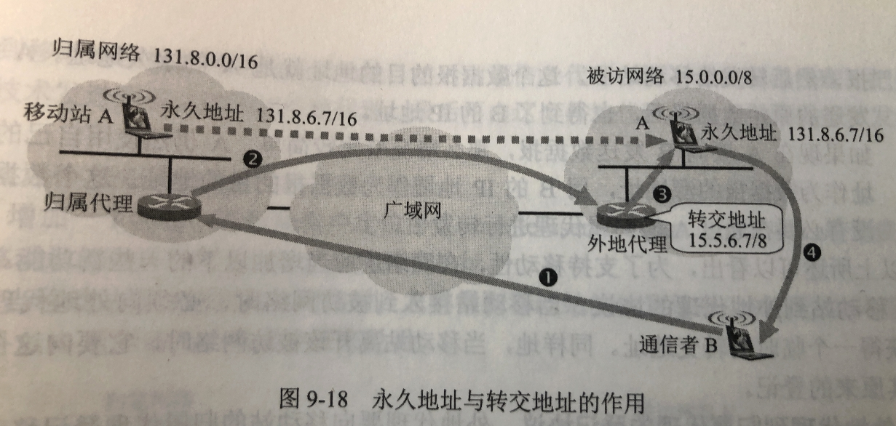

# 419 移动 IP

区分一下动态 IP，动态 IP 是指通过使用 DHCP 协议，在一个局域网内动态地获得一个 IP 地址。

当某用户在家中使用笔记本，然后关机后出差到外地重新上网。
显然地，我们知道，他可以通过 DHCP 自动获得 IP 地址。

通常情况下，和位置不变上网没什么区别，反正用户只要能上网就行了，不关心 IP 地址的变化。

移动 IP，指计算机移动到外地时，仍然保留其原来地 IP 地址。

当计算机在不同网络中移动时，我们是希望一直保持网络连接，计算机做建立的 TCP 连接在移动着也是一直保持连接的。然而 TCP 的连接的建立是需要时间的，不可能瞬间建好，若每次加入新的网络需要重新获得 IP 地址，意味着 IP 地址改变，也意味着 TCP 连接必须先中断再重新建立。

移动 IP 要解决的问题，就是使得用户的移动对于上层的网络应用来说是透明的。
更具体地说，若一个移动站在漫游时仍保持其 IP 地址不变，就要想办法使已建立的 TCP 连接与移动用户的漫游无关。此外，还要想办法让互联网中的其他主机能够找到这个移动站。

## 一. 书上的话

首先，一个移动站必须有一个原始地址，即**永久地址**，或**归属地址（home address）**。移动站原始连接到的网络叫作**归属网络（home network）**。永久地址和归属网络的关联是不会改变的。

为了让地址的改变对互联网的其余部分是透明的，移动 IP 使用了代理。**归属代理（home agent）**通常就是连接在归属网络上的路由器，然而它作为代理的特定功能则是在应用层完成的。因此，归属代理既是路由器，也是主机。

（我的理解，就是说，虽然你确实把你的手机带出了归属网络，而且你的手机 IP 地址没有改变，但在归属网络中，有路由器会当作你的手机。哦，对其他来说，认为这个路由器就是你的手机，把信息发给这个被当作你的手机的路由器，但这个路由器知道，自己只是你的手机的替代，收到了你的手机的信息，会再转发给你。）

当移动站移动到另一个地点，他接入的网络被称为**被访网络（visited network）**或**外地网络（foreign network）**。被访网络中使用的代理叫作**外地代理（foreign agent）**，它通常就是连接在被访网络上的路由器（当然也充当主机）。
假定移动站到达的网络是被访网络 15.0.0.0/8。外地代理的一个任务就是要为移动站创建一个临时地址，叫作**转交地址（care of address）**。转交地址的网络号显然必须和被访网络一致。我们假定现在该移动站的转交地址是 15.5.6.7/8。外地代理的另一个功能是及时把移动站的转交地址通知其归属代理。

（我的理解，就是说，得告诉归属代理你的手机现在的地址，毕竟知道现在你的手机在哪，归属代理才能知道该把收到的你的手机的消息转发到哪。）

注意两点：
第一，转交地址是供移动站、归属代理、外地代理使用的，各种应用程序都不使用这种转交地址；
第二，转交地址再互联网中并不具有唯一性。这就是说，外地代理可以给好几个移动站指派同样得转交地址，甚至把自己得 IP 地址指派为移动站的转交地址。这样做并不会引起混乱。这是因为当外地代理要向连接在被访网络上的移动站发送数据报时，并不会向通常那样使用地址解析协议 ARP，而是直接使用这个移动站的 MAC 地址（当移动站首次和外地代理通信时，外地代理就记录下这个移动站的 MAC 地址）。

（我的理解，第一，是指对其他的程序透明，它们照常使用，不需要了解、使用这些转交地址。
第二，给移动站的转交地址，在这个网络里就可以了，告诉归属代理的转交地址，让归属代理知道发送到这个被访网络里就行了，反正外地代理和移动站是在一个局域网内了，所以通信用的是 MAC 地址了）

有时，移动站本身也可以充当外地代理，即移动站和外地代理是同一设备。这时的转交地址叫作**同址转交地址（co-located care-of address）**。但是要这样做，移动设备必须能够接收发送到转交地址的数据报。使用同址转交地址的好处是移动站可以移动到任何网络，而不许担心外地代理的可用性。但缺点是移动站需要有额外的软件，使之能充当自己的外地代理。

## 二. 通信过程

图1.永久地址与转交地址

移动站 A 在刚进入被访网络：

1. 在外地代理登记获得一个转交地址，离开时会注销。
2. 外地代理向归属代理登记转交地址。

有发送给 A 的数据报：

1. 归属代理截获数据报。

2. 归属代理再封装数据报，新的数据报目的地址是转交地址，发给外地代理（隧道）。

   这里隧道就是指，把原来的数据报通过重新封装成新的数据报，外地代理收到后再解封得到原来的数据报，就是前面在 413 IPv6 中讲的隧道技术。

3. 外地代理拆封数据报，发送给 A。

A 回到了归属网络：

1. A 向归属代理注销转交地址。

2021.03.26