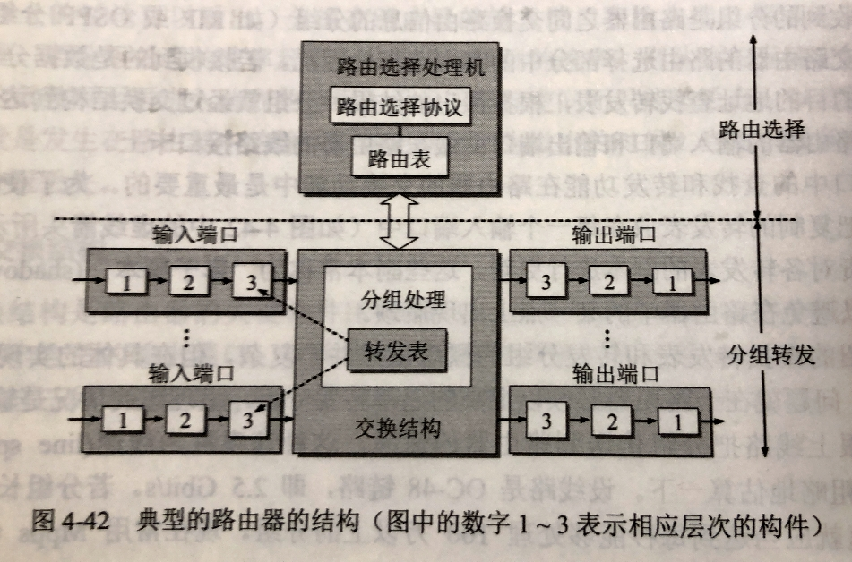
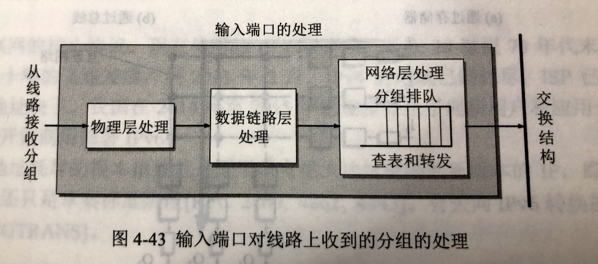
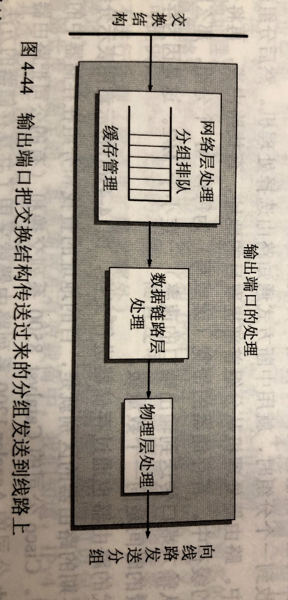

# 420 网络层设备

实际上就是介绍路由器。

路由器是一种具有多个输入端口和多个输出端口的专用计算机，其任务是转发分组。

从路由器某个输入端口收到的分组，按照分组要去的目的地（即目的网络），把该分组从路由器的某个合适的输出端口转发给下一跳路由器。下一跳路由器也按照这种方法处理分组，直到该分组到达终点位置。路由器的转发分组正式网络层的主要工作。

图1.典型的路由器的结构（图中的数字 1-3 表示相应层次的构建）

图中的数字 1-3 表示相应层次的构建：指 3 表示网络层，2 表示数据链路层，1 表示物理层。

从图 1 可见，整个路由器的结构可划分为两大部分：**路由选择**部分和**分组转发**部分。

## 一 路由选择部分

路由选择部分也叫做**控制部分**，其核心构件是路由选择处理机。

路由选择处理机的任务是根据所选定的路由选择协议构造出路由表，同时经常或定期地和相邻路由器交换路由信息而不断地更新和维护路由表。
关于怎样根据路由选择协议构造和更新路由表，已经在前面的415 RIP 协议、416 OSPF 协议、417 BGP 协议讲述过了。

## 二 分组转发部分

### 2.1 组成

分组转发部分才是本节要讨论的问题。它由三部分组成：**交换结构**、一组**输入端口**和一组**输出端口**（这里的端口就是指硬件端口）。

下面分别讨论这三部分的组成。

#### 2.1.1 交换结构的组成

交换结构（switching fabric）又称为**交换组织**，它的作用就是根据**转发表（forwarding table）**对分组进行处理，将某个输入端口进入的分组从一个合适的输出端口转发出去。交换结构本身就是一种网络，但这种完了过完全包含在路由器中，因此交换结构可以看成是 " 在路由器中的网络 "。

注意，" 转发 " 与 " 路由选择 " 是有区别的。

在互联网中，" 转发 " 就是路由器根据转发表把收到的 IP 数据报从路由器合适的端口转发出去。" 转发 " 仅仅涉及到一个路由器。

但 " 路由选择 " 则设计到很多路由器，路由表则是许多路由器协同工作的结构。这些路由器按照复杂的路由算法，得出整个网络的拓扑变化情况，因而能够动态地改变所选择地路由，并由此构造出整个路由表。

路由表一般仅包含（目的网络，下一跳（用 IP 地址表示））的映射。
转发表是从路由表得出的。转发表必须包含完成转发功能所必需的信息。这就是说，在转发表的每一行必须包含（要到达的目的网络，输出端口和某些 MAC 地址信息（如下一跳的以太网地址））的映射。
将转发表和路由表使用不同的数据结构实现会带来一些好处，这是因为在转发分组时，转发表的结构应当使查找过程最优化，但路由表则需要对网络拓扑变化的计算最优化。
路由表总是用软件实现的，但转发表则甚至可用特殊的硬件来实现。请读者注意，**在讨论路由选择的原理时，往往不去区分转发表和路由表的区别，额可以笼统地都使用路由表这一名词**。

并不是所有数据报都会转发出去，比如 RIP 分组、OSPF 分组，是交换路由信息的分组，那么将这些交换路由信息的分组送往路由处理机。
如果收到的是数据分组，才查找转发表，转发出去。

#### 2.1.2 输入、输出端口的组成

在图 1 中，输入、输出端口里面都各有三个方框，用方框中的 1，2，3 分别代表物理层、数据链路层、网络层的处理模块。

物理层进行比特的接收。
数据链路层则按照数据链路层协议接收传送分组的帧。把帧的首部和尾部剥去后，分组就被送入网络层的处理模块。
若接收到的分组是路由器之间交换路由信息的分组（如 RIP 或 OSPF 分组等），则把这种分组送交路由器的路由选择部分中的路由选择处理机。
若接收到的是数据分组，则按照分组首部中的目的地址查找转发表，根据得出的结构，分组就经过交换结构到达合适的输出端口。

一个路由器的输入、输出端口就坐在路由器的**线路接口卡**上。

输入端口中的查找和转发功能在路由器的交换功能中是最重要的。为了使交换功能分散化，往往把复制的转发表放在每一个输入端口中（如图 1 中虚线箭头所示）。路由选择处理机负责对各转发表的副本进行更新。这些副本常称为**影子副本（shadow copy）**。分散化交换可以避免路由器中的某一点出现瓶颈。

（我的理解，分散化，就是让每个输入端口的网络层负责判断是路由信息分组，还是数据分组，然后查表；让交换结构就只负责把分组交给路由选择机，或输出端口。这样就不用把这些工作全给交换结构做了。）

### 2.2  输入、输出端口对收到分组的处理

在具体的实现中，会遇到不少困难，主要是因为路由器必须以很高的速率转发分组。
最理想的情况是输入端口处理速率能够跟上线路把分组传送到路由器的速率。这种速率称为**线速（line speed 或 wire speed）**。
粗略地估算一下，设线路是 OC-48 链路，即 2.5 Gbit/s，若分组长度为256 字节，那么线速就应当达到每秒能够处理 100 万（ $\frac{2.5\times2^{30}}{256\times8}=1310720$）以上的分组，现在常用 Mpps（百万分组每秒）为单位说明一个路由器对收到的分组地处理效率有多高。
在路由器的设计中，怎样提高查找转发表的速率是一个十分重要的研究课题。

图2. 输入端口的处理

当一个分组正在查找转发表时，后面又紧跟着从这个输入端口收到的另一个分组。这个后到的分组就必须在队列中排队等待，因而产生了一定的时延。

图3. 输出端口的处理

再来观察在输出端口上的情况。
输出端口从交换结构接收分组，然后把它们发送到路由器外面的线路上。在网络层的数据模块中设有一个缓冲区，实际上它就是一个队列。
当交换结构传送过来的分组的速率超过输出链路的发送速率时，来不及发送的分组就必须暂时存放在这个队列中。
数据链路层处理模块把分组加上链路层的首部和尾部，交给物理层后发送到外部线路。

从以上讨论可以看出，分组在路由器的输入端口和输出端口都可能会在队列中排队等待处理。
若分组处理的速率赶不上分组进入队列的速率，则队列的存储空间最终必定减少到零，这就是后面在进入队列的分组由于没有存储空间而只能被丢弃。

以前我们提到过分组丢失就是发生在路由器中的输入或输出队列产生溢出的时候。
当然，设备或线路出故障也可能使分组丢失。

## 三. 三层设备的区别

路由器：网络层设备，可以互连两个不同网络层协议的网段。

网桥：数据链路层设备，根据 MAC 帧的目的地址，只转发给目的地址主机所在的网段（当然，没有记录时还是全部端口转发）。可以互连两个物理层和链路层不同的网段。

集线器：物理层设备，只是对衰减的信号进行放大，转发到所有端口。不能互连两个物理层不同的网段。

| 设备                           | 能否隔离冲突域 | 能否隔离广播域 |
| ------------------------------ | -------------- | -------------- |
| 网络层设备（路由器）           | 能             | 能             |
| 数据链路层设备（网桥、交换机） | 能             | 不能           |
| 物理层设备（中继器、集线器）   | 不能           | 不能           |

2021.03.26

