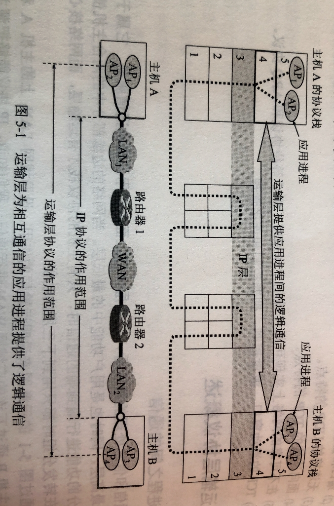

# 501 运输层概述

运输层，只有主机才有的层次，路由器没有运输层。

## 一. 运输层的功能

运输层的功能：

1. 运输层提供进程和进程之间的逻辑通信。

   从网络层来说，通信的两端是两台主机。毕竟对网络层来说，确实是这样，它只交给上层（运输层）就完成任务了。
   但实际上，真正进行通信的实体是在主机中的进程，是这台主机中的一个进程和另一台主机中的一个进程在交换数据（即通信）。因此严格地讲，两台主机进行通信就是两台主机中的应用进程互相通信。
   从运输层来看，**通信的真正端点并不是主机而是主机中的进程**。

   

   
图1.运输层提供进程与进程的逻辑通信

   逻辑通信，是指从应用层看来，只要把应用层报文交给下面的运输层，运输层就可以把这报文传送到对方的运输层，好像这种通信就是沿水平方向直接传送数据。但事实上这两个运输层之间并没有一条水平方向的物理连接。数据的传送是沿着途中虚线方向（经过多个层次）传送的。

   可以看出，**网络层为主机之间提供逻辑通信，运输层为应用进程之间提供端到端的逻辑通信**。

2. 复用和分用。

   在一台主机中经常有多个应用进程同时分别与另一台主机中的多个应用进程通信。

   复用，指发送方不同的应用进程都可以使用同一个运输层协议传送数据（当然需要加上适当的首部）。
   分用，指接收方的运输层在剥去报文的首部后能够把这些数据正确交付目的应用进程。

   我的理解，也就是，复用，指主机上有多种多样的进程，比如游览器游览网页、电子邮件发送邮件、聊天软件发送消息等等，但不必为了这些每个进程设计一个协议（这样也太复杂太麻烦了），而是这些不同的进程，遵循同样的规则，都使用同一个运输层协议，就好啦。
   分用，就是这些不同进程的数据，使用了同一个运输层协议，封装好，到达了另一台主机，收到数据的主机的运输层再根据首部信息，将这些数据分发给对应的进程，就是分用。

3. 差错检测：

   应该记得，网络层中， IP 数据报首部的检验和字段，指检验首部而不检验数据部分，自然这部分的检错就在运输层。

4. 提供两种不同的传输协议：

   根据应用程序的不同需求，运输层需要又两种不同的运输协议，即**面向连接的 TCP** 和**无链接的 UDP**。

还要指出，运输层向高层用户屏蔽了下面网络核心的细节，它使应用进程看见的就是好像在两个运输层实体之间有一条端到端的逻辑通信信道。
但这条逻辑通信信道对上层的表现却因运输层使用不同协议而有很大的差别。

当运输层采用面向连接的 TCP 协议时，尽管下面的网络是不可靠的（只提供尽最大努力服务），但这种逻辑通信信道就相当于**一条全双工的可靠信道**。
当运输层采用无连接的 UDP 协议时，这种逻辑通信信道仍然是**一条不可靠信道**。

## 二. 运输层的两个主要协议

1. TCP：

   传送数据之前必须建立连接，数据传送结束后要释放连接。不提供广播或多播服务。由于 TCP 要提供可靠的面向连接的传输服务，因此不可避免地增加了许多开销：确认、流量控制、计时器、连接管理等。

   可靠，面向连接，时延大，适用于大文件。

2. UDP：

   传送数据之前不需要建立连接，收到 UDP 报文后也不需要给出任何确认。

   不可靠，无连接，时延小，适用于小文件。

## 三. 运输层的端口

### 3.1 软件端口

应用层所有的应用进程都可以通过运输层在传送到网络层，这就是复用。
运输层从网络层收到发送给各应用进程的数据后，必须分别交付指明的应用进程，这就是分用。

显然，给应用层的每个应用进程赋予一个非常明确的标志是至关重要的。

我们知道，在单个计算机中的进程是用进程标识符 PID（一个不大的整数）来标志的。
但在互联网环境下，用计算机系统所指派的这种进程标识符来标志应用层的各种应用进程则是不行的。
这是因为在互联网上使用的计算机的操作系统种类很多，而不同的操作系统有使用不同格式的进程标识符。为了使运行不同操作系统的计算机的应用进程能够互相通信，就必须用统一的方法（而这种方法必须与特定操作系统无关）对 TCP/IP 体系的应用进程进行标志。

但是，把一个特定机器上运行的特定进程，指明为互联网上通信的最后终点还是不可行的。
因为进程的创建和撤销都是动态的，通信的一方几乎无法识别对方机器上的进程。另外，我们往往需要利用目的主机提供的功能来识别终点，而不需要知道具体实现这个功能的进程是哪一个（例如，要和互联网上的某个邮件服务器联系，并不一定要知道这个服务器功能是由目的主机上的哪个进程实现的）。

解决这个问题的方法就是在运输层使用**协议端口号（protocol port number）**，或通常简称为**端口（port）**。
这就是说，虽然通信的终点是应用进程，但只要把所传送的报文交到目的主机的某个合适的目的端口，剩下的 工作（即最后交付目的进程）就由 TCP 或 UDP 来完成。

注意，这种**这协议栈层间的抽象的协议端口是软件端口**，和路由器或交换机上的硬件端口是完全不同的概念。
硬件端口是**不同硬件设备**进行交互的接口，而**软件端口是应用层的各种协议进程**与**运输实体进行层架交互的一种地址**。
不同的系统具体实现端口的方法可以是不同的（取决于系统使用的操作系统）

在后面讲到的 UDP 和 TCP  的首部格式中，我们会看到它们都有**源端口**和**目的端口**这两个重要字段。
当运输层收到 IP 层交上来的运输层报文时，就能够根据其首部中的目的端口号把数据交付应用层的目的应用进程。

TCP/IP 的运输层用一个 16 位**端口号**来标志一个端口。注意，**端口号只具有本地意义**，它只是为了标志**本计算机**应用层中的各个进程在和运输层交互时的层间接口。在互联中不同计算机中，相同的端口号是**没有关联**的。
16 位的端口号可运行有 65535 个不同的端口号，这个数目对一个计算机来说是足够使用的。

由此可见，两个计算机中的进程要互相通信，不仅需要知道对方的 IP 地址，还需要知道对方的端口号。

### 3.2 端口号分类：

1. 服务器端使用的端口号：

   1.1 **熟知端口号**（well-known port number）或系统端口号：

   ​	数值为 0-1023，IANA 把这些端口号用于 TCP/IP 最重要的一些应用程序，让所有用户都知道。

   ​	就是说这些非常重要的程序，给它们固定的端口号，大家都按这个规则来。

   ​	常用的熟知端口号：

   |  应用程序  | FTP  | TELNET | SMTP | DNS  | TFTP | HTTP | SNMP | SNMP(trap) | HTTPS |
   | :--------: | :--: | :----: | :--: | :--: | :--: | :--: | :--: | :--------: | :---: |
   | 熟知端口号 |  21  |   23   |  25  |  53  |  69  |  80  | 161  |    162     |  443  |

   1.2 **登记端口号**：

   ​	数值为 1024-49151。为没有熟知端口号的应用程序使用。

   ​	使用这类端口号必须在 IANA 按照规定的手续登记，以防止重复。
   ​	也就是没那么重要的，提供某些服务的进程用登记端口号。

2. 客户端使用的端口号：

   数值为 49152-65535。由于这类端口号仅在客户进程运行时才动态选择，因此又叫作**短暂端口号**。

   这类端口号留给客户进程选择暂时使用。当服务器进程收到客户进程的报文时，就知道客户进程所使用的端口号，因而可以把数据发送给客户进程。通信结束后，刚才已使用过的客户端口号就不复存在，这个端口号就可以供其他客户进程使用。

套接字，在网络中采用发送方和接收方的套接字组合来识别端口，套接字唯一标识了网络中的一个主机和它上面的一个进程。

套接字 Socket =（IP地址:端口号）。
例如（210.37.145.1:23）。

2021.03.27

