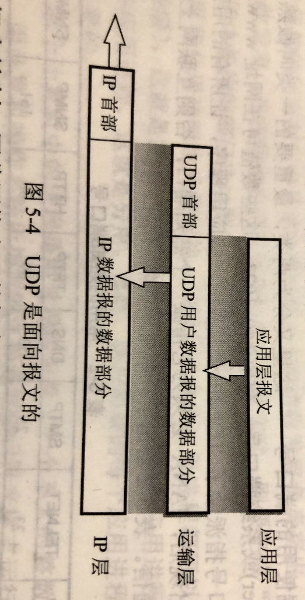
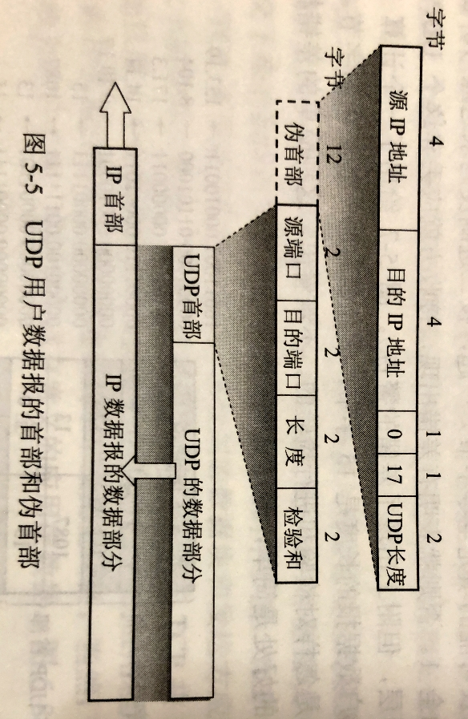
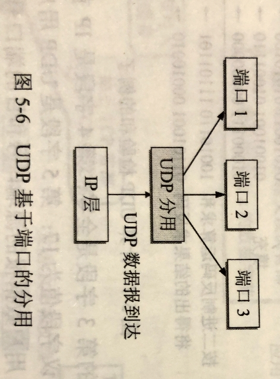
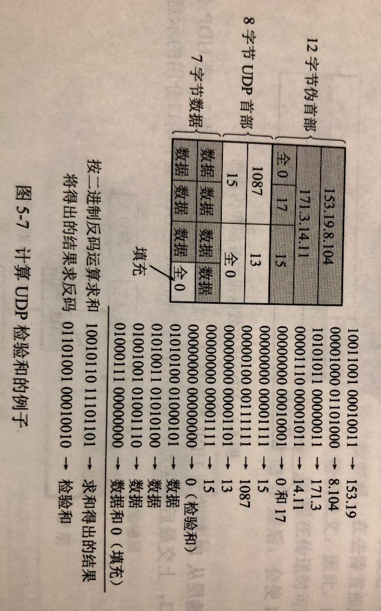

# 502 UDP 协议

## 一. UDP 概述

**用户数据报协议 UDP** 只在 IP 数据报服务之上增加了很少功能，即复用、分用功能，和差错检测的功能。

UDP 的主要特点是：

1. UDP 是**无连接**的，即发送数据之前不需要建立连接，因此减少了开销和发送数据之前的时延。

2. UDP 使用**尽最大努力交付**，即不保证可靠交付，因此主机不需要维持负责的连接状态表（这里面有许多参数）。

3. UDP 是**面向报文**的。

   

   
图1. UDP 是面向报文的，不划分报文段

   发送方的 UDP 对应用程序交下来的报文，在添加首部后就向下交付 IP 层。
   UDP 对应用层交下来的报文，既不合并，也不拆分，而是**保留这些报文的边界**。这就是说，应用层交给 UDP 多长的报文，UDP 就照样发送，即一次发送一个报文，如图 1 所示。
   在接收方的 UDP，对 IP 层交上来的 UDP 用户数据报，在去除首部后就原封不动地交付上层地应用进程。
   也就是说，UDP 一次交付一个完成的报文。因此，应用程序必须选择合适大小的报文。若报文太长，UDP 把它交给 IP 层后，IP 层在传送时可能要进行分片，这会降低 IP 层的效率。反之，若报文太短，UDP 把它交给 IP 层后，会使 IP 数据报首部的相对长度太大，这也降低了 IP 层的效率。

4. UDP **没有拥塞控制**，因此网络出现的用设不会使源主机的发送速率降低。
   这对某些实时应用是很重要的，很多实时应用（如 IP 电话、实时视频会议等）要求源主机以很高的速率发送数据，并且允许在网络发生拥塞时丢失一些数据，但却不允许数据有太大的时延。
   UDP 正好适合这种要求。

5. UDP **支持一对一、一对多、多对一、多对多的交互通信**。

6. UDP 的**首部开销小**，只有 8 个字节，比 TCP 的 20 个字节的首部要短。

## 二. UDP 的首部格式

图2. UDP 用户数据报的首部和伪首部

用户数据报 UDP 有两个字段：首部字段、数据字段。

首部字段，只有 8 个字节，由四个字段组成，**每个字段长度都是两个字节**：

1. **源端口**：源端口号。在需要对方回信时选用。不需要时可用全 0。
2. **目的端口**：目的端口号。这在终点交付报文时必须使用。
3. **长度**：UDP 用户数据报的长度，其最小值是 8（仅含首部）。
4. **校验和**：检测 UDP 用户数据报在传输中是否有错。有错就丢弃。

图3. UDP 基于端口的分用

当运输层从 IP 层收到 UDP 数据报时，就根据首部中的目的端口，把 UDP 数据报通过相应的端口，上交最后的终点——应用进程。

如果接收方 UDP 发现收到的报文中的目的端口不正确（即不存在对应于该端口号的应用进程），就丢弃该报文，并由网际控制报文协议 ICMP 发送 "端口不可达" 差错报文给发送方。

在前面<计算机网络>—4网络层—412 ICMP 协议，中的 Traceroute 指令，就是让发送的 UDP 用户数据报故意使用一个非法的 UDP 端口，从而达到测试的目的。

##### 检验和、伪首部

> UDP 的检验和功能是可选的，如果源主机不想计算校验和，那么该校验和字段应全为 0。（来源王道习题）

在计算检验和时，要在 UDP 用户数据报之前增加 12 个字节的**伪首部**。
所谓伪首部是因为实际的 UDP 用户数据报并不存在这 12 个字节。只是在计算检验和时，临时加上，得到一个临时的 UDP 用户数据报，用这个临时的 UDP 用户数据报来计算出检验和。
伪首部仅仅是用来计算检验和，并不会向下、向上传递。

图 1 中已经给出了伪首部 12 字节的内容：

1. 源 IP 地址。

2. 目的 IP 地址。

3. 这个字段固定全 0。

4. 就是 IP 数据报首部中的协议字段：

   8bit，指出此数据报携带的数据是使用何种协议，以便目的主机的 IP 层知道应将数据部分上交给哪个协议进行处理。
   TCP 为 6；UDP 为 17。所以图 1 中此处为 17。

5. UDP 长度：UDP 首部（不包含伪首部）部分长度+数据部分长度。和首部中的长度字段一样的，看下图 4 都是 15。

图4. 计算 UDP 检验和的例子

UDP 计算检验和与 IP 数据报的首部检验和也是类似的。
不同在于，IP 数据报只检验首部。UDP 是将首部（包括伪首部）和数据部分一起都进行检验。

类似的，把 UDP 用户数据报的检验和字段变为全 0，以 16bit（2B） 为一组。若 UDP 用户数据报总长度不是 16bit（2B） 的整数倍，则填充 0。
（图 4 左方示意图画的是一行是 4B，右方运算图才是 16bit（2B） 为一组。）

然后按照二进制反码计算出这些 16 字节一组的和，将此和的二进制**反码**写入检验和字段，然后就发送 UDP 用户数据报。
（注意，最终写入校验和字段的是二进制反码运算求和**取反**，最后是取反了的。）

（反码算数运算：和正常的二进制加法一样，唯一的区别就是当最高位产生进位时，会是在最低位+1。
我手算了一遍，和图 4 里结果一样，那这个运算规则就是对的。）

在接收方，把收到的 UDP 用户数据报连同伪首部（以及可能填充的全零字节）一起，按照二进制反码求和。
当无差错时，其结果全为 1；
（因为这里说的是二进制反码求和，没有再对和取反，所以是 1 表示无差错。如果说是再取反，则 0 表示无差错，如在 403 IP 数据报格式 中，说的就是二进制反码求和取反，所以是 0 表示无差错。）
否则及表明有差错出现，接收方应丢弃这个 UDP 用户数据报（也可以上交给应用层，但得附上出现了差错的警告）。

不难看出，这种简单的差错检验方法的检错能力并不强，但好处是简单，处理起来较快。

2021.03.27

