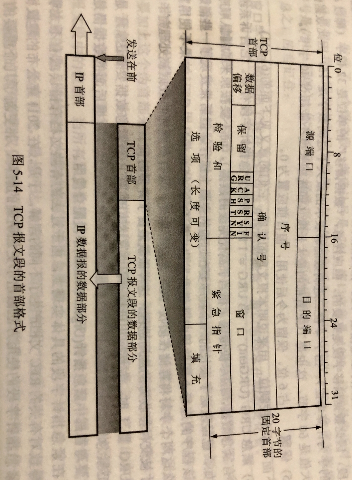

# 503 TCP 协议特点与报文段格式

因为 TCP 协议比较复杂，所以分开讲述，这一节先简单介绍。

## 一. TCP 最主要的特点

TCP 最主要的特点：

1. TCP 是**面向连接的运输层协议**。这就是说，应用程序在使用 TCP 协议之前，必须先建立 TCP 连接。在传送数据完毕后，必须释放已建立的 TCP 连接。
   建立的连接是是虚连接，或称逻辑连接，而不是一条真正的物理链路。

2. 每一条 TCP 连接只能有两个**端点（endpoint）**，每一条 TCP 连接只能是**点对点**的（一对一）。

3. TCP 提供**可靠交付**的服务。通过 TCP 连接传送的数据，无差错、不丢失、不重复，并且按序到达。

4. TCP 提供**全双工通信**。

   TCP 允许通信双方的应用进程在任何时候都能发送数据。TCP 连接的两端都设有发送缓存和接收缓存，用来临时存放双向通信的数据。
   在发送时，应用程序在把数据传送给 TCP 的缓存后，就可以做自己的事，而 TCP 在合适的时候把数据发送出去。
   在接收时，TCP 把收到的数据放入缓存，上层的应用进程在合适的时候读取缓存中的数据。

   发送缓存中：准备发送的数据、已发送但尚未收到确认的数据；
   接收缓存中：按序到达但尚未呗应用程序读取的数据、不按序到达的数据。

5. **面向字节流**。

   TCP 中的流（stream）指的**流入到进程或从进程流出的字节序列**。
   面先字节流的含义是：虽然应用进程和 TCP 的交互是一次一个数据块（大小不等），但 TCP 把应用进程交下来的数据仅仅看成是一连串的**无结构的字节流**。

   TCP 并不知道所传送的字节流的含义。TCP 不保证接收方应用程序所收到的数据块和发送方应用程序所发出的数据块具有对应大小的关系。
   例如，发送方应用程序交给发送方的 TCP 共 10 个数据块，但接收方的 TCP 可能只用了 4 个数据块就把收到的字节流交付上层的应用程序。
   （感觉就是不同主机的数据块大小不一样，数据块容量小的发出 10 个，但数据块容量大的只需要 4 个就把这 10 个的内容存下了。）
   但接收方应用程序收到的字节流必须和发送方应用程序发出的字节流完全一样。
   当然，接收方的应用程序必须由能力识别收到的字节流，把它还原成有意义的应用层上数据。

TCP 在发送报文时与 UDP 不同。
TCP 并不关心应用进程一次把多长的报文发送到 TCP 的缓存中，而是根据对方给出的窗口值和当前网络拥堵的程度来决定一个报文段应包含多少个字节。
UDP 发送的报文长度是应用进程给出的。

如果应用进程传送到 TCP 缓存的数据块太长，TCP 就可以把它划分短一些再传送。如果应用进程一次只发来一个字节，TCP 也可以等待积累有足够多的字节后再构成报文段发送出去。

## 二. TCP 报文段的首部格式

图1.TCP 报文段的首部格式

首部固定各字段意义如下：

1. **源端口**：2B（16bit），写入源端口号。

2. **目的端口**：2B（16bit），写入目的端口号。

3. **序号**：

   4B（32bit），也叫做**报文段序号**。序号范围就是 $[0,2^{32}-1]$ ，使用 mod $2^{32}$ 运算，即当序号增加到 $2^{32}-1$ 后，下一个序号就又回到 0。

   这是因为，在一个 TCP 连接中传送的字节流中的**每一个字节都按顺序编号**。整个要传送的字节流的起始序号必须在连接建立时设置。首部中的序号字段值则指的是**本报文段所发送的数据的第一个字节编号**。

   例如，本报文段的数据部分的第一个字节序号是 301，且本报文段的数据部分共有 100 个字节，则下一个报文段的序号为 401。

4. **确认号**：

   4B（32bit），是**期望收到对方下一个报文段的第一个数据字节的序号**。

   例如，B 正确收到 A 发送来的序号为 501 的报文段，数据长度为 200B，表明 B 正确接收了到 700 为止的数据，于是 B 期望收到 A 的下一个数据序号为 701，所以在 B 发送给 A 的确认报文段中，将确认号设为 701。

   由于序号、确认号是 4bit，最大可对 4GB 的数据进行编号，在一般情况下，已经可以保证序号的重复使用了，即旧序号的数据早已经通过网络到达终点。

5. **数据偏移**：

   （4bit），用于指出 TCP 报文段的数据部分起始处，距离 TCP 报文段的起始处有多远。实际就是指出 TCP 的首部长度。

   这是因为，TCP 首部有一个长度不定的选项字段，导致 TCP 的首部长度不固定，所以需要数据偏移字段指出 TCP 的首部长度，从而使接收方可以区分首部部分与数据部分。

   **数据偏移的单位是 4B（32bit）**，表示偏移多少个 4B，因此，数据偏移的值最大是 15（1111），表示 TCP 首部长度为 60B，这也是 TCP 首部的最大长度（因为选项长度不能超过 40B）。

6. **保留**：

   （6bit），保留为今后使用，但目前应置为 0。

下面为 6 个控制位，都占 1 bit：

7. **紧急 URG（UEGent）**：

   当 UGR = 1 时，表明紧急指针字段有效。它告诉系统此报文段中有紧急数据，应尽快传送（相当于高优先级的数据），而不要按原来的排队顺序来传送。

   例如，已经发送了很长一个程序要在远地的主机上运行，但后来发现一些问题，需要取消运行。因此用户从键盘发出中断命令（Control+C）。如果不使用紧急数据，那么这两个字符将存储在接收 TCP 的缓存末尾。只有在所有数据被处理完毕后这两个字符才被交付接收方的应用进程。

   当 UGR = 1 时，发送应用进程就告诉发送方的 TCP 有紧急数据要传送。于是发送方 TCP 就把紧急数据插入到本报文段数据的最前面，而在紧急数据后面的数据仍是普通数据。这是要与首部中的紧急指针字段配合使用。

8. **确认 ACK（ACKnowledgment）**：

   仅当 ACK = 1 时确认号字段才有效。当 ACK = 0 时，确认号无效。

   TCP 规定，在连接建立后所有传送的报文段都必须把 ACK 置 1。

9. **推送 PSH（Push）**：

   当两个应用进程进行交互式通信时，有时在一段的应用进程希望在键入一个命令后立即就能够收到对方的响应。在这种情况下， TCP 旧可以使用推送操作。这时，发送方 TCP 把 PSH 置 1，并理解创建一个报文段发送出去。接收方收到 TCP PSH = 1 的报文段，就尽快地（即推送向前）交付接收应用进程，而不再等待到整个缓存都填满了后再向上交付。

   （我的理解，就是原本收到的数据要凑够一个缓存的数据块，才向上交付给应用进程，现在收到 PSH = 1 的报文段，就立刻把收到的数据开始向上交付。当然还是按顺序向上交付的）

   虽然应用程序可以选择推送操作，但推送操作很少使用。

10. **复位 RST（ReSeT）**：

    也可称为重建位或重置位。

    当 RST = 1 时，表明 TCP 连接中出现严重错误（如由于主机崩溃或其他原因），必须释放连接，然后再重新建立运输连接。

    RST = 1 还用来拒绝一个非法的报文段或拒绝打开一个连接。

11. **同步 SYN（SYNchronization）**：

    在建立连接时用来同步序号。

    当 SYN = 1 而 ACK = 0 时，表明这是一个连接请求报文段。对方若同意建立连接，则应在响应的报文段中使 SYN = 1 和 ACK = 1。
    因此 SYN = 1 表示这是一个连接请求或连接接受报文。

12. **终止 FIN（FINis）**：

    用来释放一个连接，当 FIN = 1 时，表明此报文段的发送方的数据已发送完毕，并要求释放运输连接。

控制位结束

13. **窗口**：

    2B（16bit），窗口指的是发送本报文段的一份的**接收窗口**（而不是自己的发送窗口）。窗口值告诉对方，从本报文段首部中的确认号算起，接收方目前允许对方发送的数据量（以字节为单位）。
    因为接收方的数据缓存空间是有限的。
    总之**窗口值作为接收方让发送方设置起发送窗口的依据**。

    例如，发送了一个报文段，确认号为 701，窗口字段为 1000，是告诉对方，从 701 号开始，我的接收缓存空间还可接收 1000B 的数据（即序号是 701 到 1700 的数据），你要发送数据给我应该考虑到这一点。

    窗口字段明确指出了现在允许对方发送的数据量。窗口值经常在动态变化着。

14. **检验和**：

    2B（16bit），检验和字段的检验范围是首部和数据部分。
    与 UDP 用户数据报一样，TCP 的检验和也是加上伪首部，分为 16bit 一组进行检验。
    这里的伪首部与 UDP 伪首部的格式是相同的，唯一的区别就是，17 改为 6，因为这个字段本身就是 IP 数据报首部中的协议字段：TCP 为 6；UDP 为 17。所以改为 6。

15. **紧急指针（Urgent Pointer）**：

    2B（16bit），紧急指针仅在 UGR  = 1 时才有意义，它指出本报文段中紧急数据的字节数（紧急数据结束后就是普通数据）。因此，紧急指针指出的是紧急数据的末尾在报文段中的位置。当所有紧急数据都处理完时，TCP 就告诉应用程序恢复到正常的操作。

    注意到是，即便窗口为 0 时，也可以发送紧急数据。

16. **选项**：

    长度可变，最长 40B。当没有使用选项时，TCP 的首部长度最短为 20B。最后的填充字段仅仅是为了使 TCP 的首部长度为 4B 的整数倍。
    
    TCP 最初只规定了一种选项，即**最大报文长度 MSS（Maximum Segment Size）**。注意，MSS 指的是每一个 TCP 报文段中的**数据字段的最大长度**。而不是 TCP 首部加上数据字段的整个 TCP 的长度。
    
    随着互联网的发展，又陆续增加了几个选项。如**窗口扩大**选项、**时间戳**选项、**选择确认（SACK）**选项等。
    
    窗口扩大选项：
    窗口扩大选项是为了扩大窗口，TCP 首部的窗口字段为 16bit，因此最大的窗口为 $64K(2^{16})$ 字节。这个大小对早期网络是足够用的，但对于包含卫星信道的网络（常称为**长粗管道**），传播时延和带宽都很大，要获得高吞吐量需要更大的窗口大小。
    窗口大小选项占 3 字节，其中有一个字节表示**移位值 S**。新的窗口值等于 TCP 首部中的窗口位数从 16 增加到 （16+S）。移位值允许使用的最大值是 14，相当于窗口最大值增大到了 $2^{(16+14)}-1=2^{30}-1$ 。
    窗口扩大选项可以在双方初始建立 TCP 连接时进行协商。如果连接的某一端实现了窗口扩大，当它不再需要扩大其窗口时，可发送 S=0 的选项，使窗口大小回到 16。
    
    时间戳选项：
    时间戳选项占 10 字节，其中最主要的字段是**时间戳值**字段（4 字节）和**时间戳回送回答字段**（4 字节）。
    时间戳选项有以下两个功能：
    
    1. 用来计算往返时间 RTT。发送方在发送报文段时把当前时钟的时间值放入时间戳字段，接收方在确认该报文段时把时间戳字段值复制到时间戳回送回答字段。因此，发送方在收到确认报文后，可以准确地计算处 RTT。
    2. 用于处理 TCP 序号超过 $2^{32}$ 的情况，这又称为**防止序号绕回 PAWS（Protect Against Wrapped Sequence numbers）**。当使用高速网络时，在一次 TCP 连接的数据传送中序号很可能会被重复使用。例如，使用 1.5 Mbit/s 的速率发送报文段时，序号重复要 6 小时以上；但若使用 2.5 Gbit/s 的速率，则不到 14 s 序号就会重复。
       为了使接收方能够把新的报文段和迟到很久的报文段区分开，可以在报文段中加上这种时间戳。

#### 关于最大报文段长度 MSS

MSS 指的是每一个 TCP 报文段中的数据字段的最大长度。

设置 MSS 并不是考虑接收方的接收缓存放不下接收到的报文段中的数据部分。实际上，MSS 和接收窗口值没有关系。
主要是因为，如果不限制报文段的长度，那么若报文段过长，则会导致在向下传给 IP 层时，超过了 IP 数据报的最大长度，就会有把一个报文段分成多片 IP 数据报、接收端将多个 IP 数据报装配成原来的 TCP 报文段的开销。

实际上，MSS 的值受到 MTU 的限制。
复习一下，每一种数据链路层协议都规定了一个数据帧中的数据字段（也就是 IP 数据报）的最大长度，称为最大传送单元 MTU。
所以，要使得 IP 数据报不分片，那么就是使得 IP 数据报的长度小于 MTU。
要使得 MSS 在 IP 数据报不分片的情况下最大，就是 $MSS\leq MTU-IP数据报首部-TCP报文段首部$ 。

不过话是这么说，但是，一，如果两台主机之间存在经过的网络有更小的 MSS（更小的 MTU），那么还是会在这些更小 MTU 的网络中有分片和装配的开销；二，IP 数据报的传输路径是不定的、动态的。即便已经在一条路径上确定好了的 MSS 没有分片、装配的开销，如果 IP 数据报改走另一条路径了，仍然有可能会分片。
因此最佳的 MSS 是很难确定的。

在两台主机连接的过程中，双方都把自己能够支持的 MSS 写入 MSS 字段，发送给对方。让对方获知自己的 MSS 值，此后，双方都以自己收到的 MSS 值来发送 TCP 报文段，对方就不会发送超过自己 MSS 的报文段。
两个传送方向可以是不同的 MSS 值。当然也可以是相同的。
MSS 的有默认值，如果对方没有填写 MSS 字段，那么默认为 536 字节。所以**互联网上的所有主机，都应该能够接收 MSS = 536 的报文段**。

#### 关于紧急 URG、紧急指针

我着实没看文字没看懂，网上查了半天信息，也没一个详细的。
倒是查到，紧急数据现在已经很少用，也不推荐再使用，只是为了兼容旧的系统而存在。
也许是这个原因导致相关信息少吧。

总结一些，大概是正确的东西。
大概啊，充满很多不确定。因为我也没理清这个东西，而且网上的信息，还是不太权威，不能完全相信。

注意，以下内容不一定正确，因为我是综合了书上、网上内容总结的，其中可能是大量正确信息中混杂有不少错误信息，可能导致认为前面正确信息是正确得，连带着认为后面错误信息也是正确的了。

还是这个例子（分点只是为了方便看而已，不然一大段一大段的看着眼花）：

1. 主机 A 已经发送了很长一个程序要在远地的主机 B 上运行，但后来发现一些问题，需要取消运行。因此用户从键盘发出中断命令（Control+C）。

2. 于是主机 A 向主机 B 发送紧急数据，该例中紧急数据为中断命令，可能占一个字节，可能占多个字节。
   当主机 A 想要向主机 B 发送了一个紧急数据，则 A 进入紧急状态， 此时从 A 发往 B 的报文段，都会是 URG = 1，紧急指针的值有效的报文段。
   包括在进入紧急状态前就已经在缓冲区中尚未发送的数据，但这些数据在进入紧急状态后才形成的报文段发出，其报文段的也会是 URG = 1 ，紧急指针的值有效。

   报文段序号 + 紧急指针值 = 紧急数据最后一个字节的字节编号（此处为字节流中中断命令最后一个字节的字节序号）。

3. （在我的理解中）这是因为紧急数据也是进入发送缓冲区，然后发送的（这点我真不确定是否需要排队）。
   然而在进入紧急状态前，发送缓冲区是可能存在有未发送的数据的，而受到接收方接收窗口的限制，比如发送缓冲区已存在 100B 数据未发送，但接收窗口只有 50，那还得等这前面的发出去了才行。
   所以进入紧急状态后发送的报文段，并不一定就包含紧急数据。

   但是，A 进入紧急状态后发送给 B 的报文段，都是 URG = 1 ，紧急指针的值有效的报文。

   直到 A 将紧急数据发送完毕，A 才解除紧急状态。

4. 含有紧急数据的报文段，其紧急数据必然在报文段数据部分的最前面。
   我终于悟了为什么 URG 这里写的是 " 于是发送方 TCP 就紧急数据插入到本报文段数据的最前面，而在紧急数据后面的数据仍是普通数据 "。
   因为报文段序号 + 紧急指针值，只能得到紧急数据最后一个字节的字节编号。
   也就是我们只有一个变量来描述紧急数据的开始和结束位置，显然，如果要描述紧急数据的开始和结束位置，那么至少需要两个变量，但我们只有紧急指针一个变量，我们选择将其用来描述紧急数据的结束位置。
   自然地，只要规定紧急数据必须放在报文段的开头，这样紧急数据的开头就是报文段数据部分的开头，从而能够确定紧急数据的长度。

5. 当 B 收到一个 URG= 1 的报文段（不一定就含有紧急数据），进入紧急状态，将该报文段插队交付给上层应用，根据其报文段序号和紧急指针值相加，得到紧急数据的字节序号，存储下来。

   理解为 TCP 会为每个套接字维护报文段序号和一个紧急指针变量，这样就等同于知道了紧急数据的结束字节的字节序号（我也不知道 TCP 是存的报文段序号和紧急指针变量，还是只存二者之和一个变量，反正两者都是等价的吧）。

6. 然后 B 还是正常地接收报文段， 有 URG= 1 的报文段就优先交付，没有就正常按序交付，但是这些进入了紧急状态后（此时 B 已经知道了有紧急数据要传过来，且知道了紧急数据的结束位置字节序号），才交付的且在紧急数据字节序号后的字节，是暂时不会处理的，而是暂存。直到接收到紧急数据，才会根据紧急数据的值来决定对这些数据如何处置。

   比如，紧急数据为中断命令，对应的是 B 将这些紧急数据前的数据丢弃不再继续处理（我这里是自己随便假设是这样对应的）。

7. 然后，在紧急数据接收后 B 解除紧急状态。

8. 注意，当 A 发送多个紧急数据给 B，后来的紧急数据的指针会覆盖先到的，比如 A 发送紧急数据，其紧急指针为 3，然后又发送发送紧急数据，其紧急指针为 15，那么 B 就会先收到 3，修改维护的紧急指针值为 3，然后收到 15，又修改为 15。
   这个很好理解，比如，我中断了 3 之前的命令，又发送一些命令，又想中断这些命令，于是中断了 15 之前的命令。

9. 即便窗口为 0 时，也可以发送紧急数据。

   也就是当接收方的接收缓冲区已满，但此时也可以发送紧急数据。

   我这里在网上的信息看到说 " 紧急数据不进入缓冲区就直接交给上层进程 "，但没有在书上看原话，书上只有 "即便接收窗口为 0 时，也可以发送紧急数据。"

10. 这里还有一点疑惑 " 于是发送方 TCP 就把紧急数据插入到本报文段数据的最前面 "，为什么是 " 插入到本报文段数据的最前面 " 呢？按照我的理解，这个例子中要取消前面的命令，那么也包括在 A 中尚未发送的命令。而如果是插入到 A 中尚未发送的命令前面，顺序就乱了。

    所以我认为，这里的意思是，一是想说明我前面说的为了确定紧急数据的长度所以放在最前面，二是想说明发送紧急数据的报文段不一定非得只含紧急数据，在紧急数据后如果有普通数据要发送，那就一起就在一个报文段发送了，这样就可以减少报文段首部的占比。
    
    所以我认为，这里的 " 插入到本报文段数据的最前面" 是指在紧急数据和其后的普通数据，形成一个报文段就一起发送了，而非插入到紧急数据之前的未发送普通数据前。
    
    不过，又有一个问题。
    即便窗口为 0 时，也可以发送紧急数据，那么窗口为 0 时，能够发送的紧急数据的报文段，是只有紧急数据还是有紧急数据和其后的普通数据呢？
    
    这我就真不知道了，我第一感觉，这种情况应该是只有紧急数据的吧，又一想，如果是一起紧急数据 + 普通数据，这样说不定进程可以直接先做着紧急数据后的普通数据的，与紧急数据之前数据无关的事。

11. 今天突然又想到了问题，网上有信息说，紧急数据只有一个字节。如果是这样的话，那么现在一个紧急指针就能确定紧急数据的开始和结束的位置，毕竟一个字节本身既是开始也是结束位置。

    也就意味着不需要紧急数据必须在开头位置了。不过这样紧急数据不在数据部分开头的话，意味着紧急数据就只能是一个字节了。
    如果按照紧急数据必须在数据部分开头，那么才是紧急数据可以是多个字节。
    书上说的是紧急数据 " 插入到本报文段数据的最前面 " 意味着紧急数据可以是多字节的？

    但是，又有一个问题，如果紧急数据是多个字节，限制在数据部分开头时，接收方要如何知道这就是包含紧急数据的报文段呢。
    我们知道 TCP 的报文段首部是没有说明数据部分的长度的。即便接收到的报文段的序号与紧急数据的字节序号很接近，也可能这个报文段的数据部分很短，紧急数据也就不一定就在这个报文段里。
    难道还得读到紧急数据最后一个字节时，再回头从这个报文段开头读嘛。

    搞不懂了。
    关于紧急数据，大概就是这些理解了。要是搞懂了还记得这里再回来写个正确的吧。

2021.04.03

