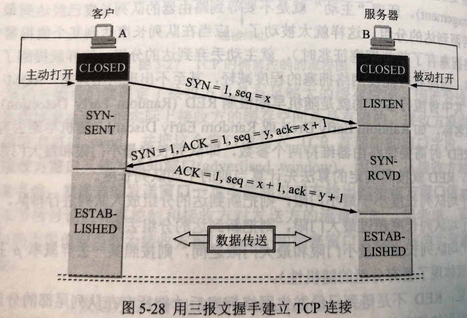
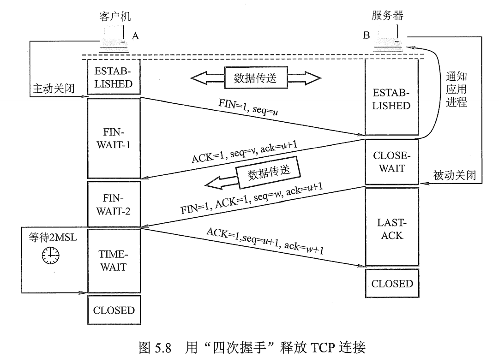

# 504 TCP 连接管理

TCP 连接传输三个阶段：连接建立、数据传送、连接释放。

TCP 连接的建立采用**客户服务器方式**，主动发起连接建立的应用进程叫作**客户（client）**，而被动等待连接建立的应用进程叫**服务器（server）**。

在 TCP 连接建立过程中要解决以下三个问题：

1. 要使每一方能够确知对方的存在。
2. 要允许双方协商一些参数（如最大窗口值、是否使用窗口扩大选项和时间戳及服务质量等）。
3. 能够对运输实体资源（如缓存大小、连接表中的项目等）进行分配。

## 一. TCP 连接的建立

TCP 建立建立的过程叫作握手，握手需要在客户与服务器之间交换三个 TCP 报文段，如图 1 所示。

图1.用三个 TCP 报文段握手建立 TCP 连接

现假定主机 A 运行的是 TCP 客户程序，主机 B 运行的是 TCP 服务器程序。

1. 最初，双方的 TCP 进程都处于 CLOSED（关闭）状态。

2. 一开始，B 的 TCP 服务器进程先创建**传输控制块 TCB**，准备接受客户进程的连接请求。然后服务器处于 LISTEN（收听）状态，等待客户的连接请求。如有，则做出响应。

   传输控制块 TCB（Transmission Control Block）存储了每一个连接中的一些重要信息，如：TCP 连接表，指向发送和接收缓存的指针，指向重传队列的指针，当前的发送和接收序号，等等。

3. A 的 TCP 客户进程也是首先创建**传输控制模块 TCB**。然后在打算建立 TCP 连接时，向 B 发出连接请求报文段，这时首部中的同步位 SYN = 1，同时选择一个初始序号 seq = x。

   TCP 规定，**SYN 报文段（即 SYN = 1 的报文段）不能携带数据，但要消耗掉一个序号**。

   这时，TCP 客户进程进入 SYN-SENT（同步已发送）状态。

4. B 受到连接请求报文段后，如同意建立连接，则向 A 发送确认（并为该 TCP 连接分配 TCP 缓存和变量）。在确认报文段中应把 SYN 位和 ACK 位都置 1，确认号是 ack = x + 1，同时也为自己选择一个初始序号 seq = y。

   注意，这个报文段也不能携带数据，但同样**要消耗一个序号**。这时 TCP 服务器进程进入 SYN-RCVD（同步收到状态）。

5. TCP 客户进程收到 B 的确认后，还要向 B 给出确认（并为该 TCP 连接分配缓存和变量）。
   确认报文段的 ACK 置 1，确认号 ack = y + 1，而自己的序号 seq = x + 1。

   TCP 的标准规定，ACK 报文段可以携带数据。但**如果不携带数据则不消耗序号**，在这种情况下，下一个数据报文段的序号仍是 seq = x + 1.

   这时，TCP 连接已经建立，A 进入 ESTABLISHED（已建立连接状态）。

6. 当 B 收到 A 的确认后，也进入 ESTABLISHED 状态。

上述连接建立过程叫做**三报文握手**。
请注意，B 发送给 A 的报文段，实际上也可拆分为发送两个报文段：先发送一个确认报文段（ACK = 1，ack = x + 1），然后在发送一个同步报文段（SYN = 1，seq = y）。这样过程就变成了**四报文握手**，但效果是一样的。

成功劲了以上步骤之后，就建立了 TCP 连接，接下来就可以传送应用层数据。 TCP 提供的是全双工通信，因此通信双方的应用进程在任何时候都能发送数据。

#### 为什么 A 最后还要发送一次确认？

主要是为了防止已失效的连接请求报文段突然又传送到了 B，因而产生错误。

已失效的连接请求报文段：指 A 发送的连接请求报文段由于某些原因在某些网络节点长时间滞留，以至于 A 重新发送了一个连接请求报文段，并且已经与 B 完成了后续步骤，完成了数据传输，连接释放了。

结果，此时最开始的连接请求报文段才到 B，于是 B 认为 A 又发起了一个新的连接请求，向 A 发出确认报文段，同意建立连接。

如果不采用 A 还要确认一次的机制的话，只要 B 发出确认，连接就已经建立了，但 A 收到 B 的确认报文段，A 没有发出建立连接的请求，因此并不会对 B 的确认报文段做出反应，也根本就不会向 B 发送数据。

但 B 已经为这个连接分配了资源，并会维持一段时间，白白占用了 B 的资源。
而采用三报文握手的办法，B 发出连接后，A 没反应，B 收不到确认，就知道 A 并没有要求建立连接。

#### TCP 洪范攻击

服务器端在收到连接请求报文段，同意建立连接，就为该连接分配资源；
客户端在收到确认报文段，就为该链接分配资源。
这也就导致了 TCP 服务器端容易受到 SYN 洪范攻击。
即，攻击者只发送大量的连接请求报文段，这样服务器端就会为这些连接分配资源，而攻击者不会对服务器发来的确认报文段再发回确认。导致服务器端的这些连接长期存在，而且由于收不到攻击者的确认，还会重复发送确认报文段给攻击者。

## 二. TCP 连接的释放

1. A 的应用进程先向其 TCP 发出连接释放报文段，并停止再发送数据，主动关闭 TCP 连接。
   A 把连接释放报文段首部的终止控制位 FIN 置 1，其序号 seq = u，它等于前面已传送过的数据的最后一个字节的序号加 1。

   发送后，A 进入 FIN-WAIT-1（终止等待 1）状态，等待 B 的确认。

   注意，TCP 规定，**FIN 报文段即使不携带数据，也消耗掉一个序号**。

2. B 收到连接释放报文段后即发出确认，确认好 ack = u + 1，而这个报文段自己的序号是 v，其值等于 B 前面已传送过的数据的最后一个字节的序号加 1。

   然后 B 就进入了 CLOSE-WAIT（关闭等待）状态。

   TCP 服务器进程这时应通知高层应用进程，因而从 A 到 B 这个方向的连接就释放了，这时的 TCP 连接处于**半关闭（half-close）**状态，即 A 已经没有数据要发送了，但 B 若发送数据，A 仍要接收。也就是说，从 B 到 A 这个方向的连接并未关闭，这个状态可能会持续一段时间。

3. A 收到来自 B 的确认后，就进入 FIN-WAIT-2（终止等待 2）状态，等待 B 发出的连接释放报文段。

4. 若 B 已经没有要向 A 发送的数据，其应用进程就通知  TCP 释放连接。这时 B 发送的连接释放报文段必须使 FIN = 1。现假定 B 的序号为 w（在半关闭状态 B 可能又发送了一些数据）。B 还必须重复上次已发送过的确认号 ack = u + 1。

   这时 B 就进入了 LAST-ACK（最后确认）状态，等待 A 的确认。

5. A 收到 B 的连接释放报文段后，必须对此发出确认。在 A 发出的确认报文段中把 ACK 置 1，确认号 ack = w + 1，而自己的序号是 seq = u + 1（根据 TCP 标准，前面发送过的 FIN 报文段要消耗一个序号）。

   然后进入到 TIME-WAIT（时间等待）状态。

6. 注意，现在 TCP 连接还没有释放掉。必须经过**时间等待计时器（TIME-WAIT timer）**设置的时间 2MSL 后，A 才进入到 CLOSED 状态。

   时间 MSL 叫作**最长报文段寿命（Maximum Segment Lifetime）**，RFC 793 建议设为 2 分钟，当然对于现在的网络 MSL = 2 分钟可能太长了。因此 TCP 允许不同的实现更具具体情况使用更小的 MSL 值。

   So，A 进入 TIME-WAIT 状态后，要经过 2MSL 才能进入 CLOSED 状态，才能开始建立下一个新的连接。

   当 A 撤销相应的传输控制块 TCB 后，就结束了这次的 TCP 连接。

为什么 A 在 TIME-WAIT 状态必须等待 2MSL 的时间呢？
下面两个理由。

但首先讲清楚 MSL 这个东西。
MSL 是最长报文段寿命，指任何报文在网络上存在的最长的存活时间。
MSL 是人为设定的一个值。
可以认为，如果一个报文发送出去，超过了 MSL 的时间，则要么它已经到达了目的主机，要么它已经从网络中消失了（因为还有 IP 层的 TTL 跳数限制）。

（个人理解，MSL 就是发出报文的主机认为，我发出去的报文要是在 MSL 时间，再远也应该送到了，超过了 MSL 的话，也会因为 TTL 的限制被路由丢弃，从而在网络中消失了。）

理由：

1. 为了保证 A 发送的最后一个 ACK 报文段能够到达 B。

   这个 ACK 报文段有可能丢失，因而使处在 LAST-ACK 状态的 B 收不到对已发送的 FIN + ACK 报文段的确认。
   B 会超时重传这个 FIN + ACK 报文段，而 A 就能在 2MSL 时间（A 发出 + B 发回的最大时间）内收到这个重传的 FIN + ACK 报文段。
   接着 A 重传一次确认，重新启动 2MSL 计时器。最后 A 和 B 都正常进入到 CLOSED 状态。

   如果 A 在 TIME=WAIT 状态不等待一段时间，而是在发送完 ACK 报文段后立即释放连接，那么久无法收到 B 重传的 FIN + ACK 报文段，因而也不会再发送一次确认报文段。这样 B 就无法按照正常步骤进入 CLOSED 状态。

2. 防止前面提到的 " 已失效的连接请求报文段 " 出现在本连接中。

   A 在发送完最后一个 ACK 报文段后，再经过时间 2MSL，就可以使本连接持续的时间内所产生的所有报文段都从网络中消失。这样就可以使下一个新的连接中不会出现这种旧的连接请求报文段。

   我的理解，就是说，建立连接、传输数据、很快就完成了，但网络中可能还存在延迟的 " 已失效的连接请求报文段 "，如果 A 进入 TIME-WAIT 等待，直接关闭的话，可能关闭后，B 收到 " 已失效的连接请求报文段 "，于是为其分配资源，又被白白占用一段时间。

   而如果 A 等待 2MSL，那么等待 MSL 后，" 已失效的连接请求报文段 " 要么从网络中消失了（由于 TTL 限制）；要么就已到达了 B，B 发送回来的 ACK 就会在 2MSL 内到达 A。
   然后我猜，A 会发送 FIN 并重启 2MSL 计时器（不过这句话是我猜的，因为网上没看到相关的，只是我猜会是这样吧）。

除了时间等待计时器外，TCP 还设有一个**保活计时器（keepalive timer）**。服务器每次收到一次客户的数据，就重新设置保活计时器，时间的设置通常是两小时。若两小时没有收到客户的数据，服务器就发送一个探测报文段，以后每隔 75s 发送一次，若一连发送 10 个探测报文段后仍无客户的响应，服务器就认为客户端出了故障，接着就关闭这个连接。

2021.04.04