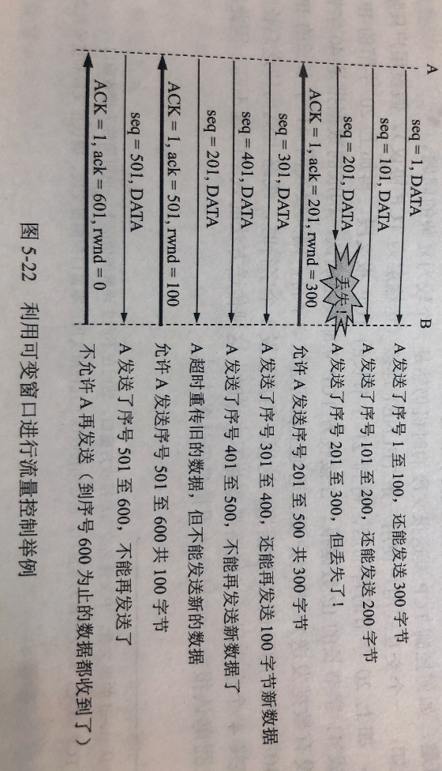

# 506 流量控制

利用滑动窗口实现流量控制。

如果发送方把数据发送得过快，接收方就可能来不及接收，这就会造成数据的丢失。

所谓流量控制（flow control）就是让发送方的发送速率不要太快，要让接收方来得及接收。

在通信过程中，接收方根据自己接收缓存的大小，动态地调整发送方地发送窗口大小，即接收方 rwnd（接收方设置确认报文段的窗口字段来将 rwnd 通知发送给发送方），发送方的发送窗口取接收窗口 rwnd 和拥塞窗口 cwnd 的最小值。

图1.流量控制举例

流量控制举例：

1. 在主机 A、B 连接建立时，B 就告诉了 A，B 的接收窗口 rwnd = 400。因此，A 的发送窗口不能超过 B 给出的接收窗口的数值，单位是字节。

2. 图 1 中可以注意到，接收方的主机 B 进行了三次流量控制，第一次减小 rwnd = 300；第二次 rwnd = 100；第三次 rwnd =0，即不允许发送方在发送数据了，直到 B 重新发出一个新的窗口值位置。

   其实还是可以发送一些特殊的报文段的：
   TCP 规定，即便窗口设置为 0，也必须接收：零窗口探测报文段、确认报文段、携带紧急数据的报文段。

3. 考虑到可能出现的情况，当 B 发送 rwnd = 0 的报文段后不久，想要恢复数据传送，发送 rwnd = 400，但是这个 rwnd = 400 的报文段丢失了。

   这样就导致，A 在等待 B 发送 rwnd 不为 0 的报文段，B 在等待 A 发送数据。互相一直等待，死锁局面一直持续下去。

   为了解决这个问题，TCP 为每一个连接设有一个**持续计时器（persistence timer）**。只要 TCP 连接的一方收到对方的**零窗口通知**，就启动持续计时器。

   若持续计时器设置的时间到期，就发送一个零窗口**探测报文段**（仅携带 1 字节的数据），而对方就在确认这个探测报文段时给出现在的窗口值。
   如果发送方收到窗口值仍然是 0，重新设置持续计时器；如果不是 0，则死锁的僵局就打破了。

2021.04.08