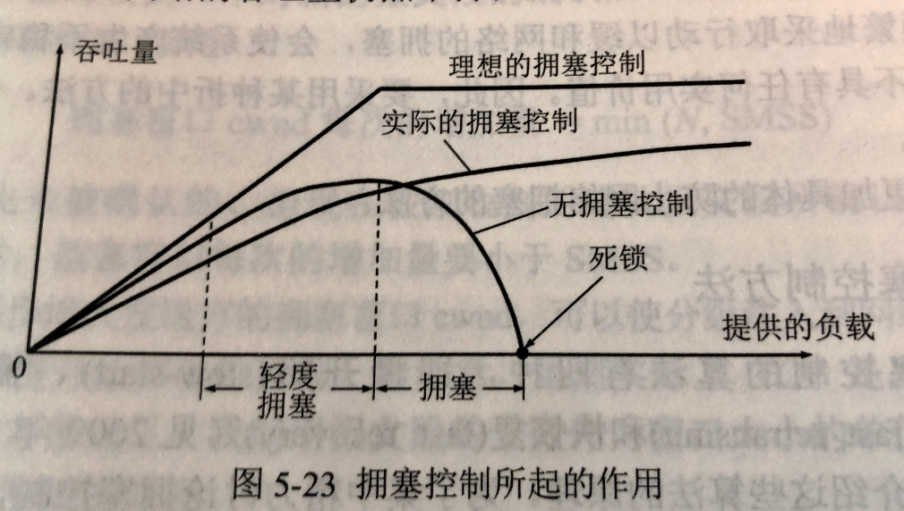
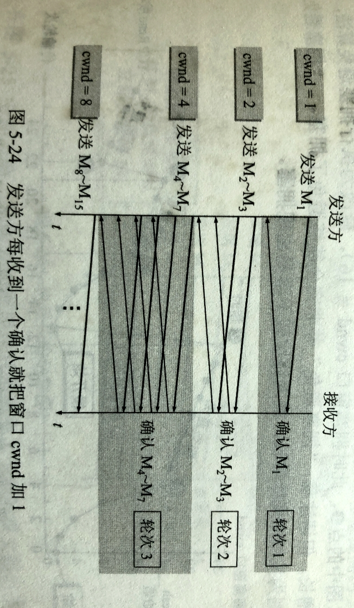
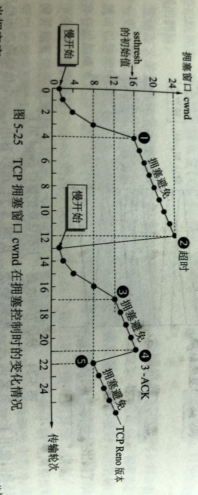
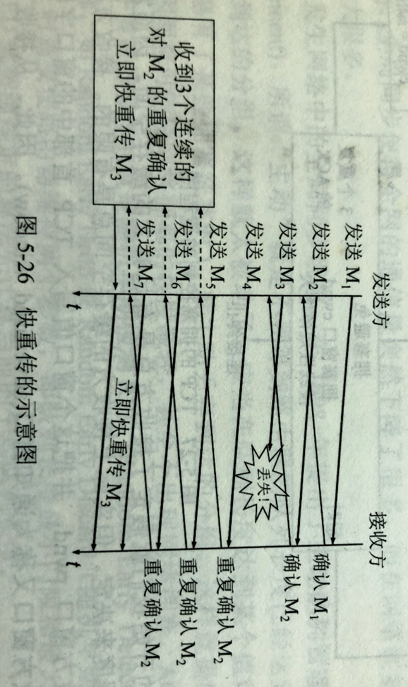
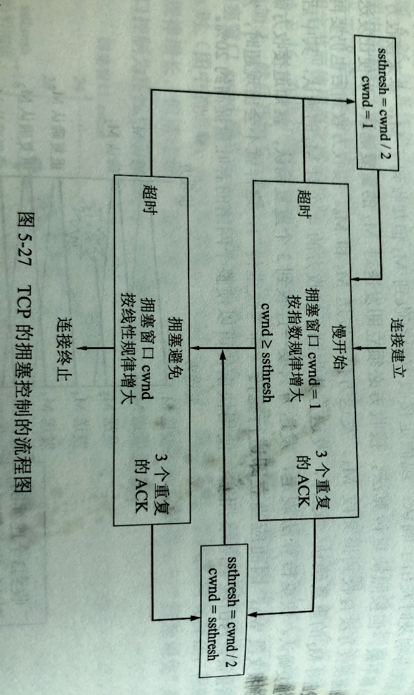

# 507 TCP 拥塞控制

## 一. 拥塞控制一般原理

#### 发生拥塞的原因

在计算机网络中的链路容量（即带宽）、交换节点中的缓存和处理机等，都是网络的资源。

在某段时间内，若对网络中的某一资源的需求超过了该资源所能提供的可用部分，网络的性能就要变坏。这种情况就叫做**拥塞（congestion）**。
$$
\sum对资源的需求>可用资源
$$
若网络中有许多资源同时呈现供应不足，网络的性能就要明显变坏，整个网络的吞吐量将随输入负荷的增大而下降。

网络拥塞是一个非常复杂的问题，简单地将资源增加并不能解决问题。
例如，提高某个节点缓存，但该节点输出链路上的传输速度并未提高，也只能导致分组在该节点缓存中排队等待罢了，然后超出重传时间，发送方重传这些分组。

本质上是因为整个系统的各个部分速度不匹配，只增加一个资源是无法解决问题的，只有所有部分都平衡了，问题才能得到解决。

拥塞常常趋于恶化。
例如，当一个路由器没有足够的缓存空间，丢弃一些新到的分组，而发送方就会重传这部分被丢弃的分组，甚至会重传多次，使得更多的分组流入网络，加剧网络的拥塞。

#### 拥塞控制、流量控制的区别

拥塞控制是**防止过多的数据注入到网络中，这样可以使网络中的路由器或链路不致过载**。
拥塞控制所要做的都有一个前提，就是**网络能够承受现有的网络负荷**。
拥塞控制是一个**全局性的过程**，涉及到所有主机、所有路由器，以及与降低网络传输性能有关的所有因素。

相反，流量控制**往往是指点对点通信量的控制**，是个**端到端的问题**。
流量控制所要作的是抑制发送端发送数据的速率，以便使接收端来得及接收。

#### 网络拥塞图

进行拥塞控制需要付出代价。
首先需要获得网络内部的流量分布信息。在实时控制时，还需要在节点之间交换信息和各种命令，以便选择空hi的策略和实施控制。这样就产生了额外开销。
拥塞控制又是需要将一些资源（如缓存、带宽等）分配给个别用户（或一些类别的用户）单独使用，这样就使得网络资源不能更好地实现共享。
十分明显，在涉及拥塞控制策略时，必须全面衡量得失。

图1.拥塞控制起的作用

图 1 中，横坐标为**提供的负载（offered load）**，代表单位时间内输入给网络的分组数目，也称为**输入负载**或**网络负载**。纵坐标是**吞吐量**，代表单位时间内从网络输出的分组数目。

现实的网络：
随着输入负载的增加，吞吐量的增长率逐渐减小。
当网络吞吐量还未到达饱和时，网络就已经进入了**轻度拥塞**的状态。
输入负载继续增加，达到某一值后，网络吞吐量反而降低，这时网络就进入了**拥塞状态**。
输入负载继续增加，网络吞吐量下降到 0，网络已无法工作，这就是所谓的**死锁（deadlock）**。

理想的拥塞控制：
在达到吞吐量最大值前，吞吐量等于输入负载；到达吞吐量最大值后，吞吐量一直维持最大值。

实际的拥塞控制：
吞吐量的导数随着负载的增加而减小。

#### 解决方法

实践证明，拥塞控制是很难设计的，因为它是一个**动态的**问题。
甚至许多情况下，拥塞控制机制本身范围成为了引起网络性能恶化、发送死锁的原因。

从控制理论的角度来看待网络拥塞问题，从大的方面看来，可以分为**开环控制**和**闭环控制**两种方法。

开环控制就是在设计网络时事先将有关发生拥塞的因素考虑周到了，力求网络在工作时不产生拥塞。但一旦整个系统运行起来，就不再中途进行改正了。

闭环控制是基于反馈环路的概念，主要有以下几种措施：

1. 检测网络系统以便检测到拥塞在何时、何处发生。
2. 把拥塞发生的信息传送到可采取行动的地方。
3. 调整网络系统的运行以解决出现的问题。

有很多方法来检测网络的拥塞，比如：由于缺少缓存空间而被丢弃的分组的百分数、平均队列长度、超时重传分组数、平均分组时延、分组时延的标准差等等。
一般监测到拥塞发生时，要将拥塞发生的信息传送到产生分组的源站。当然，通知拥塞发生的分组同样会使网络更加拥塞。

另一种方法是在路由器转发的分组中保留一个比特或字段，用该比特或字段的值表示网络没有拥塞或产生了拥塞。也可以由一些主机或路由器周期性地发出探测分组，以询问拥塞是否发生。

此外，过于频繁地采取行动以缓和网络地拥塞，会使系统产生不稳定地振荡。
当过于迟缓地采取行动又不具有任何实用价值，因此要采用某种折中地方法，但选择正确地时间常数是相当困难的。

## 二. TCP 的拥塞控制方法

TCP 进行拥塞控制的算法有四种：**慢开始（slow-start）**、**拥塞避免（congestion avoidance）**、**快重传（fast retransmission）**、**快恢复（fast recovery）**。

为了集中精力讨论拥塞控制，我们假定：

1. 数据是单方向传送的，对方只传送确认报文。
2. 接收方总是有足够大的缓存空间，因而发送窗口的大小由网络的拥塞程度来决定。

在流量控制中就讲述过，发送端发送窗口的上限值应该取 $\text{min}\left\{接收窗口\text{rwnd},拥塞窗口\text{cwnd}\right\}$ 。
在这里区分一下：
接收窗口：接收方根据接收缓存设置的值，并告知给发送方，反映接收方容量。
拥塞窗口：发送方根据自己估算的网络拥塞程度而设置的值，反映网络当前容量。

下面讨论的拥塞控制也叫作**基于窗口**的拥塞控制。

发送方维持一个叫作**拥塞窗口 cwnd（congestion window）**的状态变量。
拥塞窗口的大小取决于网络的拥塞程度，并且动态地在变化。发送方让自己的发送窗口等于拥塞窗口。

发送方控制拥塞窗口的原则是：只要网络没有出现拥塞，拥塞窗口就可以再增大一些，以便把更多的分组发送出去，这样就可以提高网络的利用率。但只要网络出现拥塞或有可能出现拥塞，就必须把拥塞窗口减小一些，以减少注入到网络中的分组数，以便缓解网络中出现的拥塞。

发送方如果知晓网络发生了拥塞。
现在的通信线路的传输质量一般都很好，因此传输出现差错而丢弃分组的概率是很小的（远小于 1%）。因此，可以认为，当发送方没有按时收到应当到达的确认报文，即，只要出现了超时，就可以认为是因为网络拥塞而导致路由器丢弃了分组。
因此，**判断网络拥塞的依据就是出现了超时**。

### 慢开始算法

**慢开始**算法的思路：
当主机开始发送数据时，由于并不清楚网络的负荷情况，所以如果立即把大量数据字节注入到网络，那么就有可能引起网络发生拥塞。经验证明，较好的方法是先探测一下，即**由小到大逐渐增大发送窗口**，也就是说，**由小到大逐渐增大拥塞窗口数值**。

在旧的规定中，在刚刚开始发送报文段时，先把初始拥塞窗口 cwnd 设置为 1 至 2 个发送方最大报文段 SMSS（Sender Maximum Segment Size）的数值，但新的 RFC 5681 把初始拥塞窗口 cwnd 设置为不超过 2 至 4 个 SMSS 的数值。
具体规定如下：

1. 若 $SMSS \leq 1095$ 字节，则设置初始拥塞窗口 $cwnd = 4\times SMSS$ 字节，且不得超过 4 个报文段。
2. 若 $1095<SMSS \leq 2190$ 字节，则设置初始拥塞窗口 $cwnd = 3\times SMSS$ 字节，且不得超过 3 个报文段。
3. 若 $SMSS \leq 2190$ 字节，则设置初始拥塞窗口 $cwnd = 2\times SMSS$ 字节，且不得超过 2 个报文段。

然后，慢开始规定，每收到一个**对新的报文段的确认**后，可以把拥塞窗口增加最多一个 SMSS 的数值。即：
$$
拥塞窗口 cwnd 每次的增加量=\text{min}\{N,SMSS\}
$$
N，原先未被确认的，但现在被刚收到的确认报文段所确认的字节数；

显然，当 N<SMSS 时，cwnd 每次的增加量小于 SMSS。

**注意**，在下面的叙述中，将 cwnd 的单位当作报文段的个数来看待。但实际上 cwnd 的单位还是字节。
这样讲述主要是为了方便讲解原理。
例如，实际上 cwnd = 10 SMSS，下面讲述就说 cwnd = 10。

下面举例说明该过程：

图2.发送方每收到一个新的报文段的确认就把窗口 cwnd 加 1

从图 2 可见，
刚开始，cwnd = 1，发送 1 个报文段 $M_1$ ，收到对 $M_1$ 的确认后，cwnd = 2；
cwnd = 2，发送 2 个报文段 $M_2,M_3$ ，收到对 $M_2,M_3$ 的确认后，cwnd = 4；
cwnd = 4，发送 4 个报文段 $M_4\sim M_7$ ，收到对 $M_4\sim M_7$ 的确认后，cwnd = 8；

如前所述，发送方每收到一个新的报文段的确认就把窗口 cwnd 加 1。
也可说为，**每经过一个传输轮次（transmission round），拥塞窗口 cwnd 就加倍**。

传输轮次，就是强调：把拥塞窗口 cwnd 所允许发送的报文段都连续发送出去，并收到对已发送的最后一个字节的确认。
一个传输轮次的时间，也就是一个往返时间 RTT （注意 RTT 并非恒定不变的）。

当然这里图 2 只是举个例子，实际上还是发送方每收到一个新的报文段的确认就把窗口 cwnd 加 1，并且就可以立即发送新报文段了，而非等着收到该轮次所有确认后才发送新的报文段。

在这里指出，慢开始的 " 慢 " 并不是指 cwnd 的增长速率慢，而是指在 TCP 开始发送报文段时先设置 cwnd = 1，使得发送方在开始时只发送一个报文段（目的是试探一下网络的拥塞情况），然后再逐渐增大 cwnd。这当然相对比设置大的 cwnd 值一下就把许多报文段注入到网络中要 " 慢得多 "。这样，对于防止网络出现拥塞是一个非常好的方法。

为了防止拥塞窗口 cwnd 增长过大引起网络拥塞，还需要设置一个**慢开始门限 ssthresh** 状态变量（如何设置 ssthresh，在后面讲述）。
慢开始门限 ssthresh 的用法如下：

1. 当 cwnd < ssthresh 时，使用上述的慢开始算法。
2. 当 cwnd = ssthresh 时，既可使用慢开始算法，也可使用拥塞避免算法；
3. 当 cwnd > ssthresh 时，停止使用慢开始算法，改用拥塞避免算法；

### 拥塞避免算法

拥塞避免算法的思路：
让拥塞窗口 cwnd 缓慢地增大，即每经过一个往返时间 RTT 就把发送方的拥塞窗口 cwnd 加 1，而不是像慢开始阶段那样加倍增长。因此拥塞避免阶段就有**加法增大 AI（Additive Increase）**的特点。这表明在拥塞避免阶段，拥塞窗口 cwnd **按线性规矩缓慢增长**，比慢开始算法的拥塞窗口增长速率缓慢得多。

（个人理解，我觉得就是慢开始是指数增长，而指数增长到后面太恐怖了，一下就翻倍。可能出现本轮次没有拥塞，但下个轮次翻倍了，一下子就超出了网络负载很多很多的情况。）

图3. cwnd 使用拥塞控制时的变化

如图 3，慢开始门限 ssthresh  = 16。
横坐标为传输轮次。

1. 在前面时间，使用慢开始算法，发送方每收到一个新的报文段的确认，就将 cwnd 加 1；
   当 cwnd 增长到 16（ssthresh） 时，改为执行拥塞控制算法，cwnd 按线性规律增长。

   可以注意到，拥塞避免并不能真的避免拥塞，而是使 cwnd 由指数增长变为线性增长，**使网络比较不容易出现拥塞**。

2. 在 cwnd = 24 = ssthresh 时，出现了超时，发送方判断为网络拥塞，于是调整慢开始门限 ssthresh = cwnd/2 = 12，同时设置 cwnd = 1，又进入了慢开始阶段。
   （果然和我猜的一样，调整 ssthresh 变为发送超时的一半，就是指数增长发送超时前的最大 cwnd。）

3. 慢开始阶段，cwnd  = 12 = ssthresh 时，又执行拥塞避免算法，变为线性增长。

   感觉是当一个轮次中 cwnd 每收到一个确认就增加 1，当 cwnd >= ssthresh 时，一个轮次就只增加 1 次。

4. 接着，在图 3 中 ④ 处，出现了一个新的情况，发送方连续收到了 3 个对同一报文段的确认（图 3 中记为 3-ACK）。

下面对 3 个同一报文段的确认进行解释。

### 快重传算法

有时，发送方发出的报文段会丢失，但并不是因为网络发生拥塞而丢失的。
接收方未收到报文段，自然发送方也就收不到确认，于是超时，认为网络发生拥塞。
这样会导致发送方错误地启动慢开始，cwnd = 1，因此降低了传输效率。

而采用**快重传**算法，可以让发送方**尽早知道发生了个别报文段的丢失**。
快重传算法首先要求接收方不要等待自己发送数据时才进行捎带确认，而是要**立即发送确认**，即使收到了**失序的报文段**也要立即发出对已收到的报文段的确认。

图4. 快重传示意图

如图 4，接收方每次收到报文段，就对前面已收到的、连续的报文段的、最后一个报文段发出确认。

原本，在图 4 中，收到 $M_4$ 后，接收方可以什么都不做，等着收到 $M_3$ 后，才发出 $M_3$ 的确认就好了。
但使用快重传算法，就需要在收到 $M_4,M_5,M_6,M_7$ 后立即发送对 $M_2$ 的确认。

同时，按照快重传算法的规定，发送方只要**一连收到 3 个重复确认**，就知道接收方取人没有收到 $M_3$ ，因而应该**立即进行重传**。

这样就避免了出现超时而导致发送方误以为出现了网络拥塞，重新启动慢开始。
使用快重传可以使整个网络的吞吐量提高约 20%。

### 快恢复算法

所以，在图 3 中的④，发送方知道是丢失了个别的报文段，于是执行**快恢复**算法，调整门限值 ssthresh = cwnd/2 = 8，同时设置 cwnd = ssthresh = 8，并开始执行拥塞避免算法。

图 3 中标注的 TCP Reno 版本，表示区别于老的 TCP Tahao 版本。

在有的快恢复实现中，是把快恢复开始时的 cwnd 值再增大 3 个报文段长度，即便 cwnd = ssthresh + 3 MSS。
理由是，既然收到了 3 个重复的确认，说明有 3 个分组已经离开了网络由接收方接收到了，所以 cwnd 可以增加 3 MSS。

---

在拥塞避免阶段，cwnd 按线性增大，常称为**加法增大 AI（Additive Increase）**；而一旦出现超时或 3 个重复的确认，就要把门限值 ssthresh 减半，常称为**乘法减小 MD（Multiplicative Decrease）**。
二者合在一起就是所谓的 AIMD 算法。

下面为归纳 TCP 拥塞控制的流程图：

图5.TCP 的拥塞控制流程图

该图更加全面，补充了在慢开始阶段就发生超时或 3 个重复 ACK 的情况。

在流量控制中就讲述过，发送端发送窗口的上限值应该取 $\text{min}\left\{接收窗口\text{rwnd},拥塞窗口\text{cwnd}\right\}$ 。

只不过我们这里讲解拥塞控制原理的时候，假定了接受端的缓存总是足够大。显然实际并非如此。
所以综合考虑，发送端发送窗口的上限值应该取 $\text{min}\left\{接收窗口\text{rwnd},拥塞窗口\text{cwnd}\right\}$ 。

当 rwnd < cwnd 时，是接收方的接受能力限制发送方窗口的最大值；
当 rwnd > cwnd 时，是网络的拥塞程度限制发送方窗口的最大值；

2021.04.12