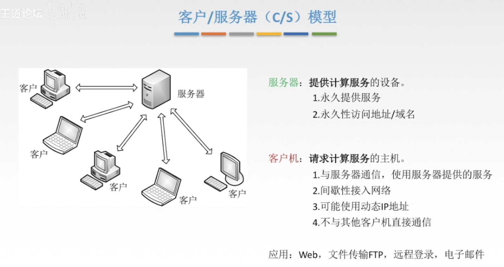
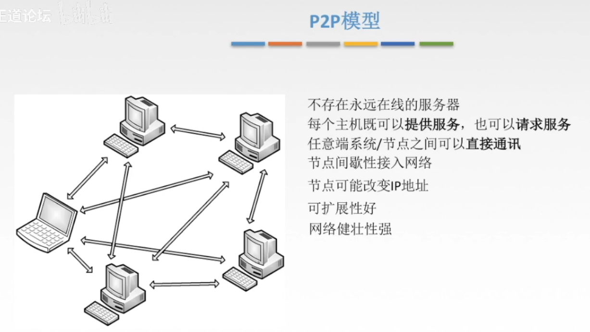

# 601 网络应用模型

## 一. 应用层概述

在上一章，已经学习了运输层为应用进程提供了端到端的通信服务。但不同网络应用的应用进程之间，还需要有不同的通信规则。

因此在运输层协议之上，还需要有**应用层协议（application layer protocol）**。
这是因为，每个应用层协议都是为了解决某一类应用问题，而问题的解决又必须**通过位于不同主机中的多个应用进程之间的通信和协同工作来完成**。

应用进程之间的这种通信必须遵循严格的规则。应用层的具体内容就是精确**定义这些通信规则**。具体来说，应用层应当定义：

1. 应用进程交换的报文类型，如请求报文和响应报文。
2. 各种报文类型的语法，如报文中的各个字段及其详细描述。
3. 字段的语义，即包含在字段中的信息的含义。
4. 进程何时、如何发送报文，以及对报文进行响应的规则。

应用层的许多协议都是基于**客户服务器方式**。即便是 P2P 对等通信方式，实质上也是一种特殊的客户服务器方式。
这里再明确一下，**客户（client）**和**服务器（server）**都是指通信中所设计的两个**应用进程**。客户服务器方式所描述的是进程之间服务和被服务的关系。这里最主要的特征就是：**客户是服务请求方，服务器是服务提供方**。

注意的是，应用层协议与网络应用并不是同一个概念。
应用层协议只是网络应用的一部分。
例如，万维网应用是一种基于客户/服务器体系结构的网络应用。
万维网包含很多部件，万维网游览器、万维网服务器、万维网文档的标准格式，以及一个应用层协议。万维网的应用层协议是 HTTP，它定义了在万维网游览器和万维网服务器之间传送的报文类型、格式和序列等规则。而万维网游览器如何现实一个万维网页面，万维网服务器是用多线程还是用多进程来实现，则都不是 HTTP 所定义的内容。

## 二. 网络应用模型

### 2.1 客户/服务器（Client/Server，C/S）模型

图1.C/S 模型

### 2.2 P2P（Peer-to-Peer）模型

图2.P2P 模型

P2P 中任意一对计算机称为**对等方（Peer）**。

2021.04.15

