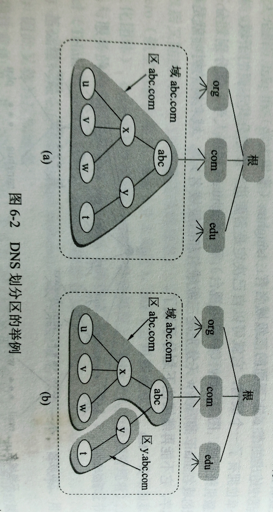
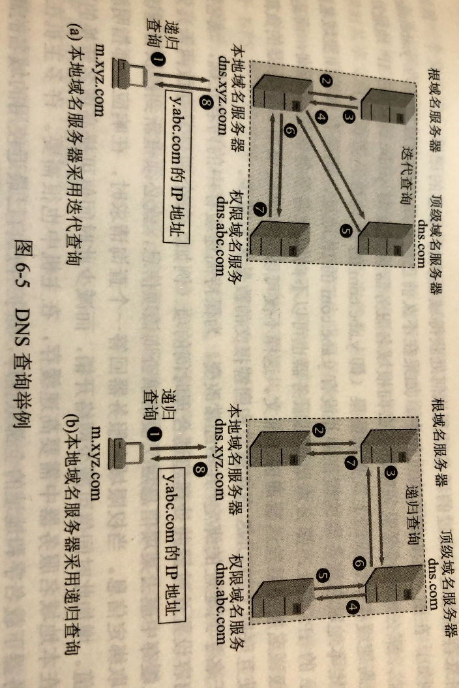

# 602 域名系统 DNS

## 一. 域名系统概述

主要是因为，IP 地址不好记啊，一串数字，当然没有 www.baidu.com 这样的名字好记。

早在 ARPANET 时代，当时整个网络也就只有几百台计算机，所以使用一个叫 hosts 的文件，里面列出所有主机的名字和相应的 IP 地址。
这样用户就只需要输入主机名字就好了，计算机根据主机名字来从 hosts 文件中查询出对应的 IP 地址，就可以进行通信了。

**域名系统 DNS（Domain Name System）**就是互联网使用的命名系统。
简单的说就是，网络中的计算机太多了，现在计算机实现主机名字与 IP 地址的转换，是通过发送主机名字给 DNS 服务器，DNS 服务器里面存有很多主机名字及其相应的 IP 地址，然后 DNS 就把查到的 IP 地址发回给该计算机。

为什么叫 "域名"，而不就叫 "名字"。因为在这个域名系统中，使用了许多叫 "域（domain）" 的东西，所以就出现了域名这个词。

为什么，那干脆都 IP 数据报里面直接用域名不就好了，还用啥 IP 地址啊。
这是因为 IPv4 地址是固定的 32 位长，而域名的长度是不固定的，处理起来麻烦。

理论上讲，整个互联网可以只用一个域名服务器，存入互联网上所有主机名，并回答对 IP 地址的查询。
显然，这不现实。
所以采用的是分布式的域名系统 DNS。

互联网的域名系统 DNS 被设计成为一个联机分布式数据库系统，并采用客户服务器方式。
DNS 使大多数名字都在本地进行**解析（resolve）**，仅少量解析需要在互联网上通信，因此 DNS 系统的效率很高。
由于 DNS 是分布式系统，即使单个计算机出了故障，也不会妨碍整个 DNS 系统的正常运行。

域名到 IP 地址的解析是由分布在互联网上的许多**域名服务器程序**（可简称位域名服务器）共同完成的。
域名服务器程序在专设的节点上运行，而人们也常把运行域名服务器程序的机器称为**域名服务器**。

域名到 IP 地址的解析过程要点如下：
当某一个应用进程需要把主机名解析为 IP 地址时，该应用进程就调用**解析程序**，并成为 DNS 的一个客户，把带解析的域名放在 DNS 请求报文中，以 UDP 用户数据报方式发给本地域名服务器（使用 UDP 是为了减少开销）。本地域名服务器在查找域名后，把对应的 IP 地址放在回答报文中返回。应用进程获得目的主机 IP 地址后即可进行通信。

若本地域名服务器不能回答该请求，则此域名服务器就暂时成为 DNS 中的另一个客户，并向其他域名服务器发出查询请求。这种过程直至找到能够回答该请求的域名服务器为止。

## 二. 互联网的域名结构

早期互联网使用非等级的名字空间，优点是名字简短，然而当互联网用户急剧增加，这种方式就不太行了。

现在采用层次树状结构的命名方法，任何一个连接在互联网上的主机或路由器，都有唯一个**层次结构的名字**，即**域名（domain name）**。这里，域是名字空间中一个可被广利的划分。域还可以划分为子域，而子域还可继续划分为子域的子域，这样就形成了顶级域、二级域、三级域等等。

图1.域名层次

从语法上讲，每一个域名都由**标号（label）**序列组成，而各标号之间用**点**隔开。

如图 1 所示，标号 com 是顶级域名，标号 cctv 是二级域名，标号 mail 是三级域名。

DNS 规定，域名中的每一个标号**不超过 63 个字符**（为了方便记忆，最好不超过12 个字符），由英文字母和数字组成，**不区分大小写**，标号中除了连字符 "-" 外不能使用其他标点符号。且**由多个标号组成的完整域名总公共不超过 255 个字符**。
级别最低的域名写在最左边，级别最高的域名写在最右边。
DNS 既不规定一个域名需要包含多少个下级域名，也不规定每一级域名表示什么意思。
各级域名由上一级的域名管理机构管理，而最高的顶极域名则由 ICANN 进行管理。

用这种方法可使每一个域名在整个互联网范围内是唯一的，并且也容易设计出一种查找域名的机制。

在 2012 年，将顶级域名划分为了三大类：

1. 国家顶级域名 nTLD：cn，us，uk，......
2. 通用顶极域名 gTLD：com，net，org，int，edu，gov，mil，aero，asia，biz，...
3. 基础结构域名（infrastructure domain）：只有一个，arpa，用于反向域名解析，故又称反向域名。

图2. 域名树

如图 2，用域名树来表示互联网的域名系统是最清楚的。

最上面是根，没有对应的名字。
跟下面一级的节点就是顶级域名。
顶级域名往下面划分子域，就是二级域名。
再往下就是三级域名、四级域名......

一旦某个单位拥有了一个域名，它就可以自己决定是否要进一步划分其下属的子域，并且不必由其上级机构批准。

域名树的叶节点，就已经是单台计算机的名字了，那就没法继续往下划分域名了。

强调指出，互联网的名字空间是按照机构的组织来划分的，与物理的网络无关，与 IP 地址中的子网也没有关系。

## 三. 域名服务器

### 3.1 域、区

理论上来讲，可以使得每一级的域名都有一个相对应的域名服务器，使得所有域名服务器构成和图 2 域名树相对应的域名服务器树的结构。但这样会使域名服务器数量太多，使域名系统的运行效率降低。
因此，DNS 采用的是划分区的办法来解决。

一个服务器所负责管辖的（或有权限的）范围叫作**区（zone）**。
各单位根据具体情况来划分自己管辖范围的区。但在一个区中的所有节点必须是能够连通的。每一个区设置相应的**权限域名服务器（authoritative name server）**，用来保存该区中所有主机的域名到 IP 地址的映射。
总之，DNS 服务器的管辖范围不是以域为单位，而是以区为单位。
区是 DNS 服务器实际管辖的范围，区可能等于或小于域，但一定不能大于域。

图3.DNS 划分区的举例

举例：
图 3（a） 表示 abc 公司只划分了一个区，此时域 abc.com 和 区 abc.com 是等价的。
图 3（b） 表示 abc 公司只划分了两个区，此时域 abc.com 中有区 abc.com 和区 y.abc.com。

图4.图3（b）的树状结构的 DNS 域名服务器示意图

在图 4 中，每一个 DNS 服务器都能够进行部分域名到 IP 地址的解析。当某个 DNS 服务器不能进行域名到 IP 地址的转换时，它就设法找到互联网上别的域名服务器进行解析。

### 3.2 域名服务器的分类

从图 4 也可以看出，互联网上的 DNS 域名服务器也是按照层次安排的。每一个域名服务器都只对域名体系中的一部分进行管辖。
根据域名服务器所起的作用，可以把域名服务器划分为以下四种不同的类型：

1. **根域名服务器（root name server）**：

   根域名服务器是最高层次的域名服务器，也是最重要的域名服务器。

   所有根域名服务器都知道所有顶级域名服务器的域名和 IP 地址。

   根域名服务器是最重要的域名服务器，本地域名服务器，要对互联网上任何一个域名进行解析，只要它自己无法解析，就首先要求助于根域名服务器。
   如果所有的根域名服务器瘫痪了，那么整个互联网中的 DNS 系统就无法工作。

   当然，根域名并不是直接告诉本地域名服务器 IP 地址，而是告诉本地域名服务器下一步应该找哪一个顶级域名服务器进行查询。

   全世界的根域名服务器只使用 13 个不同 IP 地址的域名，即 $"\_.routservers.net"（\_为a到m ）$ 。
   虽然只有 13 个域名，但实际上根域名服务器不止由 13 个机器组成，而是很多个机器组成。多个机器共同使用同一域名，使用了**任播**技术，当访问根域名服务器时，访问的是距离你最近的那个该域名的根域名服务器。

   不过，根域名服务器的分布很不均衡，分摊下来，北美平均每 375 万个网民 1 个根域名服务器，亚洲超过 2 千万个网民 1 个根域名服务器。

2. **顶级域名服务器（TLD 服务器）**：

   顶级域名服务器负责管理在该顶级域名服务器注册的所有二级域名。

   当收到 DNS 查询请求时，就给出相应的回答（可能是最后的结果，也可能是下一个应该找的而二级域名服务器的 IP 地址）

3. **权限域名服务器**：

   也就是前面举例中的负责一个区的域名服务器。

   如果权限域名服务器无法给出最后的查询回答，就会告诉发出查询请求的 DNS 客户，下一步应该找哪一个权限域名服务器。

   （看到王道书上有题目叫作 "授权域名服务器"）

4. **本地域名服务器**：

   本地域名服务器并不属于图 4 所示的域名服务器的层次结构，但它对域名系统十分重要。

   当一台主机发出 DNS 请求时，这个查询请求报文就发送给本地域名服务器。
   当要查询的主机也属于同一个本地 ISP 时，本地域名服务器能够自己完成域名到 IP 地址的转换，就不再需要去访问其他的域名服务器了。

   本地域名服务器离用户较近，一般不超过几个路由器的距离，例如，每一个互联网服务提供者 ISP，一个大学，大学里的一个系，都可以拥有一个本地域名服务器。

### 3.3 域名解析过程

图5. DNS 查询举例

域名解析过程：

1. 主机向本地域名服务器的查询一般采用**递归查询（recursive query）**。

   递归查询，指：如果主机所查询的本地域名服务器不知道被查询域名的 IP 地址，那么本地域名服务器就以 DNS 客户的身份，向其他根域名服务器继续发出查询请求报文（即替该主机继续查询），而不是让该主机自己进行下一步的查询。

   因此，递归查询返回的查询结果要么是所要查询的 IP 地址，要么就是报错，表示无法查询到所需 IP 地址。

2. 本地域名服务器向根域名服务器的查询通常是采用**迭代查询（iterative query）**。

   迭代查询，指：当根域名服务器收到本地域名服务器发出的迭代查询请求报文时，要么给出所要查询的 IP 地址，要么告述本地域名服务器下一步应当向哪一个域名服务器去进行查询。然后让本地域名服务器进行后续查询（而不是替本地域名服务器进行后续的查询）。

   根域名服务器通常是把自己知道的顶级域名服务器的 IP 地址告诉本地域名服务器，让本地域名服务器在想顶级域名服务器查询。顶级域名服务器在收到本地域名服务器的查询请求后，要么给出所要查询的 IP 地址，要么告诉本地域名服务器下一步应当向哪一个权限域名服务器进行查询，本地域名服务器就这样进行迭代查询。

   最后，知道了所要解析的域名的 IP 地址，然后把这个结果返回给发起查询的主机。

当然本地域名服务器也可以采用递归查询，这取决于最初的查询请求报文的设置是要求使用哪一种查询方式。

---

为了提高 DNS 查询效率，并减轻根域名服务器的负荷和减少网络上的 DNS 查询报文数量，在域名服务器中广泛地使用了**高速缓存**（有时也称为高速缓存域名服务器）。高速缓存用来存放最近查询过地域名以及从何处获得域名映射信息的记录。

例如，不久前已经有用户查询过域名为 y.abc.com 的 IP 地址，那么本地域名服务器就不必向根域名服务器重新查询 y.abc.com 的 IP 地址，而是直接把高速缓存中的上次的查询结果告诉给这次查询的用户。
类似的，如果本地服务器的缓存中也会存放最近的顶级域名服务器的 IP 地址，这样就不用每次都需要向根域名服务器进行查询。

当然，为了保证高速缓存中的内容正确，域名服务器应当为每项内容设置计时器并处理超过合理时间的项。

不但在本地域名服务器中需要高速缓存，在主机中也很需要。
许多主机在启动时从本地域名服务器下载名字和地址的全部数据库，维护存放自己最近使用的域名的高速缓存，并且只在从缓存中找不到名字时才使用域名服务器。当然，主机也要定期更新。

2021.04.16