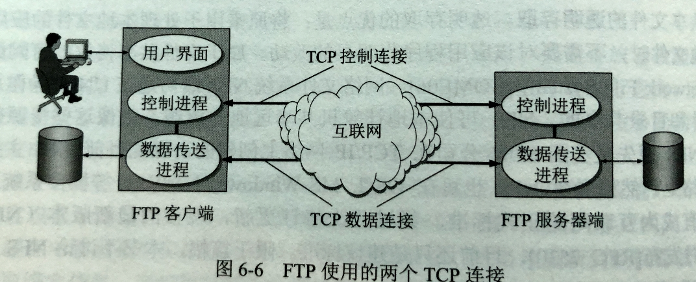

# 603 文件传送协议 FTP

## 一. FTP 概述

**文件传送协议 FTP（File Transfer Protocol）**是互联网上使用得最广泛的文件传送协议。
FTP 提供交互式的访问，允许客户指明文件的类型与格式（如指明是否使用 ASCLL 码），并允许文件具有存取权限（如访问文件的用户必须经过授权，并输入有效的口令）。
FTP 屏蔽了各计算机系统的细节，因而适合于在异构网络中任意计算机之间传送文件。

在互联网早期，用 FTP 传送文件占约整个互联网的通信量的三分之一，直到 1995 年， WWW 的通信量才首次超过 FTP。

下面分别介绍基于 TCP 的 FTP，和基于 UDP 的简单文件传送协议 TFTP。
二者都是文件共享协议中的一大类，即**复制整个文件**，其特点是：若要存取一个文件，就必须先获得一个本地的文件副本。如果要修改文件，只能对文件的副本进行修改，然后再将修改后的文件副本传回原节点。

文件共享协议中的另一大类是**联机访问（on-line access）**。
联机访问意味着允许多个程序同时对一个文件进行存取。和数据库系统的不同之处是用户不需要调用一个特殊客户进程，而是由操作系统提供对远地共享文件进行访问的服务，就如同对本地文件的访问一样。
这就使用户可以用远地文件作为输入和输出来运行任何应用程序，而操作系统中的文件系统则提供对共享文件的**透明存取**。
透明存取的优点是：将原来用于处理本地文件的应用程序用来处理远地文件时，不需要对该应用程序做明显的改懂。
属于文件共享协议的有**网络文件系统 NFS（Network File System）**。NFS 可使本地计算机共享远地的资源，就像这些资源在本地一样。主要应用于 TCP/IP 网络上。

## 二. FTP 的基本工作原理

网络环境中一项基本应用就是将文件从一台计算机中复制到另一台可能相距很远的计算机中。

初看起来这是件简单的事情，但由于两台主机之间的文件系统可能千差万别，所以并不简单。

文件传送协议 FTP 只提供文件传送的一些基本服务，它使用 TCP 可靠的运输服务。
FTP 的主要功能是减少或消除在不同操作系统下处理文件的不兼容。

FTP 使用客户服务器方式。
一个 FTP 服务器进程可同时为多个客户进程提供服务。
FTP 的服务器进程由两大部分组成：一个**主进程**，负责接收新的请求；另外有若干个**从属进程**，负责处理单个请求。

主进程的工作步骤如下：

1. 打开熟知端口（端口号为 21），使客户进程能够连接上。
2. 等待客户进程发出连接请求。
3. 启动从属进程处理客户进程发来的请求。从属进程对客户进程的请求处理完毕后即终止，但从属进程在运行期间根据需要还可能创建其他一些子进程。
4. 回到等待状态，继续接受其他客户进程发来的请求。主进程与从属进程的处理是并发进行的。

图1.FTP 使用的两个 TCP 连接

图 1 画出了 FTP 的工作情况。
图 1 中椭圆部分表示在系统中运行的进程。可见 FTP 服务器端中有两个从属进程：**控制进程**、**数据传送进程**。
注意，这里为了简化，在服务器端没有画出主进程，在客户端没有画出用户界面进程。

在进行文件传输时，FTP 的客户和服务器之间要建立两个并行的 TCP 连接：**控制连接**和**数据连接**。

当客户进程向服务器进程发出建立连接请求时，要寻找连接服务器进程的熟知端口 21，建立控制连接，同时还要告诉服务器进程自己的另一个端口号码，用于建立数据传送连接。
接着，服务器进程用自己传送数据的熟知端口 20 与客户进程所提供的端口号建立数据传送连接。
实际上，服务器端的数据连接的端口不一定是 20，采用主动方式的服务器端，则使用端口 20，因为收到了客户端的请求后，就 " 主动 " 由端口 20 向客户端建立数据连接；采用被动方式，则是其他端口号，因为收到请求后，不 " 主动 " 而是通过控制连接告知客户端用于本次数据连接的临时端口号，由客户端来 "主动" 连接这个端口。）

控制连接在整个会话期间一直保持打开，FTP 客户所发出的传送请求，通过控制连接发送给服务器端的控制进程，但控制连接并不用来传送文件。
意思是，一次文件传输完毕，数据连接断开，但控制连接不一定断开，可能又要新传送一个文件，于是又建立了一个数据连接，然后又传完了，数据连接断开，确定不传了，会话结束了，控制连接才断开。

实际用来传输文件的是数据连接。
服务器端的控制进程在接收到 FTP 客户发送来的文件传送请求后就创建**数据传送进程**和**数据连接**，用来连接客户端和服务器端的数据传送进程。
数据传输进程实际完成文件的传送，在传送完毕后关闭数据传送连接并结束运行。

由于 FTP 使用了两个不同的端口号，所以数据连接和控制连接不会发生混乱。
由于 FTP 使用了一个分离的控制连接，因此 FTP 的控制信息的**带外（out of band）**传送的。

使用两个独立的连接的主要好处是使协议更加简单和更容易实现，同时在传输文件时还可以利用控制连接对文件的传输进行控制，例如，客户发送请求终止传输。

---

FTP 并非对所有数据传输都是最佳的。
前面说到：

> 下面分别介绍基于 TCP 的 FTP，和基于 UDP 的简单文件传送协议 TFTP。
> 二者都是文件共享协议中的一大类，即**复制整个文件**，其特点是：若要存取一个文件，就必须先获得一个本地的文件副本。如果要修改文件，只能对文件的副本进行修改，然后再将修改后的文件副本传回原节点。

意味着，如果计算机 A 想要在计算机 B 上的一个大文件的末尾添加信息，那么就需要将整个大文件由 B 传送到 A，A 修改后再将修改后的文件由 A 传送到 B。

网络文件系统 NFS 则采用了另一种思路，**NFS 允许应用进程打开一个远地文件，并能在该文件的某一个特定的位置上开始读写数据**。
所以，NFS 可以使用户只复制需要的一小段数据。
对于上述的情况，A 中的 NFS 客户端将要添加的数据和在文件后写入的请求发送给 B 中的 NFS 服务器就好了。

---

其他东西：

FTP 还有两种传输模式：

1. 文本传输模式：
   ASCLL 模式，就是传输文件两边主机系统可能不一样，一边是 Windows，一边是 Unix，使用文本传输模式，就会在传输后将换行符转换为客户端的字符。比如 Unix 传给 Windows，Unix 的换行是 /r，就会自动换成 Windows 的 /r/n。
2. 二进制模式：
   Binary 模式，就当作比特流来传送，不会像文本传输模式那样自动修改内容。
   所以如果穿的不是文本，又使用了文本传输模式，就可能比特流里面，有和 /r 或 /r/n 的一样的比特组合，就会被改掉，那接收到的数据就出错了。

使用 FTP 有些是需要登录的，可以用用户名和密码登录。
但也有匿名登录的（也就是不需要用户名和密码），主要是为了为公共提供服务。

## 三. 简单文件传送协议 TFTP

TFTP（Trivial File Transfer Protocol）同样使用客户服务器方式，但它使用的是 UDP 协议。
这意味着 TFTP 需要有自己的差错改正措施来实现可靠传输。

TFTP 只支持文件传输而不支持交互。
TFTP 没有一个庞大的命令集，没有列目录的功能，也不能对用户身份进行鉴别。

TFTP 的主要优点：

1. TFTP 可用于 UDP 环境。

   例如，当需要将程序或文件同时向许多机器下载时就往往需要使用 TFTP。

2. TFTP 代码所占内存较小。

   这对于较小的计算机或某些特殊用途的设备是很重要的。这些设备不需要硬盘，只需要固化了 TFTP、UDP 和 IP 的小容量只读存储器即可。当接通电源后，设备执行制度存储器中的代码，在网络上广播一个 TFTP 请求。网络上的 TFTP服务器就发送响应，其中包括可执行二进制程序。设备收到此文件后将其放入内存，然后开始运行程序。这种方式增加了灵活性，也减少了开销。

TFTP 的主要特点是：

1. 每次传送的数据报文中有 512 字节的数据，但最后一次可不足 512 字节。
2. 数据报文按序编号，从 1 开始。
3. 支持 ASCLL 码或二进制传送。
4. 可对文件进行读或写。
5. 使用很简单的首部。

TFTP 的工作很像停止等待协议。
发送完一个文件块后就等待对方的确认，确认时应指明所确认的块编号。
发完数据后在规定时间内收不到确认就要重发数据 PDU。
发送确认 PDU 的一方若在规定时间内收不到下一个文件块，也要重发确认 PDU。
这样就可以保证文件的传送不致因某一个数据报的丢失而告失败。

在一开始工作时，TFTP 客户进程发送一个读请求报文或写请求报文给 TFTP 服务器进程，其熟知端口号为 69。
TFTP 服务器进程要选择一个新的端口号和 TFTP 客户进程进行通信。
若文件长度恰好为 512 字节的整数倍，则在文件传送完毕后，还必须在最后发送一个只含首部而无数据的数据报文。
若文件长度不是 512 字节的整数倍，则最后传送数据报文中的数据字段一定不满 512 字节，这正好可作为文件结束的标志。

2021.04.17

