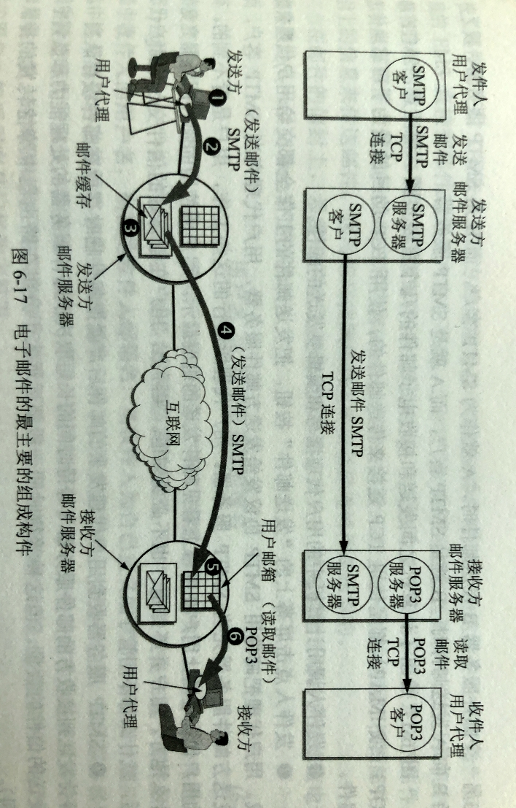
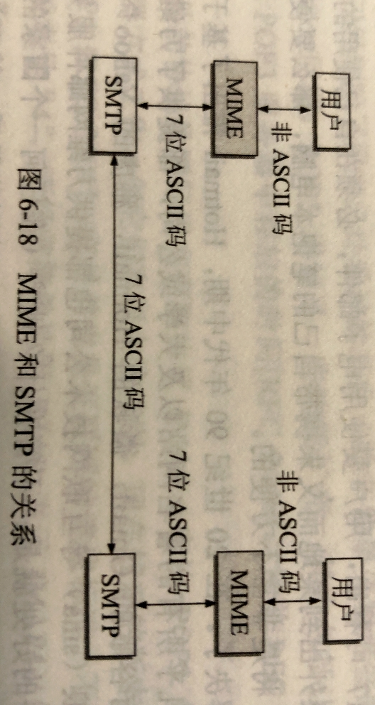

# 604 电子邮件

## 一. 电子邮件概述

电子邮件（e-mail）讲邮件发送到收件人使用的邮件服务器，并放在其中的收件人邮箱（mail box）中，收件人可在自己方便时上网到自己使用的邮件服务器进行读取。

电子邮件最重要的两个标准就是：**简单邮件传送协议 SMTP（Simple Mail Transfer Protocol）**和**互联网文本报文格式**。

由于 SMTP 只能传送可打印的 7 位 ASCLL 码邮件，因此在 1993 年又提出了**通用互联网邮件扩充 MIME（Multipurpose Internet Mail Extensions）**。
MIME 在其邮件首部中说明了邮件的数据类型（如文本、声音、图像、视像等）。在 MIME 邮件中可同时传送多种类型的数据。

一个电子邮件系统应具有三个主要组成构建：
用户代理、
邮件服务器、
邮件发送协议（如 SMTP）和邮件读取协议（如 POP3）。

**用户代理 UA（User Agent）**，就是用户与电子邮件系统的接口，在大多数情况下他就是运行在用户电脑中的一个程序。因此用户代理又称为**电子邮件客户端软件**。用户代理向用户提供一个很友好的接口（目前主要是窗口界面）来发送和接收邮件。

用户代理至少应该具有以下 4 个功能：

1. **撰写**：给用户提供编辑信件的环境。
2. **显示**：能方便地在计算机屏幕上显示出来信。
3. **处理**：处理包括发送邮件和接收邮件。
4. **通信**：发信人在撰写完邮件后，要利用邮件发送协议发送到用户所使用地邮件服务器。收件人在接收邮件时，要使用邮件读取协议从本地邮件服务器接收邮件。

邮件服务器 24 小时不间断地工作，并且具有很大容量的邮件信箱（毕竟只有这样才能保证接收到所有邮件）。
邮件服务器需要使用两种不同协议，一种协议用于用户代理向邮件服务器发送邮件或在邮件服务器之间发送邮件，如 SMTP 协议；一种用于用户代理从邮件服务器读取邮件，如邮局协议 POP3。
邮件服务器按照客户服务器方式工作，邮件服务器必须能够同时充当客户和服务器。例如当邮件服务器 A 向另一个邮件服务器 B 发送邮件时，A 就成了 SMTP 客户。

电子邮件由**信封（envelope）**和**内容（content）**两部分组成。
TCP/IP 体系的电子邮件系统规定**电子邮件地址（e-mail address）**的格式为：用户名@邮件服务器的域名。
下面再详讲。

图1.电子邮件

图 1 上方为电子邮件主要组成构件：用户代理、邮件服务器、邮件发送协议和邮件读取协议。

图 1 下方为发送一封电子邮件的过程，稍微注意一下两种不同的通信方式。
**推（push）**：SMTP 客户把邮件推给 SMTP 服务器。
**拉（pull）**：POP3 客户把邮件从 POP3 服务器拉过来。

## 二. 电子邮件的信息格式

一个电子邮件分为**信封（envelope）**和**内容（content）**两大部分。
在 RFC 5322 文档中只规定了邮件内容种的**首部（header）**格式，而对邮件**主体（body）**部分则让用户自由撰写。
用户写好首部后，邮件系统自动地将信封所需的信息提取出来写在信封上。用户不需要填写电子邮件信封上的信息。

首部包括一些关键字，后面加上冒号，最重要的关键字是 To 和 Subject。

"To:" 后面填入一个或多个收件人的电子邮件地址。

"Subject:" 是邮件的主题。主题类似文件系统的文件名，便于用户查找邮件。

还有其他的关键字，如：
"From:" 表示发件人的电子邮件，
"Date:'' 表示发信日期，这两个一般由系统自动填入。
还有 "Bcc:"，"Reply-To:" 等等。

## 三. 简单邮件传送协议 SMTP

**端口号 25**。

SMTP 的主要特点：

SMTP 规定了在两个相互通信的 SMTP 进程之间应如何交换信息。
由于 SMTP 使用客户服务器方式，因此负责发送邮件的 SMTP 进程就是 SMTP 客户，负责接收邮件的 SMTP 进程就是 SMTP 服务器。

至于邮件内部的格式，邮件如何存储，以及邮件系统应以多快的速度来发送邮件，SMTP 也都未做出规定。

SMTP规定了 14 条命令和 21 种应答信息。
每条命令用几个字母组成，而每一种应答信息一般只有一行信息，由一个 3 位数字的代码开始，后面附上（也可不附上）很简单的文字说明。

下面通过发送方和接收方的邮件服务器之间的 SMTP 通信的三个阶段介绍几个最主要的命令和响应信息。

### 3.1 连接建立

1. 发件人的邮件送到发送方邮件服务器的缓存后，SMTP 客户每隔一定时间对邮件缓存扫描一次（如 30 分钟）。
2. 如发现有邮件，就使用 SMTP 的**熟知端口号 25** 与接收方邮件服务器的 SMTP 建立 TCP 连接。
3. 在连接建立后，接收方 SMTP 服务器要发出 "220 Service ready"（服务就绪）。
4. 然后 SMTP 客户向 SMTP 服务器发送 HELO 命令，附上发送方的主机名。
5. SMTP 服务器若有能力接收邮件，则回答 "250 OK"，表示已准备接收。
   若 SMTP 服务器不可用，则回答 "421 Service not available"（服务不可用）。

**SMTP 不使用中间的邮件服务器**。
TCP 连接总是在发送方和接收方这两个邮件服务器之间直接建立。
当接收方邮件服务器出现问题，无法连接时，发送方邮件服务器只能等待后再次尝试建立连接，而不会找中间的邮件服务器去建立连接。

如果在一定时间内邮件还是无法发送，邮件服务器则会通知发件人。

~~~c
建立连接后
B:220 Service ready

A:HELO
B:250 OK 或 B: 421 Service not available
~~~

### 3.2 邮件传送

邮件的传送从 MAIL 命令开始。

MAIL 命令后面有发件人的地址，如：MAIL FROM:\<xiexiren@tsinghua.org.cn\>。
若 SMTP 服务器已准备好接收邮件，则回答 "250 OK"。
否则返回一个代码，指出原因，如 452（处理时出错），452（存储空间不足），500（命令无法识别）等。

然后跟着一个或多个 RCPT 命令，取决于把同一个发送给一个或多个收件人，其格式为：RCPT TO:\<收件人地址\>。
RCPT 是 recipient（收件人的缩写）。每发送一个 RCPT 命令，都应当有相应的信息从 SMTP 服务器返回，如 "250 OK"，表示指明的邮箱在接收方的系统中；或 "550 No such user here"（无此用户），即不存在此邮箱。

RCPT 命令的作用就是：先弄清楚接收方系统是否已作好接收邮件的准备，然后才发送邮件。这做是为了避免浪费通信资源，不至于都发送了才知道地址错误。

在下面是 DATA 命令，表示要开始传送邮件的内容了。
SMTP 服务器返回的信息是 "354 Start mail input; end with \<CRLF\>.\<CRLF\>"，这里的\<CRLF\>是 "回车换行" 的意思。
若不能接收邮件，则返回 421（服务器不可用），500（命令无法识别）等。
接着 SMTP 客户就发送邮件的内容，发送完毕后，再发送 \<CRLF\>.\<CRLF\>，表示邮件内容的结束。
若邮件收到了，则 SMTP 服务器返回信息 "250 OK"，或返回差错代码。

~~~c
A:MAIL FROM:<发件人地址>
B:250 OK 或 B: 452/452/500/...

A:RCPT TO:<收件人地址1>
B:250 OK 或 B: 550 No such user here
A:RCPT TO:<收件人地址2>
B:250 OK 或 B: 550 No such user here

A:DATA
B:354 Start mail input; end with <CRLF>.<CRLF> 或 B:421/500/...
A:邮件内容... <CRLF>.<CRLF>
B:250 OK 或 B: 差错代码
~~~

### 3.3 连接释放

邮件发送完毕后，SMTP 客户应发送 QUIT 命令。SMTP 服务器返回的信息是 "221"（服务关闭），表示 SMTP 同意释放 TCP 连接。
邮件传送的全部过程即结束。

~~~c
A:QUIT
B:221
~~~

当然，SMTP 的用户看不见以上过程，都被电子邮件的用户代理屏蔽了。

### 3.4 SMTP 的缺点

SMTP 缺点：

1. SMTP 不能传送可执行文件或其他的二进制对象。
2. SMTP 限于传送 7 位的 ASCLL 码。无法传送其他非英语国家的文字。
3. SMTP 服务器会拒绝超过一定长度的邮件。
4. 某些 SMTP 的实现并没有完全按照 SMTP 的互联网标准。

以及 STMP 的邮件是明文传送的，不利于保密等等。

后来也对 SMTP 进行了扩充，成为了扩充的 SMTP，也就是 ESMTP（Extended SMTP）。
ESMTP 新增了功能：客户端的鉴别，服务器接收二进制报文，服务器接收分块的大报文，发送前先检查报文的大小，使用安全传输 TLS，使用国际化地址等。

## 四.通用互联网邮件扩充 MIME

### 4.1 MIME 概述

对于 STMP 的不足，MIME 就在 STMP 的基础之上来解决这些问题。
MIME 并没有改动或取代 SMTP，而是继续使用 SMTP。
MIME 增加了邮件主体的结构，并定义了非 ASCLL 码的编码规则。所以，MIME 也使得电子邮件可以传送多种国家语言、声音、图像、视频等等。

图2.MIME 和 SMTP 的关系

从图 2 就能看出，MIME 也就是处于用户和 SMTP 之间，仍然是使用 SMTP 传送的。

MIME 主要包括以下三部分内容：

1. 5 个新的邮件首部字段，它们可包含在原来的邮件首部中。这些字段提供了有关部件主体的信息。
2. 定义了许多邮件内容的格式，对多媒体电子邮件的表示方法进行了标准化。
3. 定义了传送编码，可对任何内容格式进行转换，而不会被邮件系统改变。

为了适应于任意数据类型和表示，每个 MIME 报文报文包含告知收件人数据类型和使用编码的信息。MIME 把增加的信息加入到原来的邮件首部中。

下面是 MIME 增加的 5 个新的邮件首部的名称及其意义（有的可以是选项）：

1. MIME-Version：标志 MIME 的版本，当前为 1.0。若无此行，则为英文文本。
2. Content-Description：这是可读字符串，说明此邮件主题是否是图像、音频或视频。
3. Content-Id：邮件的唯一标识符。
4. Content-Transfer-Encoding：在传送时邮件的主题是如何编码的。
5. Content-Type：说明邮件主题的数据类型和子类型。

前面三项意思都很清楚，下面只对后两项进行介绍。

### 4.2 内容传送编码（Content-Transfer-Encoding）

实际上就是，因为 SMTP 只能传送 ASCLL 码，所以我们传送非文本报文，非英语报文时，就将其比特组合转换为符合 ASCLL 码中的比特组合，然后进行传送。接收方接收到后，再复原回原本的比特组合。

三种常用的内容传送编码

#### 4.2.1 7 位 ASCLL 码

最简单的编码就是 7 位 ASCLL 码，而每行不能超过 1000 个字。
MIME 对这种由 ASCLL 码构成的邮件主体不进行任何转换。

ASCLL 编码原本为 7 位，但最初为了增加检错能力，所以增加了一位奇偶校验位，于是，使用 ASCLL 码也是 8位。但其最高位一定是 0，后面 7 位就是原本的 ASCLL 码。

#### 4.2.2 quoted-printable

quoted-printable 适用于所传送数据中只有少量非 ASCLL 码。

quoted-printable 的编码方法是，对于所有可打印的 ASCLL码（除了等号 "=" 外），都不进行改变。
但对于等号 "=" 、不可打印的 ASCLL 码、非 ASCLL 码的数据，的操作是：先将每个字节的二进制代码用两个十六进制数字表示，然后在前面再加上一个等号 "="，得到编码后的比特组合。

例如，等号 "="（00111101） 经过 quoted-printable 编码后为（00111101 00000011 00001101）。
$$
\begin{aligned}
\\\rightarrow &00111101
\\\rightarrow &00111101\quad0011\quad1101（前面添等号 "="，本身划分为两个 4bit）
\\\rightarrow &00111101\quad3\quad D（这两个4bit以十六进制看待）
\\\rightarrow &00111101\quad 00110011\quad 01000100（以十六进制看待得到的字符，转化为 ASCLL 码中对应字符的比特组合）
\end{aligned}
$$
原本 8bit，转换后需要传输 24bit，开销为 $(24-8)/8=200\%$ 。

#### 4.2.3 base64 编码

对于任意的二进制文件，可用 base64 编码。

将二进制代码划分为一个个 24 位长的单元，然后每一个 24 位的单元划分为4 个 6 位组。
每一个 6 位组，6bit 共 64 种不同状态，按照一个映射表，转换为对应的 ASCLL 码中的比特组合。

如果最后一个单位不足 24 位，只有 8 位，就在末尾添上两个等号 "="，凑够 24 位；只有 16 位，就在末尾添上一个等号 "="，凑够 24 位。

其实就是 6 bit 有 000000 - 111111。
从 000000 对应大写字母 A，依次对应到 Z，然后接着是小写 a 到 z。这就是 52 个了。
然后接着是 10 个数字 0 到 9；
最后两个是 01111 对应 +，111111 对应 /。

例如：
$$
\begin{aligned}
一个 24 位单元:& 01001001\quad 00110001\quad01111001
\\划分位 4 个 6 位组:& 010010\quad 010011\quad 000101\quad 111001
\\由映射表对应的字符:&\quad S\quad\quad\quad  T\quad\quad\quad\quad F\quad\quad\quad 5
\\转换为的 ASCLL 编码:&01010011\quad 01010100\quad 01000110\quad 00110101
\end{aligned}
$$
不难看出，原本 24 bit，转化后需要传输 32 bit，开销为 $(32-24)/24=33\%$。

### 4.3 内容类型（Content-Type）

MIME 标准规定 Content-Type 说明必须含有两个标识符，即内容类型（type）和子类型（subtype），中间用 "/" 分开。

MIME 标准原先定义了 7 个基本内容类型和 15 种子类型，不过这个文档 RFC 1521 已经被归入 " 陈旧的 " 了。
当然 MIME 也允许用户使用自己自定义的内容类型与子类型。

后来，出现了越来越多的子类型，并且在不断增长。

下面列出 MIME 的内容类型，和部分子类型举例。

| 内容类型            | 子类型举例                        | 说明                   |
| ------------------- | --------------------------------- | ---------------------- |
| text（文本）        | plain,html,xml,css                | 不同格式的文本         |
| image（图像）       | gif,jpeg,tiff                     | 不同格式的静止图像     |
| audio（音频）       | basic,mpeg,mp4                    | 可听见的声音           |
| video（视频）       | mpeg,mp4,quicktime                | 不同格式的影片         |
| model（模型）       | vrml                              | 3D模型                 |
| application（应用） | octet-stream,pdf,javascript,zip   | 不同应用程序产生的数据 |
| message（报文）     | http,rfc822                       | 封装的报文             |
| multipart（多部分） | mixed,alternative,parallel,digest | 多种类型的组合         |

其中 multipart 是非常有用的，它使得邮件增加了很大的灵活性。

multipart 的子类型：

1. mixed 子类型：允许单个报文含有多个相互独立的子报文。每个子报文可有自己的类型和编码。

   mixed 子类型使用户能够在单个报文中附上文本、图像、声音等，或用额外数据段发送一个备忘录，类似商业信笺含有的附件。

   在 mixed 后面还要用到一个关键字 Boundary=，此关键字定义了分隔报文段各部分所有的字符串（由邮件系统顶级），只要在邮件的内容中不会出现与之相同的字符串即可。
   当某一行以两个连字符 "--" 开始，后面接着是上述定义的字符串，就表示下面开始了另一个子报文。

2. alternative 子类型：允许单个报文段含有同一数据的多种表示。

   当给多个使用不同硬件和软件系统的收件人发送备忘录时，这种 multipart 报文解就很有用。例如，用户可同时用 ASCLL 文本和格式化的形式发送文本，从而允许拥有图形功能的计算机用户在查看图形时选择格式化的形式。

3. parallel 子类型：允许单个报文段含有可同时显示的各个子部分。例如，图像和声音子部分必须一起播放。

4. digest 子类型：允许单个报文段含有一组其他报文。例如，从讨论中收集电子邮件报文。

下面是一个 MIME 邮件，含有一个简单解释的文本和含有非文本信息的照片。

~~~C
From: xiexiren@tsinghua.org.cn
To: xyz@163.com
MIME-Viersion:1.0
Content-Type: multipart/mixed; boundary=qwertyuiop

--qwertyuiop
XYZ:
    图片在此邮件中，收到请回信。
    						谢希仁
--qwertyuiop
Content-Type: image/gif
Content-Transfer-Encoding: base64
	...(此处为图像的数据)...
--qwertyuiop--
~~~

最后一行的 --qwertyuiop--，即 -- 接 Boundary= 定义的字符串后，又接 --，说明整个 multipart 的结束。

## 五. 邮件读取协议 POP3 和 IMAP

常用的邮件读取协议有两个，即邮局协议的第 3 个版本 POP3 和**网际报文存取协议 IMAP（Internet Message Access Protocol）**。

### 5.1 邮局协议 POP

**端口号 110**。

邮局协议 POP 是一个非常简单，但功能有限的协议。现在使用的是其第 3 个版本 POP3。

POP3 也使用客户服务器方式。
在接收邮件的用户计算机中的用户代理必须运行 POP3 客户程序，在收件人所连接的 ISP 的邮件服务器中则运行 POP3 服务器程序。

POP3 服务器只有在用户输入鉴别信息（用户名和口令）后，才允许对邮箱进行读取。
POP3 是明文传输密码的。

POP3 的特点是，只要用户从 POP3 服务器读取了邮件，那么 POP3 服务器就会把这个邮件删除。
这也就导致了一个问题，比如，当用户读取了邮件，却没有立即回复，而是关机，打算明天再回复。然而 POP3 已经删除了这个邮件了，等明天他开机根本就找不到这个邮件了（除非将邮件复制到了本地）。

所以，POP3 也进行了一些功能扩充，让用户可以设置邮件读取后仍然在 POP3 服务器的存放的时间。

POP3 也是基于 ASCLL 码的，如果要传输非 ASCLL 码的数据，则要使用 MIME 转换为 ASCLL 码形式。

### 5.2 网际报文存取协议 IMAP

**端口号 143**。

网际报文存取协议 IMAP，比 POP3 复杂得多。

IMAP 也是客户服务器工作方式。
现在版本使用的是 IMAP4，但通常还是使用 IMAP。
（就奇怪了，POP3 通常就写 POP3，IMAP4 通常就写 IMAP）

IMAP 是一个联机协议。
用户的计算机上运行 IMAP 客户程序，与接收方的邮件服务器上的 IMAP 服务器程序建立 TCP 连接。
然后，用户可以在自己的计算机上，像本地操纵一样，操纵邮件服务器的邮箱。
用户可以看到邮箱的首部，若用户需要打开某个邮件，则该邮件才传到用户的计算机上。

用户可以为了自己的邮箱创建便于分类管理的层次式邮箱文件夹，也能移动存放的邮件从一文件夹到另一文件夹，也可按照某种条件对邮件进行查找。

在用户未发出删除邮件的命令之前，IMAP 服务器邮箱中的邮件一直保存着。

IMAP 最大的好处就是，用户可以在不同的地方，使用不同的计算机，随时上网查阅、处理自己的邮件服务器中的邮件。

IMAP 还允许收件人只读取邮件的某一部分。
例如，当附件是一个视频，而且过大时，收件人无线上网网速慢时可以只下载其中的正文文本部分，等到网络速率快的网络，再去下载这个很大的附件。

IMAP 缺点就是，如果用户没有将邮件复制到本地计算机上，那就必须得上网才能够查阅自己的邮件。

注意区分：
SMTP 是发送方的用户代理向发送方邮件服务器，发送方邮件服务器向接收方邮件服务器，发送邮件所使用的协议。
POP3 和 IMAP 是接收方的用户代理从接收方邮件服务器上读取邮件所使用的协议。

## 六. 基于万维网的电子邮件

现在的电子邮件，都是登录网页，也没有下载用户代理软件吧。
所以特点就是，方便。

发送方向发送方邮件服务器发送邮件，使用的协议改为了 HTTP 协议。
从发送方邮件服务器向接收方邮件服务器发送邮件，使用的协议还是 SMTP 协议。
从接收方向接收方邮件服务器读取邮件，使用的协议改为了 HTTP 协议。

2021.04.18

