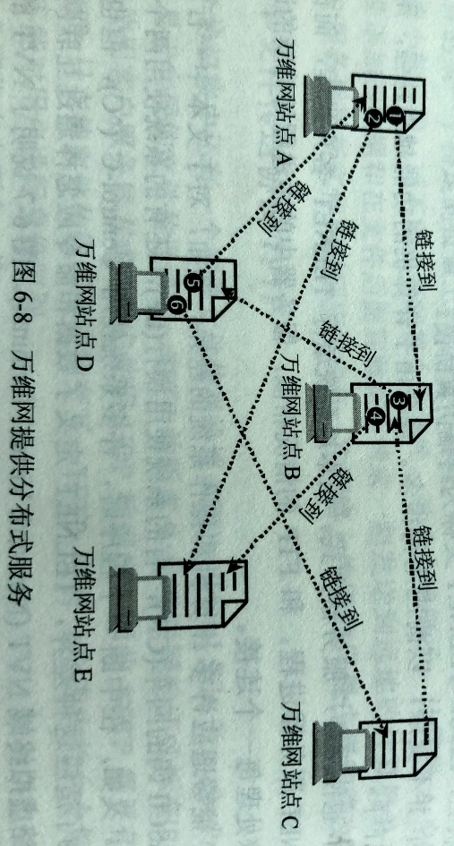
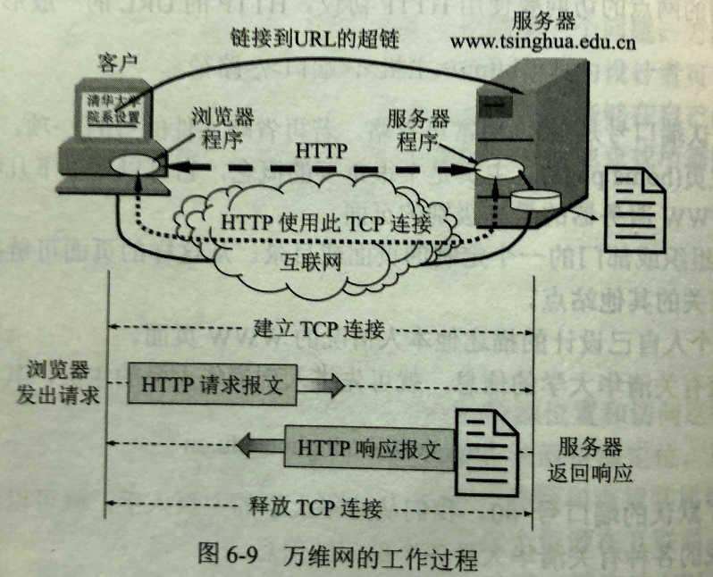
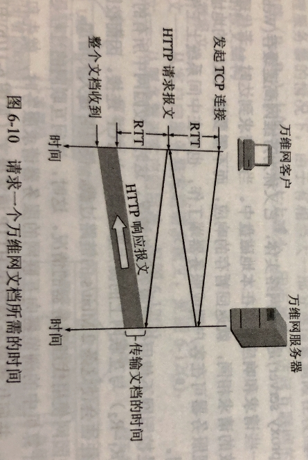
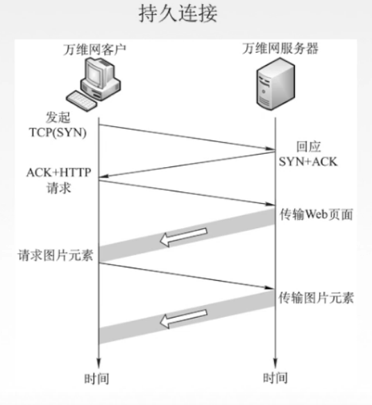
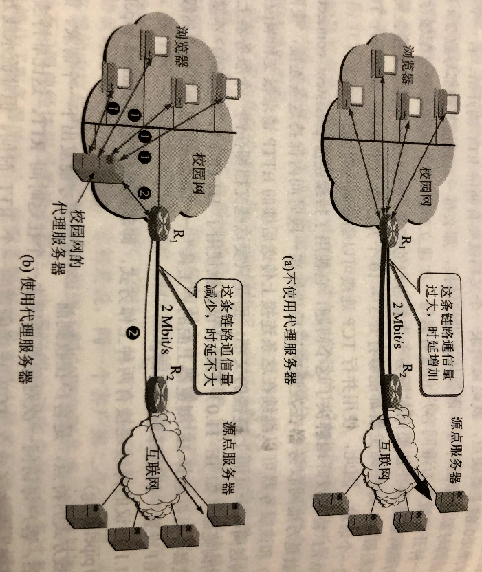
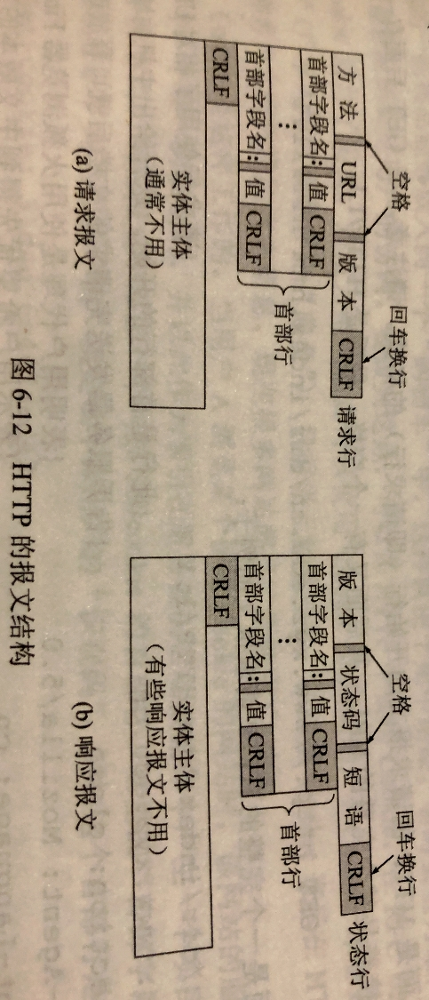

# 605 万维网和 HTTP 协议

## 一. 万维网概述

**万维网 WWW（World Wide Web）**是一个大规模的、联机式的信息储藏所，英文简称为 Web。

万维网用链接（link）的方法能非常方便地从互联网上的一个站点访问另一个站点。

万维网以客户服务器方式工作。
浏览器就是在用户主机上的万维网客户程序。
万维网文档所驻留的主机则运行服务器程序，这台主机也称为万维网服务器。

客户程序向服务器程序发出请求，服务器程序向客户程序送回客户所要的万维网文档。
在一个客户程序主窗口显示出的万维网文档称为页面（page）。

图 1.万维网提供一个分布式服务

万维网是一个分布式的超媒体（hepemedia）系统，是超文本（hypetext）系统的扩充。
超文本就是指包含指向其他文档的链接的文本。这些链接的数目不受限制，可以指向世界上任何一个接在互联网上的超文本系统中的文档。

可见：万维网需要解决的问题：

1. 怎么标志分布在整个互联网上的万维网文档？

   使用**同一资源定位符 URL（Uniform Resource Locator）**来标志万维网上的各种文档，并使每一个文档在整个互联网的范围内具有唯一的标识符 URL。

2. 用什么样的协议来实现万维网上的各种链接？

   万维网客户程序与万维网服务器程序之间的交互，使用**超文本传送协议 HTTP（HypeText Transfer Protocol）**。

   HTTP 是一个应用层协议，它使用 TCP 连接进行可靠的传送。

3. 怎样使不同作者创作不同风格的万维网文档，都能在互联网上的各种主机上显示出来，同时使用户清楚地知道在什么地方存在着链接？

   使用**超文本标记语言 HTML（HypeText Markup Language）**，万维网页面设计者可以很方便的显示页面，并可用链接，从本页面的某处链接到互联网上的任何一个万维网页面。

4. 怎样使用户能够很方便地找到所需信息？

   用搜索工具。也就是用搜索引擎来搜索。

## 二. 同一资源定位符 URL

### 2.1 URL 的格式

同一资源定位符 URL，用来表示从互联网上得到的资源位置和访问这些资源的方法。
URL 实际上就是在互联网上的资源的地址，显然，互联网上的所有资源，都有一个唯一确定的 URL。

此处，资源，是指在互联网上可以被访问的任何对象。

由于被访问对象所使用的协议不同，所以 URL 还需要指出读取某个对象时所使用的协议。

URL 一般的形式由以下四个部分组成
$$
<协议>://<主机>:<端口>/<路径>
$$
<协议>：指出使用什么协议来获取该万维网文档。最常用的 http（超文本传送协议 HTTP），ftp（文件传送协议 FTP）。

"://"：固定格式。

<主机>：指出主机，也就是该主机在互联网上的域名，当然直接填 IP 地址也行。

<端口>，<路径>：有时可省略。

现在的浏览器，为了方便用户，基本上都会省略 http:// 和 www.，用户输入 baidu.com 就行了，浏览器会自动把未输入的补齐 http://www.baidu.com。

### 2.2 使用 HTTP 的 URL

对于万维网的网点的访问要使用 HTTP 协议。使用 HTTP 协议时的 URL 的一般形式是：
$$
\text{http}://<主机>:<端口>/<路径>
$$
HTTP 的默认端口号是 80，通常可省略不写。
如果同时也省略掉不写<路径>，那么 URL 就指向互联网上的某个**主页（home page）**。

例如要查有关清华大学的信息，就可以直接输入 http://www.tsinghua.end.cn 进入主页，再通过主页中的链接，查找信息。
$$
\text{http://}
\underbrace{www.tsinghua.edu.cn}
_{主机域名}
\text{/}
\underbrace{public/newthu/newthu_cnt/faculties/index.html}
_{路径名}
$$
URL 的<协议>和<主机>部分，不区分大小写，但是<路径>有时要区分大小写。

## 三. 超文本传送协议 HTTP

HTTP 协议定义了浏览器（即万维网客户进程）怎样向万维网服务器请求万维网文档，以及服务器怎样把文档传送给浏览器。

从层次的角度看，HTTP 是**面向事务（tansactionorented）**应用层协议，是万维网上能够可靠地交换文件（包括文本、声音、图像等各种多媒体文件）的重要基础。
注意，HTTP 不能传送完成超文本跳转所必须的信息，也可以传送任何可从互联网上得到的信息。

此处，事务，指一系列的信息交换，而且这一系列的信息交换是一个不可分割的整体，也就是说要么所有信息交换都完成，要么一次交换都不进行。

### 3.1 HTTP 工作过程

图2.万维网的工作过程

每个万维网网点都有一个服务器进程，它不断监听 TCP 的端口 80，以便发现是否有浏览器（即万维网客户）向它发出连接建立请求。

一旦监听到了连接建立请求，并建立了 TCP 连接后，浏览器就向万维网服务器发出游览某个页面的请求（HTTP 请求报文）。
服务器接着就返回所请求的页面作为响应（HTTP 响应报文）。

最后，TCP 连接就被释放了。

在浏览器和服务器之间的请求和响应的交互，必须按照规定的格式和遵循一定的规则。这些格式和规则就是超文本传送协议 HTTP。

更具体一些：

1. 用户通过输入 URL，或点击超链接的方式访问资源。
2. 浏览器分析 URL。
3. 浏览器向 DNS 请求解析 IP 地址。
4. DNS 解析出 IP 地址。
5. 浏览器与服务器建立 TCP 连接。
6. 浏览器发出取文件命令（HTTP 请求报文，其中有告诉服务器自己需要的文件名）。
7. 服务器响应（HTTP 响应报文，其中有浏览器所需文件）。
8. 释放 TCP 连接。
9. 浏览器显示。

### 3.2 HTTP 协议的特点

HTTP 使用面向连接的 TCP 作为运输层协议，TCP 也就保证了数据的可靠传输，HTTP 就不用像 TFTP 一样考虑自己实现可靠传输了。

但是 HTTP **本身是无连接**的。
本身无连接的意思是指，虽然 HTTP 使用了 TCP 连接，但通信的双方在交换 HTTP 报文之前不需要先建立 HTTP 连接。

（我感觉无连接的意思是，HTTP 的下层已经有 TCP 保证了可靠传输了，所以上层的 HTTP 也就没有必要再搞一个来回发送消息建立连接的机制了。所以 HTTP 是无连接的。）

HTTP 协议是**无状态**。
无状态是指，同一个客户第二次访问同一个服务器上的页面时，服务器的响应与第一次被访问时相同。服务器并不会记得曾经访问过的客户，也不记得为该客户服务过多少次。
这种设计简化了服务器的设计，使服务器更容易支持大量并发的 HTTP 请求。

当然，实际生活中还是有很多网站想要记住用户，比如淘宝。
对于这些网站，使用 **Cookie**，见后文。

### 3.3 HTTP 连接方式

HTTP 连接方式：非持续连接、持续连接。

#### 3.3.1 非持续连接

图3. 请求一个万维网文档所需的时间

如图 3 所示，当游览器请求一个万维网文档时，TCP 使用三报文握手。
那么，在建立 TCP 连接的前两个部分完成后（经过一个 RTT 后），万维网客户就把 HTTP 请求报文作为 TCP 连接的第三个报文的数据部分，发送给万维网服务器。（也就是客户给服务器的 ACK 中的数据部分就是 HTTP 请求报文嘛）
万维网服务器收到 HTTP 请求报文后，就把所请求的文档作为 HTTP 响应报文返回给客户。

这是 HTTP/1.0 的方式。
当然，存在缺点。
因为传送一个文档完毕后，就会关闭掉该 TCP 连接，所以每个请求的文档，都需要建立 TCP 连接，要会有两个 RTT 的开销。
而且每次建立 TCP 连接，都还要分配缓存和变量。
尤其是万维网服务器，往往要同时服务于大量的客户请求，所以这种**非持续连接**会使万维网服务器的负担很重。

当然，游览器可以打开多个并行的 TCP 连接方式来缓解这个问题，缩短响应时间。

#### 3.3.2 持续连接

图4.持续连接-非流水线式

HTTP/1.1 就较好的解决了这个问题，它可以使用**持续连接（persistent connection）**的方式。

持续连接，也就是万维网服务器在发送响应后，仍然在一段时间内保持这条连接，使同一个客户和该服务器可以继续在这条连接上传送后续的 HTTP 请求报文和响应报文。

HTTP/1.1 的持续连接有两种工作方式：**非流水线方式（without pipelining）**、**流水线方式（with pipelining）**。

非流水线方式，就是图 4 的方式，每次都完成了一次传输后，才发起下一次的 HTTP 请求。
流水线方式，可以连续发送 HTTP 请求，不必像非流水线方式那样只能等这个传输完了才发下一个。

### 3.4 代理服务器（proxy server）

代理服务器是一种网络实体，又称为**万维网高速缓存（Web cache）**。

代理服务器把最近的一些请求和响应暂存在本地磁盘中。
如果新的请求与代理服务器中暂存的请求相同，就直接返回代理服务区中暂存的该请求的响应。
当然，如果在代理服务器中没有相同请求，那代理服务器就作为客户，与互联网上的**源点服务器**建立 TCP 连接，获得文档，再将其发回给这个请求。

图5.不使用/使用代理服务器例子

### 3.5 HTTP 的报文结构

图6.HTTP 报文结构

HTTP 报文是**面向文本（text-oriented）**的，报文中的每一个字段都是 ASCLL 码串。

1. **开始行**：用于区分是请求报文还是响应报文。

   在请求报文中，开始行叫作**请求行（Request-Line）**；
   在响应报文中，开始行叫作**状态行（Status-Line）**。

   在开始行的三个字段之间都以空格分开，最后的 CRLF ，其中 CR 表示回车，LF 表示换行。

2. **首部行**：用来说明浏览器、服务器或报文主体的一些信息。

   首部可以有多行，也可以不使用。
   在每一个首部行中都有首部字段名和它的值，每一个结束部分也是 CRLF。
   整个首部行结束时，以一行只有 CRLF 的空行来和后面的实体主体区分开。

3. **实体主体**：在请求报文中一般不使用这个字段，在响应报文中也可能没有这个字段。

请求报文的开始行字段：

1. 方法：此处的方法是面向对象技术中使用的专有名词。这里含义实际就是对所请求的对象要进行的操作。这些方法，也就是一些命令。

   这里给出 HTTP 请求报文的一些方法。

   | 方法（操作） | 意义                              |
   | ------------ | --------------------------------- |
   | OPTION       | 请求一些选项的信息                |
   | GET          | 请求读取由 URL 所标志的信息       |
   | HEAD         | 请求读取由 URL 所标志的信息的首部 |
   | POST         | 给服务器添加信息（例如，注释）    |
   | PUT          | 在指明的 URL 下存储一个文档       |
   | DELETE       | 删除指明的 URL 所标志的资源       |
   | TRACE        | 用来进行环回测试的请求报文        |
   | CONNECT      | 用于代理服务器                    |

2. URL：就是 URL。

3. 版本：使用的什么版本的 HTTP 协议。

一个请求报文举例：

~~~c
GET /dir/index.htm HTTP/1.1 //开始行——请求行，这里使用了相对 URL（即省略了主机域名）
Host: www.xyz.edu.cn		//首部行，给出了主机域名
Connection: close			//首部行，告诉服务器发送完请求的文档后就可释放连接
User-Agent: Mozilla/5.0		//首部行，表明用户代理是使用的火狐浏览器 Firefox
Accept-Language: cn			//首部行，表示用户希望优先得到中文版本的文档
 //这里有一个空格，是首部行和实体主体的分隔。不过这个请求报文没有实体主体。
~~~

响应报文的开始行字段：

1. 版本：就是版本。

2. 状态码：状态码都是 3 位数字，分为 5 大类，原先共有 33 种，后来又增加了几种。

   1xx 表示通知信息，如请求收到了或正在进行处理。
   2xx 表示成功，如接受或收到了。
   3xx 表示重定向，如要完成请求还必须采取进一步的行动。
   4xx 表示客户的差错，如请求中有错误的语法或不能完成。
   5xx 表示服务器的差错，如服务器失效无法完成请求。

   常用的状态行：

   ~~~c
   HTTP/1.1 202 Accepted	//接受
   HTTP/1.1 400 Bad Request//错误的请求
   HTTP/1.1 4 Not Found	//找不到
   ~~~

3. 短语：就是描述的短语。上面的 Accepted、Bad Request、Not Found 这些。

### 3.5 Cookie

在服务器上存方用户的信息。

例如，在网上购物时，需要实现记录顾客将欲购买的物品加入同一购物车。
这就使用 Cookie 来实现。

当用户 A 浏览某个使用 Cookie 的网站时，该网站的服务器为 A 产生一个唯一的识别码，并以此为索引在服务器的后端数据库中产生一个项目（其中存储相关信息）。
接着在给 A 的 HTTP 响应报文中添加一个叫作 Set-cookie 的首部行，首部字段名就是 Set-cookie，其后的值就是该用户 A 的识别码。
如：Set-cookie: 31d4d96e407aad42

当用户 A 收到这个响应时，浏览器就在它管理的特定 Cookie 文件中添加一行，其中包括这个服务器的主机名和 Set-cookie 后面给出的识别码。
当 A 继续浏览这个网站时，每发送一个 HTTP 请求报文，浏览器都会从 Cookie 文件中取出这个网站的识别码，并放到 HTTP 请求报文的 Cookie 首部行中。
如：Cookie: 31d4d96e407aad42

于是，这个网站就能够跟踪用户 31d4d96e407aad42在该网站的活动。

如果几天后 A 再次访问该网站，那么浏览器就会在其 HTTP 请求报文中继续使用 Cookie: 31d4d96e407aad42。
那么根据 Cookie，就可以对应到后端数据库中存储的用户信息。自然，免去重新登录、网上购物保存收件地址这些功能也就可以很方便的实现了。

2021.04.20

